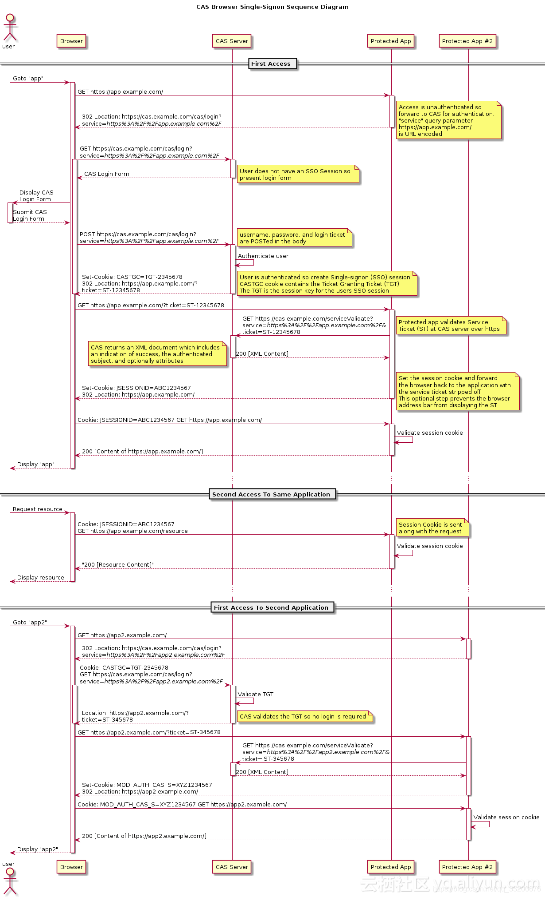

# 定义

多个系统共存的情况下，登录一次就能访问所有的系统，得到所有系统的信任。一处登录，处处登录。一处注销，处处注销。

# 解决的问题

用户只需要登录一次就可以访问所有相互信任的应用系统。

# 如何解决

### 简单的 cookie 实现

-   1、假设有登录系统、系统 A、系统 B
-   2、访问系统 A 时发现没登录，于是重定向到登录系统
-   3、登陆之后将登录信息保存在 cookie，并且重定向到系统 A，此时系统 A 能访问到 cookie 信息，就能正常访问页面了
-   4、此时访问系统 B 时也不需要重新登录了
    > 存在的问题
-   cookie 的安全问题
    -   可以加密解决
-   各个系统的跨域的问题
    -   使用 nginx 将所有应用代理到同一个域名下
    -   使用其他跨域技术方案

### jsonp 的实现

-   1、假设有登录系统、系统 A、系统 B
-   2、访问系统 A 时发现没登录，于是重定向到登录系统
-   3、登陆之后将登录信息保存在登录系统域名下的 cookie，并且重定向到系统 A
-   4、在进入到系统 A 时， 由于系统 A 和登录系统可能是不同源的产生跨域， 此时也不能访问到 cookie 信息。我们可以在系统 A 中通过 jsonp 向登录系统请求带上登录 cookie, 登录系统验证用户的登录状态后，返回*加密的信息*。
-   5、系统 A 的页面拿到加密信息后传给系统 A 的后台，系统 A 的后台通过解析加密信息来验证用户，验证通过则登录成功, 并且返回自己的登录凭证。

> 总结

-   通过 jsonp 的方式来请求登录系统做到 cookie 共享，然后最终得到每个子系统自己的验证信息。
-   这里有登录系统的凭证, 系统 A 的凭证，系统 B 的凭证， 他们三个是可以不一样的。

> 问题

-   加密算法不能泄露
-   如果系统 A 的登录凭证失效了怎么处理？如果登录系统的登录凭证失效了怎么处理？
    重新向到登录系统、发送 jsonp 请求

### 页面重定向实现

-   1、假设有登录系统、系统 A、系统 B
-   2、访问系统 A 时发现没登录，于是重定向到登录系统
-   3、登陆之后重定向到系统 A（出于安全考虑，您可能想要列出您允许身份验证应用重定向到的域）。并且地址上携带了登陆凭证

### 单个项目多个二级域名的简单实现

# 认证与授权（Authentication vs Authorization）

-   认证：识别您是谁
-   授权：知道您被允许做什么，或者让别人做什么。

### 访问系统 A

-   http://10.1.1.248:9601

### jsonp 请求

-   https://awen-test.rp-field.com/console/init?callback=jsonp_1615521046532_172

### 检测到未登录重定向

-   http://awen-test.rp-field.com/console/login?url=http%3A%2F%2F10.1.1.248%3A9601%2FgoodsCenter%23%2F
-   https://awen-test.rp-field.com/console/login?url=http%3A%2F%2F10.1.1.248%3A9601%2FgoodsCenter%23%2F

### 重定向到登陆平台，输入账号密码登陆

-   https://uuap-test.rp-field.com/cas/login?service=http%3A%2F%2Fawen-test.rp-field.com%2Fconsole%2Flogin%3Furl%3Dhttp%253A%252F%252F10.1.1.248%253A9601%252FgoodsCenter%2523%252F

### 登陆成功后重定向

-   http://awen-test.rp-field.com/console/login?url=http%3A%2F%2F10.1.1.248%3A9601%2FgoodsCenter%23%2F&ticket=eyJhbGciOiJIUzUxMiJ9.ZXlKemRXSWlPaUkwTnpVeElpd2lhWE5HY205dFRtVjNURzluYVc0aU9pSjBjblZsSWl3aVlYVjBhR1Z1ZEdsallYUnBiMjVFWVhSbElqb2lNakF5TVMwd015MHhNbFF4TVRvMU9Eb3dNaTQxTVRZck1EZzZNREJiUVhOcFlWd3ZVMmhoYm1kb1lXbGRJaXdpZFhObGNrNXZJam9pVlY5SVJFVk5TRXhGSWl3aWMzVmpZMlZ6YzJaMWJFRjFkR2hsYm5ScFkyRjBhVzl1U0dGdVpHeGxjbk1pT2lKVmMyVnlibUZ0WlZCaGMzTjNiM0prVkhsd1pVRjFkR2hsYm5ScFkyRjBhVzl1U0dGdVpHeGxjaUlzSW1semN5STZJbWgwZEhCek9sd3ZYQzkxZFdGd0xYUmxjM1F1Y25BdFptbGxiR1F1WTI5dFhDOWpZWE1pTENKdGIySnBiR1VpT2lJck9EWXhNelF4T0RnMU5UY3hNaUlzSW5SNWNHVWlPaUp3WVhOemQyUWlMQ0pqY21Wa1pXNTBhV0ZzVkhsd1pTSTZJbFZ6WlhKdVlXMWxVR0Z6YzNkdmNtUlVlWEJsUTNKbFpHVnVkR2xoYkNJc0ltRjFaQ0k2SW1oMGRIQTZYQzljTDJGM1pXNHRkR1Z6ZEM1eWNDMW1hV1ZzWkM1amIyMWNMMk52Ym5OdmJHVmNMMnh2WjJsdVAzVnliRDFvZEhSd0pUTkJKVEpHSlRKR01UQXVNUzR4TGpJME9DVXpRVGsyTURFbE1rWm5iMjlrYzBObGJuUmxjaVV5TXlVeVJpSXNJbkpsWVd4T1lXMWxJam9pNzcrOTc3Kzk3Nys5NzcrOTc3Kzk3Nys5NzcrOTc3Kzk3Nys5SWl3aVlYVjBhR1Z1ZEdsallYUnBiMjVOWlhSb2IyUWlPaUpWYzJWeWJtRnRaVkJoYzNOM2IzSmtWSGx3WlVGMWRHaGxiblJwWTJGMGFXOXVTR0Z1Wkd4bGNpSXNJbXh2Ym1kVVpYSnRRWFYwYUdWdWRHbGpZWFJwYjI1U1pYRjFaWE4wVkc5clpXNVZjMlZrSWpvaWRISjFaU0lzSW1sa0lqb2lORGMxTVNJc0ltVjRjQ0k2TVRZeE5qRXlOakk0TWl3aWFXRjBJam94TmpFMU5USXhORGd5TENKcWRHa2lPaUpUVkMweE1EQTJOQzE0WWtsQ05uVlJlSGQxZUcxc05WSkZlbGMwYm1oTGEyRjZkMEV0WVhaaGRHRnlkWFZoY0MwMk9UVm1OR0kzT0RndGFuUTBZbmNpTENKbGJXRnBiQ0k2SWpReE1Ea3pORGt4TWtCeGNTNWpiMjBpTENKMWMyVnlibUZ0WlNJNkltTm9aVzV6WmlKOQ.FIujsc7N9x96-02gIzVy1rJkrrC8MByil-ZB6TZE7YY6JXD_j4NvzWVj9vniYekpQQhPBFoI6r-rTemIRcMAlg

### 重定向到 https

-   https://awen-test.rp-field.com/console/login?url=http%3A%2F%2F10.1.1.248%3A9601%2FgoodsCenter%23%2F&ticket=eyJhbGciOiJIUzUxMiJ9.ZXlKemRXSWlPaUkwTnpVeElpd2lhWE5HY205dFRtVjNURzluYVc0aU9pSjBjblZsSWl3aVlYVjBhR1Z1ZEdsallYUnBiMjVFWVhSbElqb2lNakF5TVMwd015MHhNbFF4TVRvMU9Eb3dNaTQxTVRZck1EZzZNREJiUVhOcFlWd3ZVMmhoYm1kb1lXbGRJaXdpZFhObGNrNXZJam9pVlY5SVJFVk5TRXhGSWl3aWMzVmpZMlZ6YzJaMWJFRjFkR2hsYm5ScFkyRjBhVzl1U0dGdVpHeGxjbk1pT2lKVmMyVnlibUZ0WlZCaGMzTjNiM0prVkhsd1pVRjFkR2hsYm5ScFkyRjBhVzl1U0dGdVpHeGxjaUlzSW1semN5STZJbWgwZEhCek9sd3ZYQzkxZFdGd0xYUmxjM1F1Y25BdFptbGxiR1F1WTI5dFhDOWpZWE1pTENKdGIySnBiR1VpT2lJck9EWXhNelF4T0RnMU5UY3hNaUlzSW5SNWNHVWlPaUp3WVhOemQyUWlMQ0pqY21Wa1pXNTBhV0ZzVkhsd1pTSTZJbFZ6WlhKdVlXMWxVR0Z6YzNkdmNtUlVlWEJsUTNKbFpHVnVkR2xoYkNJc0ltRjFaQ0k2SW1oMGRIQTZYQzljTDJGM1pXNHRkR1Z6ZEM1eWNDMW1hV1ZzWkM1amIyMWNMMk52Ym5OdmJHVmNMMnh2WjJsdVAzVnliRDFvZEhSd0pUTkJKVEpHSlRKR01UQXVNUzR4TGpJME9DVXpRVGsyTURFbE1rWm5iMjlrYzBObGJuUmxjaVV5TXlVeVJpSXNJbkpsWVd4T1lXMWxJam9pNzcrOTc3Kzk3Nys5NzcrOTc3Kzk3Nys5NzcrOTc3Kzk3Nys5SWl3aVlYVjBhR1Z1ZEdsallYUnBiMjVOWlhSb2IyUWlPaUpWYzJWeWJtRnRaVkJoYzNOM2IzSmtWSGx3WlVGMWRHaGxiblJwWTJGMGFXOXVTR0Z1Wkd4bGNpSXNJbXh2Ym1kVVpYSnRRWFYwYUdWdWRHbGpZWFJwYjI1U1pYRjFaWE4wVkc5clpXNVZjMlZrSWpvaWRISjFaU0lzSW1sa0lqb2lORGMxTVNJc0ltVjRjQ0k2TVRZeE5qRXlOakk0TWl3aWFXRjBJam94TmpFMU5USXhORGd5TENKcWRHa2lPaUpUVkMweE1EQTJOQzE0WWtsQ05uVlJlSGQxZUcxc05WSkZlbGMwYm1oTGEyRjZkMEV0WVhaaGRHRnlkWFZoY0MwMk9UVm1OR0kzT0RndGFuUTBZbmNpTENKbGJXRnBiQ0k2SWpReE1Ea3pORGt4TWtCeGNTNWpiMjBpTENKMWMyVnlibUZ0WlNJNkltTm9aVzV6WmlKOQ.FIujsc7N9x96-02gIzVy1rJkrrC8MByil-ZB6TZE7YY6JXD_j4NvzWVj9vniYekpQQhPBFoI6r-rTemIRcMAlg

#

-   http://10.1.1.248:9601

# cas登陆流程图
- 参考文档：
https://blog.csdn.net/qq_33200676/article/details/82981742

# cas退出流程
1. 任意系统登出，都会跳转到sso认证中心进行统一登出，通过sessionId找到相应的token，再找到对应需要注销的子系统机器sessionId，跳转到子系统，销毁局部session。

2. 销毁全局session（sso认证中心的session），删除token信息和数据库中的子系统信息，跳转到登录页面 