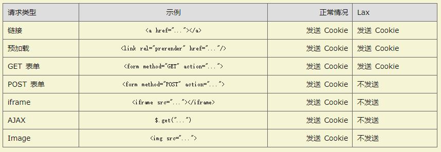

# cookie是什么？

定义 用于存储数据，当用户访问了某个网页的时候，我们就可以通过 cookie来访问这电脑上存储的数据。

1. **不同的浏览器存放的cookie位置不一样**，不能通用。 **cookie的存储是以域名的形式区分的，相同域名不同端口是可以共享cookie的。**。

2. cookie的数据可以设置名字。 例如：

   ```js
   document.cookie="名字=值",//写 
   document.cookie;//读取的是所有数据
   ```

   

3. 可以重复写多个”名字=值”，此时获取网站下的cookie时， 得到字符串形式的值，包含了当前网站下所有的cookie。 所有的cookie都是以**分号+空格**连接起来的。

4. 一个域名下存放的cookie**数量是有限**的，不同的浏览器存放 的个数不一样。

5. 每个cookie存放的**内容大小也是有限制**，不同的浏览器存放 的大小不一样

6. 如果我们想长时间存放一个cookie，需要在设置这个cookie 的时候同时设置一个过期的时间。
   cookie默认是临时存储的，当浏览器关闭时直接销毁。
   例如：

   ```js
   var oDate = new Date();
   var d = 5;
   oDate.setDate(oDate.getDate()+d);
   document.cookie='age=32;expires='+oDate.toGMTString;
   ```

   

7. 内容最好编码存放
   编码：**encodeURL()**
   解码：**decodeURL()**

   

8. 获取cookie
   原理：拆分两次 split(‘; ’) split(‘=’)
   封装：
   setcookie()
   getcookie()
   removecookie()


# cookie的作用？


# cookie是怎么工作的？
存储*cookie*是浏览器提供的功能。cookie其实是存储在浏览器中的纯文本，浏览器的安装目录下会专门有一个cookie文件夹来存放各个域下设置的cookie。
当网页要发http请求时，浏览器会先检查是否有相应的cookie，有则自动添加在request header中的cookie字段中。
但在 localStorage 出现之前，cookie被滥用当做了存储工具。
什么数据都放在cookie中，即使这些数据只在页面中使用而不需要随请求传送到服务端。

> 当然cookie标准还是做了一些限制的：
- 每个域名下的cookie 的大小最大为4KB
- 每个域名下的cookie数量最多为20个（但很多浏览器厂商在具体实现时支持大于20个）。


# cookie的格式
cookie本身就是存储在浏览器中的字符串。但这个字符串是有格式的，由键值对 key=value构成，键值对之间由一个分号和一个空格隔开。


### expires
expires选项用来设置“cookie 什么时间内有效”。expires其实是cookie失效日期，expires必须是 GMT 格式的时间（可以通过 new Date().toGMTString()或者 new Date().toUTCString() 来获得）。


### max-age
expires 是 http/1.0协议中的选项，在新的http/1.1协议中expires已经由 max-age 选项代替，两者的作用都是限制cookie 的有效时间。
- expires的值是一个时间点（cookie失效时刻= expires）
- max-age 的值是一个以秒为单位时间段（cookie失效时刻= 创建时刻+ max-age）。另外，max-age 的默认值是 -1(即有效期为 session )；若max-age有三种可能值：负数、0、正数。负数：有效期session；0：删除cookie；正数：有效期为创建时刻+ max-age


### domain和path
domain是域名，path是路径，两者加起来就构成了URL，domain和path一起来限制 cookie 能被哪些 URL 访问。

比如： 某cookie的 domain为“baidu.com”, path为“/ ”，若请求的URL(URL 可以是js/html/img/css资源请求，但不包括 XHR 请求)的域名是“baidu.com”或其子域如“api.baidu.com”、“dev.api.baidu.com”，且 URL 的路径是“/ ”或子路径“/home”、“/home/login”，则浏览器会将此 cookie 添加到该请求的 cookie 头部中。

> 所以domain和path2个选项共同决定了cookie何时被浏览器自动添加到请求头部中发送出去。如果没有设置这两个选项，则会使用默认值。domain的默认值为设置该cookie的网页所在的域名，path默认值为设置该cookie的网页所在的目录。

> domain是可以设置为页面本身的域名（本域），或页面本身域名的父域。例如：如果页面域名为 www.baidu.com, domain可以设置为“www.baidu.com”，也可以设置为“baidu.com”，但不能设置为“.com”或“com”。


### secure
secure选项用来设置cookie只在确保安全的请求中才会发送。当请求是HTTPS或者其他安全协议时，包含 secure 选项的 cookie 才能被发送至服务器。

默认情况下，cookie不会带secure选项(即为空)。所以*默认情况下，不管是HTTPS协议还是HTTP协议的请求，cookie 都会被发送至服务端。*但要注意一点，secure选项只是限定了在安全情况下才可以传输给服务端，但并不代表你不能看到这个 cookie。

### httpOnly
这个选项用来设置cookie是否能通过 js 去访问。默认情况下，cookie不会带httpOnly选项(即为空)，所以默认情况下，客户端是可以通过js代码去访问（包括读取、修改、删除等）这个cookie的。当cookie带httpOnly选项时，客户端则无法通过js代码去访问（包括读取、修改、删除等）这个cookie。
> 这种类型的cookie只能通过服务端来设置。


### sameSite
> http://www.ruanyifeng.com/blog/2019/09/cookie-samesite.html
Cookie 的SameSite属性用来限制第三方 Cookie，从而减少安全风险。他可以设置3个值：
- Strict

Strict最为严格，完全禁止第三方 Cookie，跨站点时，任何情况下都不会发送 Cookie。换言之，只有当前网页的 URL 与请求目标一致，才会带上 Cookie。这个规则过于严格，可能造成非常不好的用户体验。比如，当前网页有一个 GitHub 链接，用户点击跳转就不会带有 GitHub 的 Cookie，跳转过去总是未登陆状态。

- Lax

Lax规则稍稍放宽，大多数情况也是不发送第三方 Cookie，但是导航到目标网址的 Get 请求除外。


- None

网站可以选择显式关闭SameSite属性，将其设为None。不过，前提是必须同时设置Secure属性（Cookie 只能通过 HTTPS 协议发送），否则无效。


# cookie的操作
### 获取cookie
```js
document.cookie
```

```js
function getCookie(key) {
	var arrStr = document.cookie.split("; ");

	for (var i = 0; i < arrStr.length; i ++) {
		var temp = arrStr[i].split("=");

		if(temp[0] == key) return unescape(temp[1]);
	}
}

// 使用正则
function getCookie1(key) {
  // document.cookie.match(new RegExp(`${key}=([\\d\\D]*?)(?=; )`))
  const matched = document.cookie.match(new RegExp(`${key}=([^(; )]*)(?=; )`, ))
  if (matched) {
    return matched[1]
  }
  return null
}

```
### 添加cookie
> 注意
- 同时添加多个cookie的坑。
- cookie其实是个字符串，但这个字符串中逗号、分号、空格被当做了特殊符号。所以当cookie的 key 和 value 中含有这3个特殊字符时，需要对其进行额外编码，一般会用escape进行编码，读取时用unescape进行解码；当然也可以用encodeURIComponent/decodeURIComponent或者encodeURI/decodeURI。


```js
// 后面的两个cookie添加失败
document.cookie = "name=Jonh; age=12; class=111";

// 正确的做法，重复执行
document.cookie = "name=Jonh";
document.cookie = "age=12";
document.cookie = "class=111";
```

```js
function addCookie(key, value, options) {
    options = options || {};
    let str = key + '=' + escape(value);

    // 如果不设定过期时间, 浏览器关闭时cookie会自动消失
    if (options.expires !== undefined) {
        const date = new Date();
        const ms = options.expires * 3600 * 1000;
        date.setTime(date.getTime() + ms);
        str += '; expires=' + date.toGMTString();
    }

    // 指定了cookie的path
    options.path = options.path || '/';
    str += `; path=${options.path}`;

    // 指定域名，只能是当前域名www.baidu.com或者一级域名.baidu.com
    if (options.domain) {
        str += `; Domain=${options.domain}`;
    }

    // 当secure属性设置为true时，cookie只有在https协议下才能上传到服务器，而在http协议下是没法上传的。
    if (options.secure) {
      str += `; secure=true`;
    }

    // options.HttpOnly 不允许客户端修改
    // options.SameSite 不允许客户端修改

    document.cookie = str;
}
```

### 修改cookie
只需要重新赋值就行，旧的值会被新的值覆盖。但要注意一点，在设置新cookie时，path/domain这几个选项一定要旧cookie 保持一样。否则不会修改旧值，而是添加了一个新的 cookie。


### 删除cookie
删除一个cookie 也挺简单，也是重新赋值，只要将这个新cookie的expires 选项设置为一个过去的时间点就行了。但同样要注意，path/domain/这几个选项一定要旧cookie 保持一样。

```js
// 指定过期时间为过去的时间即可
function delCookie(key, options) {
	const exp = new Date();
	exp.setTime(exp.getTime() - 1);
  const cval = getCookie(key);
  let str= ''
	if (cval != null) {
    str = key + "=" + cval + "; expires=" + exp.toGMTString();
    // 指定了cookie的path
    if (options.path) {
      str += `; path=${options.path};`
    }
    document.cookie = str
	}
}

```


# 如何设置cookie
- 服务端设置cookie
- 客户端设置cookie

# CSRF攻击
Cookie 往往用来存储用户的身份信息，恶意网站可以设法*伪造带有正确 Cookie 的 HTTP 请求*，这就是 CSRF 攻击。


# 注意
### 在客户端设置cookie的path时只能设置当前页面地址
1. 比如说当前页面是`http://localhost:8080/a#/home`, 那么path只能设置为`/a`,设置其他的值都不行。
```js
// 在a页面能设置成功b
document.cookie=`test=123;path=/a`
// 在a页面不能设置成功
document.cookie=`test=123;path=/b`
```

2. 在切换到不同的地址时看到的cookie也是不一样的， 在`/a`是看不到path设置为`/b`的cookie的。


### 同域名情况下，cookie同名同路径的话，会被覆盖
也就是说域名相同但是端口不同，cookie是可以共享的。
> cookie只和域名、path有关， 和端口无关。
