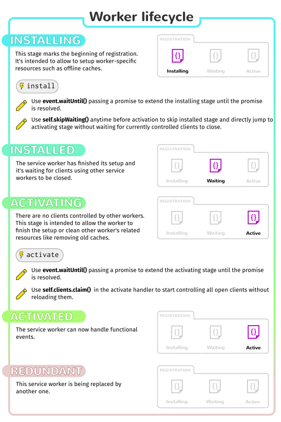

- https://segmentfault.com/a/1190000012701843
- https://developer.mozilla.org/zh-CN/docs/Web/API/Service_Worker_API/Using_Service_Workers
- https://developer.mozilla.org/zh-CN/docs/Web/API/Service_Worker_API
- https://segmentfault.com/a/1190000016446125
- https://segmentfault.com/a/1190000017079828
- https://developer.chrome.com/docs/workbox/

# 开源库
- [sw-toolbox](https://github.com/GoogleChromeLabs/sw-toolbox)


# 书籍
- https://serviceworke.rs/


# 库
- https://developer.chrome.com/docs/workbox/

# 出现SeriveWorker的背景
有一个困扰 web 用户多年的难题——丢失网络连接。即使是世界上最好的 web app，如果下载不了它，也是非常糟糕的体验。如今虽然已经有很多种技术去尝试着解决这一问题。而随着离线页面的出现，一些问题已经得到了解决。但是，最重要的问题是，仍然没有一个好的统筹机制对资源缓存和自定义的网络请求进行控制。

之前的尝试 — AppCache — 看起来是个不错的方法，因为它可以很容易地指定需要离线缓存的资源。但是，它假定你使用时会遵循诸多规则，如果你不严格遵循这些规则，它会把你的APP搞得一团糟。关于APPCache的更多详情，请看Jake Archibald的文章： [Application Cache is a Douchebag.](https://alistapart.com/article/application-cache-is-a-douchebag/)


> AppCache已经被废弃。

Service worker 最终要去解决这些问题。
- 虽然 Service Worker 的语法比 AppCache 更加复杂，但是你可以使用 JavaScript 更加精细地控制 AppCache 的静默行为。
- Service Worker 可以使你的应用先访问本地缓存资源，所以在离线状态时，在没有通过网络接收到更多的数据前，仍可以提供基本的功能（一般称之为 Offline First）。这是原生APP 本来就支持的功能，这也是相比于 web app，原生 app 更受青睐的主要原因。


# 什么是ServiceWorker
Service workers 本质上充当 Web 应用程序、浏览器与网络（可用时）之间的代理服务器。这个 API 旨在创建有效的离线体验，它会拦截网络请求并根据网络是否可用来采取适当的动作、更新来自服务器的的资源。它还提供入口以推送通知和访问后台同步 API。


# ServiceWorker和PWA的关系

PWA是一种模式。
`PWA (Progressive Web Apps) `不是一项技术，也不是一个框架，我们可以把她理解为一种模式，一种通过应用一些技术将 Web App 在安全、性能和体验等方面带来渐进式的提升的一种 Web App的模式。

`ServiceWorker `可以看做是实现pwa模式的一项技术实现。
对于` webview `来说，`Service Worker `是一个独立于js主线程的一种` Web Worker `线程， 一个独立于主线程的` Context`，但是面向开发者来说` Service Worker `的形态其实就是一个需要开发者自己维护的文件，我们假设这个文件叫做` sw.js`。通过` service worker `我们可以代理` webview `的请求相当于是一个`正向代理`的线程，fiddler也是干这些事情），在特定路径注册` service worker `后，可以拦截并处理该路径下所有的网络请求，进而实现页面资源的可编程式缓存，在弱网和无网情况下带来流畅的产品体验，所以 `service worker `可以看做是实现pwa模式的一项技术实现。


# 为什么要舍弃AppCache?
Service workers之所以优于AppCache，是因为AppCache无法支持当操作出错时终止操作。Service workers可以更细致地控制每一件事情。


# 使用前的设置
1. 在已经支持 serivce workers 的浏览器的版本中，很多特性没有默认开启。如果你发现示例代码在当前版本的浏览器中怎么样都无法正常运行，你可能需要开启一下浏览器的相关配置。
2. 你需要通过 HTTPS 来访问你的页面 — 出于安全原因，Service Workers 要求必须在 HTTPS 下才能运行。Github 是个用来测试的好地方，因为它就支持HTTPS。为了便于本地开发，localhost 也被浏览器认为是安全源。


# 基本架构
1. `service worker URL `通过` serviceWorkerContainer.register() `来获取和注册。
2. 如果注册成功，`service worker `就在` ServiceWorkerGlobalScope `环境中运行； 这是一个特殊类型的` worker `上下文运行环境，与主运行线程（执行脚本）相独立，同时也没有访问` DOM `的能力。
3. 注册成功后，`service worker `现在可以处理事件了。
4. 受` service worker `控制的页面打开后会尝试去安装` service worker`。最先发送给` service worker `的事件是安装事件(在这个事件里可以开始进行填充 IndexDB和缓存站点资源)。
5. 当` oninstall `事件的处理程序执行完毕后，可以认为` service worker `安装完成了。
6. 下一步是激活。当` service worker `安装完成后，会接收到一个激活事件(activate event)。 `onactivate `主要用途是清理先前版本的` service worker `脚本中使用的资源。
7. Service Worker 现在可以控制页面了，但仅是在 `register()` 成功后的打开的页面。也就是说，页面起始于有没有 service worker ，且在页面的接下来生命周期内维持这个状态。所以，页面不得不重新加载以让 service worker 获得完全的控制。

### 生命周期

- 使用 [`ServiceWorkerContainer.register()`](https://developer.mozilla.org/zh-CN/docs/Web/API/ServiceWorkerContainer/register) 方法首次注册service worker。如果注册成功，service worker就会被下载到客户端并尝试安装或激活。生命周期顺序：下载 -> 安装 -> 激活。
- 用户首次访问service worker控制的网站或页面时，service worker会立刻被下载。
- 如果这是首次启用service worker，页面会首先尝试安装，安装成功后它会被激活。
- 如果现有service worker已启用，新版本会在后台安装，但不会被激活，这个时序称为worker in waiting。直到所有已加载的页面不再使用旧的service worker才会激活新的service worker。只要页面不再依赖旧的service worker，新的service worker会被激活（成为active worker）。



### 事件


# 注意事项

1. service worker 是一种JS工作线程，无法直接访问DOM, 该线程通过postMessage接口消息形式来与其控制的页面进行通信;
2. 目前并不是所有主流浏览器支持 service worker, 可以通过 navigator && navigator.serviceWorker 来进行特性探测;
3. 在开发过程中，可以通过 localhost 使用服务工作线程，如若上线部署，必须要通过https来访问注册服务工作线程的页面，但有种场景是我们的测试环境可能并不支持https，这时就要通过更改host文件将localhost指向测试环境ip来巧妙绕过该问题（例如：192.168.22.144 localhost）;
4. 它设计为完全异步，同步API（如XHR和localStorage (en-US)）不能在service worker中使用。


# ServiceWorker的使用
### 注册

```js
if ('serviceWorker' in navigator) {
  navigator.serviceWorker.register('/sw-test/sw.js', { scope: '/sw-test/' }).then(function(reg) {
    // registration worked
    console.log('Registration succeeded. Scope is ' + reg.scope);
  }).catch(function(error) {
    // registration failed
    console.log('Registration failed with ' + error);
  });
}
```
- 外面的代码块做了一个特性检查，在注册之前确保` service worker `是支持的。
- 接着，我们使用` ServiceWorkerContainer.register() `函数来注册站点的` service worker`，`service worker` 只是一个驻留在我们的` app `内的一个` JavaScript `文件 (注意，这个文件的url 是相对于 origin， 而不是相对于引用它的那个 JS 文件)。
- scope 参数是选填的，可以被用来指定你想让 service worker 控制的内容的子目录。在这个例子例，我们指定了 '/sw-test/'，表示 app 的 origin 下的所有内容。如果你留空的话，默认值也是这个值， 我们在指定只是作为例子。

- 单个 service worker 可以控制很多页面。每个你的 scope 里的页面加载完的时候，安装在页面的 service worker 可以控制它。
- 每个页面不会有自己独有的worker。


> **注意**: 你的 service worker 函数像一个代理服务器一样，允许你修改请求和响应，用他们的缓存替代它们等等。


> **注意**: 关于 service workers 一个很棒的事情就是，如果你用像上面一样的浏览器特性检测方式检测发现浏览器并不支持SW，你还是可以正常地在线使用页面。与此同时，如果你在一个页面上同时使用 AppCache 和 SW , 不支持 SW 但是支持 AppCache  的浏览器，可以使用 AppCache，如果都支持的话，则会采用 SW


#### 如果注册失败了，可能是下面的原因

1. 你没有在 HTTPS 下运行你的程序
2. service worker文件的地址没有写对— 需要相对于 origin , 而不是 app 的根目录。在我们的例子例， service worker 是在 `https://mdn.github.io/sw-test/sw.js`，app 的根目录是 `https://mdn.github.io/sw-test/`。应该写成 `/sw-test/sw.js` 而非 `/sw.js`。
3.  service worker与你的app在不同的域。


另外需要注意的是：

1. service worker 只能抓取在 service worker scope 里从客户端发出的请求。
2. 最大的 scope 是 service worker 所在的地址
3. 如果你的 service worker 被激活在一个有 `Service-Worker-Allowed` header 的客户端，你可以为service worker 指定一个最大的 scope 的列表。


### 安装和激活

在你的 service worker 注册之后，浏览器会尝试为你的页面或站点安装并激活它。 


#### install事件

`install` 事件会在注册完成之后触发。`install` 事件一般是被用来填充你的浏览器的离线缓存能力。为了达成这个目的，我们使用了 Service Worker 的新的标志性的存储 API — [`cache`](https://developer.mozilla.org/zh-CN/docs/Web/API/Cache) — 一个 service worker 上的全局对象，它使我们可以存储网络响应发来的资源，并且根据它们的请求来生成key。这个 API 和浏览器的标准的缓存工作原理很相似，但是是特定你的域的。它会一直持久存在，直到你告诉它不再存储，你拥有全部的控制权。

> **注意**:  Cache API  并不被每个浏览器支持。（查看 [Browser support](https://developer.mozilla.org/zh-CN/docs/Web/API/Service_Worker_API/Using_Service_Workers#browser_support) 部分了解更多信息。） 如果你现在就想使用它，可以考虑采用一个 polyfill，比如  [Google topeka demo](https://github.com/Polymer/topeka/blob/master/sw.js)，或者把你的资源存储在 [IndexedDB](https://developer.mozilla.org/zh-CN/docs/Glossary/IndexedDB) 中。


下面是一段注册install事件的代码：

```js
this.addEventListener('install', function(event) {
  event.waitUntil(
    caches.open('v1').then(function(cache) {
      return cache.addAll([
        '/sw-test/',
        '/sw-test/index.html',
        '/sw-test/style.css',
        '/sw-test/app.js',
        '/sw-test/image-list.js',
        '/sw-test/star-wars-logo.jpg',
        '/sw-test/gallery/',
        '/sw-test/gallery/bountyHunters.jpg',
        '/sw-test/gallery/myLittleVader.jpg',
        '/sw-test/gallery/snowTroopers.jpg'
      ]);
    })
  );
});
```

- 这里我们 新增了一个 `install` 事件监听器，接着在事件上接了一个[`ExtendableEvent.waitUntil()`](https://developer.mozilla.org/zh-CN/docs/Web/API/ExtendableEvent/waitUntil) 方法——这会确保Service Worker 不会在 `waitUntil()` 里面的代码执行完毕之前安装完成。
- 在 `waitUntil()` 内，我们使用了 [`caches.open()`](https://developer.mozilla.org/en-US/docs/Web/API/CacheStorage/open) 方法来创建了一个叫做 `v1` 的新的缓存，将会是我们的站点资源缓存的第一个版本。它返回了一个创建缓存的 promise，当它 resolved 的时候，我们接着会调用在创建的缓存示例上的一个方法 `addAll()`，这个方法的参数是一个由一组相对于 origin 的 URL 组成的数组，这些 URL 就是你想缓存的资源的列表。

- 如果 promise 被 rejected，安装就会失败，这个 worker 不会做任何事情。这也是可以的，因为你可以修复你的代码，在下次注册发生的时候，又可以进行尝试。
- 当安装成功完成之后， service worker 就会激活。在第一次你的 service worker 注册／激活时，这并不会有什么不同。但是当 service worker 更新 (稍后查看 [Updating your service worker](https://developer.mozilla.org/zh-CN/docs/Web/API/Service_Worker_API/Using_Service_Workers#updating_your_service_worker) 部分) 的时候 ，就不太一样了。


### 自定义请求的响应

示例代码：

```js
this.addEventListener('fetch', function(event) {
  event.respondWith(
    caches.match(event.request).then(function() {
      return fetch(event.request).then(function(response) {
        return caches.open('v1').then(function(cache) {
          cache.put(event.request, response.clone());
          return response;
        });
      });
    }).catch(function() {
      return caches.match('/sw-test/gallery/myLittleVader.jpg');
    })
  );
});
```

- 每次任何被 service worker 控制的资源被请求到时，都会触发 `fetch` 事件，这些资源包括了指定的 scope 内的文档，和这些文档内引用的其他任何资源（比如 `index.html` 发起了一个跨域的请求来嵌入一个图片，这个也会通过 service worker 。）
- 调用 event 上的 `respondWith()` 方法来劫持我们的 HTTP 响应，然后你用可以用自己的方法来更新他们。
- `caches.match(event.request)` 允许我们对网络请求的资源和 cache 里可获取的资源进行匹配，查看是否缓存中有相应的资源。这个匹配通过 url 和 vary header进行，就像正常的 http 请求一样。
-  `caches.match(event.request)` 是非常棒的。但是如果没有匹配资源呢？如果我们不提供任何错误处理，promise 就会 reject，同时也会出现一个网络错误。如果 promise reject了， catch() 函数会执行默认的网络请求，意味着在网络可用的时候可以直接像服务器请求资源。
- 在从服务器请求资源后，会把请求到的资源保存到缓存中，以便将来离线时所用。
- 当请求没有匹配到缓存中的任何资源的时候，以及网络不可用的时候，我们的请求依然会失败。这种情况下就返回一个保底的数据。


### 更新ServiceWorker

> 第一次安装的时候，触发install事件后就会接着触发activate事件吗？第一安装和后面更新有什么区别？


比如你将代码改为：

```js
self.addEventListener('install', function(event) {
  event.waitUntil(
    caches.open('v2').then(function(cache) {
      return cache.addAll([
        '/sw-test/',
        '/sw-test/index.html',
        '/sw-test/style.css',
        '/sw-test/app.js',
        '/sw-test/image-list.js',

        …

        // include other new resources for the new version...
      ]);
    })
  );
});
```

- 如果你的` service worker `已经被安装，但是刷新页面时有一个新版本的可用，新版的 `service worker` 会在后台安装，但是还没激活。当安装发生的时候，前一个版本依然在响应请求，新的版本正在后台安装，我们调用了一个新的缓存 `v2`，所以前一个 `v1` 版本的缓存不会被扰乱。
- 当没有页面在使用当前(老的)的版本的时候，这个新的 service worker 就会激活并开始响应请求。


### activate事件

当之前版本还在运行的时候，一般被用来做些会破坏它的事情，比如摆脱旧版的缓存。在避免占满太多磁盘空间清理一些不再需要的数据的时候也是非常有用的，每个浏览器都对 service worker 可以用的缓存空间有个硬性的限制。浏览器尽力管理磁盘空间，但它可能会删除整个域的缓存。浏览器通常会删除域下面的所有的数据。

删除旧缓存：

```js
self.addEventListener('activate', function(event) {
  var cacheWhitelist = ['v2'];

  event.waitUntil(
    caches.keys().then(function(keyList) {
      return Promise.all(keyList.map(function(key) {
        if (cacheWhitelist.indexOf(key) === -1) {
          return caches.delete(key);
        }
      }));
    })
  );
});
```


# 开发者工具

`Chrome `有一个` chrome://inspect/#service-workers `可以展示当前设备上激活和存储的` service worker`。还有个 `chrome://serviceworker-internals `可以展示更多细节来允许你开始/暂停/调试` worker `的进程。未来他们会支持流量调节控制/离线模式来模拟弱网或者没网状态，这也是非常好的。


# 使用场景

- 后台数据同步
- 响应来自其它源的资源请求
- 集中接收计算成本高的数据更新，比如地理位置和陀螺仪信息，这样多个页面就可以利用同一组数据
- 在客户端进行CoffeeScript，LESS，CJS/AMD等模块编译和依赖管理（用于开发目的）
- 后台服务钩子
- 自定义模板用于特定URL模式
- 性能增强，比如预取用户可能需要的资源，比如相册中的后面数张图片
- [后台同步](https://github.com/slightlyoff/BackgroundSync)：启动一个service worker即使没有用户访问特定站点，也可以更新缓存
- [响应推送](https://developer.mozilla.org/zh-CN/docs/Web/API/Push_API)：启动一个service worker向用户发送一条信息通知新的内容可用
- 对时间或日期作出响应
- 进入地理围栏


# [API](https://developer.mozilla.org/zh-CN/docs/Web/API/FetchEvent)

### Navigator.serviceWorker

`Navigator.serviceWorker` 只读属性，返回 [关联文件](https://html.spec.whatwg.org/multipage/browsers.html#concept-document-window) 的 [`ServiceWorkerContainer`](https://developer.mozilla.org/zh-CN/docs/Web/API/ServiceWorkerContainer) 对象，它提供对[`ServiceWorker`](https://developer.mozilla.org/zh-CN/docs/Web/API/ServiceWorker) 的注册，删除，升级和通信的访问。。

### Cache

> **这是一个实验中的功能**

用来管理缓存。

### CacheStorage

> **这是一个实验中的功能**

**`CacheStorage`** 是用来管理Cache对象的。

