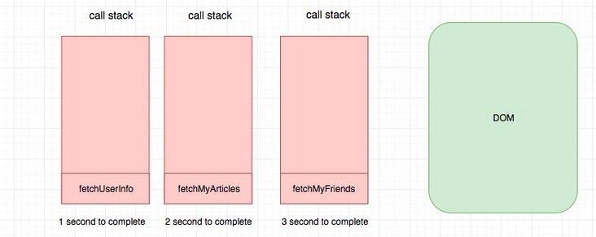
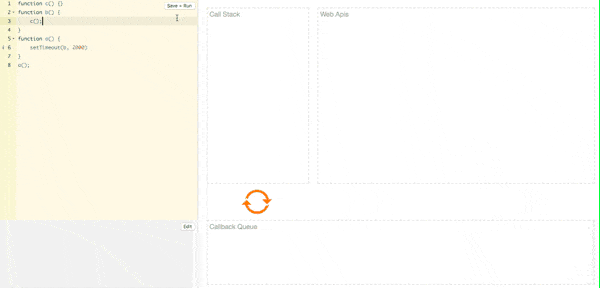
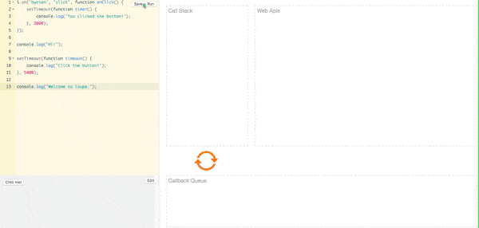
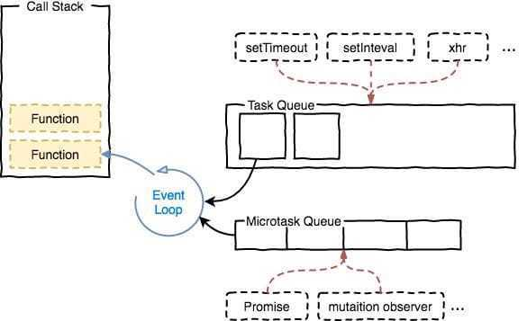

https://zhuanlan.zhihu.com/p/33058983

https://html.spec.whatwg.org/multipage/webappapis.html#event-loops

https://segmentfault.com/a/1190000021295911

## 摘要

1. js使用单线程（为什么是单线程？多线程不行？）
2. js是怎么解决单线程IO阻塞的？（异步处理）
3. 如何实现？（事件循环）
4. 事件循环是什么？


# 为什么js是单线程？

**原因之一是为了解决dom操作冲突。**在其最初也是最主要的执行环境浏览器中，我们需要进行各种各样的dom操作。试想一下 如果javascript是多线程的，那么当两个线程同时对dom进行一项操作，例如一个向其添加事件，而另一个删除了这个dom，此时该如何处理呢？因此，为了保证不会 发生类似于这个例子中的情景，javascript选择只用一个主线程来执行代码，这样就保证了程序执行的一致性。

### js是怎么解决单线程IO阻塞的？

**js是通过异步处理来解决单线程IO阻塞，所以js是线程非阻塞的。**

**线程非阻塞**则是当代码需要进行一项异步任务（无法立刻返回结果，需要花一定时间才能返回的任务，如I/O事件）的时候，主线程会挂起（pending）这个任务，然后在异步任务返回结果的时候再根据一定规则去执行相应的回调。

那异步是怎样实现的呢？通过事件循环。

### JS引擎

浏览器想要执行JS脚本，需要一个“东西”，将JS脚本（本质上是一个纯文本），变成一段机器可以理解并执行的计算机指令。这个“东西”就是JS引擎。

> 执行栈和堆。执行栈中存放正在执行的代码，堆中存放变量的值，通常是不规则的。


### 单线程 or 多线程 or 异步

`你给V8一段JS代码，它就从头到尾一口气执行下去，中间不会停止`。 为什么不停止，可以设计成可停止么，就好像C语言一样？

假设我们需要获取用户信息，获取用户的文章，获取用的朋友。


#### 单线程无异步

由于是单线程无异步，因此我们三个接口需要采用同步方式。

```javascript
fetchUserInfoSync().then(doSomethingA); // 1s
fetchMyArcticlesSync().then(doSomethingB);// 3s
fetchMyFriendsSync().then(doSomethingC);// 2s
```

由于上面三个请求都是同步执行的，因此上面的代码会先执行`fetchUserInfoSync`，一秒之后执行`fetchMyArcticlesSync`，再过三秒执行`fetchMyFriendsSync`。 最可怕的是了**JS执行栈和渲染线程是相互阻塞的**。 因此用户就在这期间根本无法操作，界面无法响应，这显然是无法接受的。


#### 多线程无异步

**由于是多线程无异步**，虽然我们三个接口仍然需要采用同步方式，但是我们可以将代码分别在多个线程执行，比如我们将这段代码放在三个线程中执行。

线程一：

```javascript
fetchUserInfoSync().then(doSomethingA); // 1s
```

线程二：

```javascript
fetchMyArcticlesSync().then(doSomethingB); // 3s
```

线程三：

```javascript
fetchMyFriendsSync().then(doSomethingC); // 2s
```



由于三块代码同时执行，因此总的时间最理想的情况下取决与最慢的时间，也就是3s，这一点和使用异步的方式是一样的（当然前提是请求之间无依赖）。为什么要说最理想呢？**由于三个线程都可以对DOM和堆内存进行访问，因此很有可能会冲突，冲突的原因和JS线程和渲染线程的冲突的原因没有什么本质不同。**因此最理想情况没有任何冲突的话是3s，但是如果有冲突，我们就需要借助于诸如`锁`来解决，这样时间就有可能高于3s了。 相应地编程模型也会更复杂，处理过锁的程序员应该会感同身受。


#### 单线程 + 异步

如果还是使用单线程，改成异步是不是会好点？问题的是关键是如何实现异步呢？这就是为什么要使用事件循环的原因。


# 事件循环是什么？

实际上浏览器的事件循环标准是由 HTML 标准规定的，具体来说就是由**whatwg规定的**，具体内容可以参考[event-loops in browser](https://html.spec.whatwg.org/multipage/webappapis.html#event-loops)。而NodeJS中事件循环其实也略有不同，具体可以参考[event-loops in nodejs](https://nodejs.org/en/docs/guides/event-loop-timers-and-nexttick/#what-is-the-event-loop)

我们在讲解`事件模型`的时候，多次提到了事件循环。 `事件`指的是其所处理的对象就是事件本身，每一个浏览器都至少有一个事件循环，一个事件循环至少有一个任务队列。**`循环`指的是其永远处于一个“无限循环”中。不断将注册的回调函数推入到执行栈。**

那么事件循环究竟是用来做什么的？浏览器的事件循环和NodeJS的事件循环有什么不同？让我们从零开始，一步一步探究背后的原因。


# 事件循环究竟是怎么实现异步的？

我们知道浏览器中JS线程只有一个，如果没有事件循环，就会造成一个问题。 即**如果JS发起了一个异步IO请求，在等待结果返回的这个时间段，后面的代码都会被阻塞。 我们知道JS主线程和渲染进程是相互阻塞的，因此这就会造成浏览器假死。** 如何解决这个问题？ 一个有效的办法就是我们这节要讲的`事件循环`。

其实**事件循环就是用来做调度的，浏览器和NodeJS中的事件循坏就好像操作系统的调度器一样。**操作系统的调度器决定何时将什么资源分配给谁。对于有线程模型的计算机，那么**操作系统执行代码的最小单位就是线程，资源分配的最小单位就是进程**，代码执行的过程由操作系统进行调度，整个调度过程非常复杂。 我们知道现在很多电脑都是多核的，为了让多个core同时发挥作用，即没有一个core是特别闲置的，也没有一个core是特别累的。操作系统的调度器会进行某一种神秘算法，从而保证每一个core都可以分配到任务。 这也就是我们使用NodeJS做集群的时候，Worker节点数量通常设置为core的数量的原因，调度器会尽量将每一个Worker平均分配到每一个core，当然这个过程并不是确定的，即不一定调度器是这么分配的，但是很多时候都会这样。

了解了操作系统调度器的原理，我们不妨继续回头看一下事件循环。 

> **事件循环本质上也是做调度的，只不过调度的对象变成了JS的执行。事件循环决定了V8什么时候执行什么代码。V8只是负责JS代码的解析和执行，其他它一概不知。浏览器或者NodeJS中触发事件之后，到事件的监听函数被V8执行这个时间段的所有工作都是事件循环在起作用。**


**对于V8来说，它有：**

- 调用栈（call stack）

> 这里的单线程指的是只有一个call stack。只有一个call stack 意味着同一时间只能执行一段代码。

- 堆（heap）


**对于浏览器运行环境来说：**

- WEB API
- DOM API
- 任务队列

> 事件来触发事件循环进行流动


以如下代码为例：

```javascript
function c() {}
function b() {
    c();
}
function a() {
    setTimeout(b, 2000)
}
a();
```

执行过程是这样的：




因此事件循环之所以可以实现异步，**是因为碰到异步执行的代码“比如fetch，setTimeout”，浏览器会将用户注册的回调函数存起来，然后继续执行后面的代码。等到未来某一个时刻，“异步任务”完成了，会触发一个事件，浏览器会将“任务的详细信息”作为参数传递给之前用户绑定的回调函数。具体来说，就是将用户绑定的回调函数推入浏览器的执行栈。**

但并不是说随便推入的，只有浏览器将当然要执行的JS脚本“一口气”执行完，要”换气“的时候才会去检查有没有要被处理的“消息”。


我们来看一下加入用户交互之后是什么样的，拿点击事件来说：

```javascript
$.on('button', 'click', function onClick() {
    setTimeout(function timer() {
        console.log('You clicked the button!');    
    }, 2000);
});

console.log("Hi!");

setTimeout(function timeout() {
    console.log("Click the button!");
}, 5000);

console.log("Welcome to loupe.");
```

上述代码每次点击按钮，都会发送一个事件，由于我们绑定了一个监听函数。**因此每次点击，都会有一个点击事件的消息产生，浏览器会在“空闲的时候”对应将用户绑定的事件处理函数推入栈中执行。**

伪代码:

```javascript
while (true) {
    if (queue.length > 0) {
        queue.processNextMessage()
    }
}
```

动画演示：




# 加入宏任务&微任务

我们来看一个更复制的例子感受一下。

```javascript
console.log(1)

setTimeout(() => {
  console.log(2)
}, 0)

Promise.resolve().then(() => {
    return console.log(3)
}).then(() => {
    console.log(4)
})

console.log(5)
```

上面的代码会输出：1、5、3、4、2。 如果你想要非常严谨的解释可以参考 whatwg 对其进行的描述 -[event-loop-processing-model](https://link.segmentfault.com/?url=https%3A%2F%2Fhtml.spec.whatwg.org%2Fmultipage%2Fwebappapis.html%23event-loop-processing-model)。

下面我会对其进行一个简单的解释。

- 浏览器首先执行宏任务，也就是我们script（仅仅执行一次）
- 完成之后检查是否存在微任务，然后不停执行，直到清空队列
- 执行RAF，页面刷新。
- 执行宏任务

其中：

**宏任务主要包含：setTimeout、setInterval、setImmediate、I/O、UI交互事件**

**微任务主要包含：Promise、process.nextTick、MutaionObserver 等**



有了这个知识，我们不难得出上面代码的输出结果。

由此我们可以看出，`宏任务&微任务`只是实现异步过程中，我们对于信号的处理顺序不同而已。如果我们不加区分，全部放到一个队列，就不会有`宏任务&微任务`。这种人为划分优先级的过程，在某些时候非常有用。


# 为什么JS执行栈和渲染线程是相互阻塞的？

我们的目标是`构建用户界面`，而传统的前端用户界面是基于DOM构建的，因此我们需要引入DOM。DOM是`文档对象模型`，其提供了一系列JS可以直接调用的接口，理论上其可以提供其他语言的接口，而不仅仅是JS。 而且除了DOM接口可以给JS调用，浏览器还提供了一些WEB API。 DOM也好，WEB API也好，本质上和JS没有什么关系，完全不一回事。JS对应的ECMA规范，**V8用来实现ECMA规范，其他的它不管。 这也是JS引擎和JS执行环境的区别，V8是JS引擎，用来执行JS代码，浏览器和Node是JS执行环境，其提供一些JS可以调用的API即`JS bindings`。**

由于浏览器的存在，现在JS可以操作DOM和WEB API了，看起来是可以构建用户界面啦。 有一点需要提前讲清楚，**V8只有栈和堆，其他诸如事件循环，DOM，WEB API它一概不知。**原因前面其实已经讲过了，因为V8只负责JS代码的编译执行，你给V8一段JS代码，它就从头到尾一口气执行下去，中间不会停止。

JS执行栈和渲染线程是相互阻塞的。为什么呢？ 本质上因为JS太灵活了，它可以去获取DOM中的诸如坐标等信息。 如果两者同时执行，就有可能发生冲突，比如我先获取了某一个DOM节点的x坐标，下一时刻坐标变了。 JS又用这个“旧的”坐标进行计算然后赋值给DOM，冲突便发生了。 

**解决冲突的方式有两种：**

1. 限制JS的能力，你只能在某些时候使用某些API。 这种做法极其复杂，还会带来很多使用不便。
2. **JS和渲染线程不同时执行就好了，一种方法就是现在广泛采用的`相互阻塞`。 实际上这也是目前浏览器广泛采用的方式。**


# 事件队列
js引擎遇到一个异步事件后并不会一直等待其返回结果，而是会将这个事件挂起，继续执行执行栈中的其他任务。

当一个异步事件返回结果后，js会将这个事件加入与当前执行栈不同的另一个队列，我们称之为事件队列。

被放入事件队列不会立刻执行其回调，而是等待当前执行栈中的所有任务都执行完毕， 主线程处于闲置状态时，主线程会去查找事件队列是否有任务。如果有，那么主线程会从中取出排在第一位的事件，并把这个事件对应的回调放入执行栈中，然后执行其中的同步代码...，如此反复，这样就形成了一个无限的循环。这就是这个过程被称为“事件循环（Event Loop）”的原因。

# macro task与micro task
当当前执行栈执行完毕时会立刻先处理所有微任务队列中的事件，然后再去宏任务队列中取出一个事件。同一次事件循环中，微任务永远在宏任务之前执行。

### 一、任务队列： 宏任务， 微任务, RAF
> 执行顺序 微任务 > RAF > Channel > 宏任务

1. 执行一个宏任务(先执行同步代码)-->
2. 执行所有微任务-->
3. UI render-->
4. 执行下一个宏任务-->
5. 执行所有微任务-->
6. UI render-->......

> 根据HTML Standard，一轮事件循环执行结束之后，下轮事件循环执行之前开始进行UI render。
> 即：macro-task任务执行完毕，接着执行完所有的micro-task任务后，此时本轮循环结束，开始执行UI render。
> UI render完毕之后接着下一轮循环。但是UI render不一定会执行，因为需要考虑ui渲染消耗的性能以及有没有ui变动。

### 二、宏任务
setTimeout()

### 三、微任务
Promise.resolve()、queueMicrotask()、MutationObserver
使用Promise.resolve和queueMicrotask、MutationObserver的优先级是一样的。
1、为什么需要使用微任务？
从微任务本身的概念来说的话，就是当我们期望某段代码，**不阻塞当前执行的同步代码，同时又期望它尽可能快地执行时**，我们就需要它

### 四、RAF
requestAnimationFrame()

### 五、channel
MessageChannel

```js
function Observer(userCallBack) {
  // 选择需要观察变动的节点
  const targetNode = document.createElement('div');

  // 观察器的配置（需要观察什么变动）
  const config = {
    attributes: true,
    childList: true,
    subtree: true
  };

  // 当观察到变动时执行的回调函数
  const callback = function (mutationsList, observer) {
    // Use traditional 'for loops' for IE 11
    // for (let mutation of mutationsList) {
    //   if (mutation.type === 'childList') {
    //     console.log('A child node has been added or removed.');
    //   } else if (mutation.type === 'attributes') {
    //     console.log('The ' + mutation.attributeName + ' attribute was modified.');
    //     userCallBack()
    //   }
    // }
    userCallBack()
    // 之后，可停止观察
    observer.disconnect();
  };

  // 创建一个观察器实例并传入回调函数
  const observer = new MutationObserver(callback);

  // 以上述配置开始观察目标节点
  observer.observe(targetNode, config);
  targetNode.id = targetNode.id == 0 ? 1 : 0
}

function channel(callback) {
  var channel = new MessageChannel();
  var port1 = channel.port1;
  var port2 = channel.port2;
  port2.onmessage = function (event) {
    callback()
  }
  port1.postMessage('');
}

setTimeout(() => {
  console.log('setTimeout')
})
channel(() => {
  console.log('channel')
})
requestAnimationFrame(() => {
  console.log('requestAnimationFrame')
})
Promise.resolve().then(() => {
  console.log('Promise')
})

Observer(() => {
  console.log('Observer')
})
queueMicrotask(() => {
  console.log('queueMicrotask')
})


console.log('sync')
```