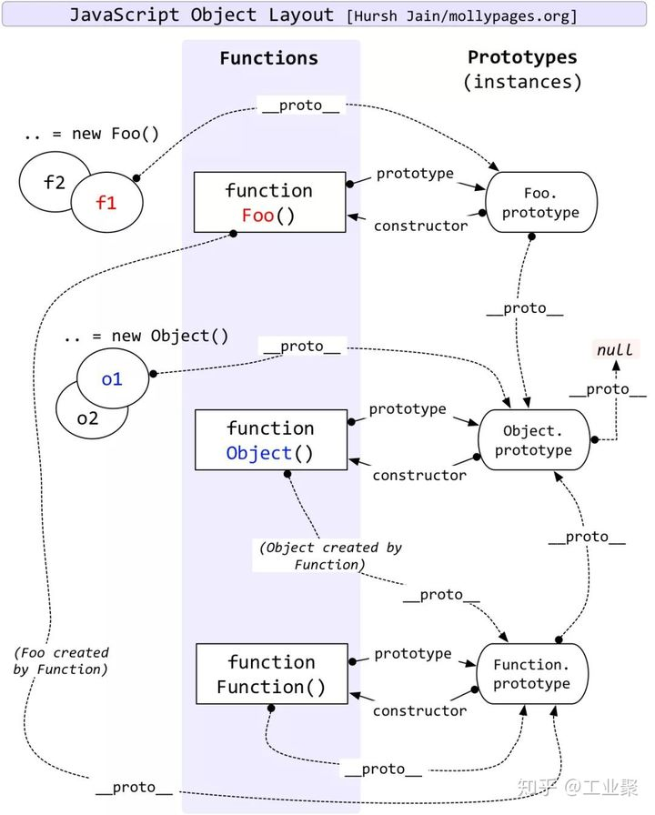

# 参考文档
-   https://zhuanlan.zhihu.com/p/87667349

# 原型和原型链

### Function、Object 的关系图



### 什么是原型？
1. 给其它对象提供共享属性的对象。
2. prototype描述的是两个对象之间的某种关系（其中一个，为另一个提供属性访问权限）。

### proto

### Object.getPrototypeOf(obj)、Object.setPrototypeOf(obj, obj1)

### 原型链

对象A的原型对象B既然是一个普通的对象，那么对象B也会有他自己的原型对象C, 依次类推C也有自己的原型对象, 直到某个对象的原型是 null 为止。
如此, 对象的原型的原型的原型...就成了一条链，就叫原型链。

> 思考：
1. 对象的属性访问过程是怎样的？
2. 对象的属性赋值是怎么样的? 赋值原型链上已有的属性？

### 原型继承方式

所谓的原型继承，就是指设置某个对象为另一个对象的原型。
1. Object.create()
- 与`Object.setPrototypeOf()`使用场景的区别？

原型式继承。

```js
// 创建对象
const user = {}

// 添加原型
Object.setPrototypeOf(user, Object.prototype)

// 扩展属性
obj.firstName = 'zhang'
obj.lastName = 'san'
```

显而易见，这样的继承方式过于繁琐。

### 构造函数加原型继承

```js
function User(firstName, lastName) {
    this.firstName = firstName
    this.lastName = lastName
}

User.prototype = Object.create(Object.prototype)
User.prototype.constructor = User

const user = new User('zhang', 'san')
```

> 对象字面量，创建对象的过程
1. 隐式的`new Object()`创建对象
2. 隐式的进行原型继承

### `Class`继承与原型继承
> class 继承
1. class 是用于创造对象的模板，所有具体的对象，都由这个对象模板 + 参数产生出来。
2. 通常来说，data 数据是由 instance 承载，而 methods 行为/方法则在 class 里。也就是说通过 class 继承，继承的是结构(数据结构)和方法。

> 与原型继承的区别
1. 基于 prototype 的继承，可以继承数据、结构和行为三者。

> 在JS中， class的继承是通过原型来模拟的。为了迎合 class 的基本行为。prototype 继承数据的能力被屏蔽了。

```js
class Test {
    a = 1
    constructor(b) {
        this.b = b
    }
    show() {
        return a + b
    }
}
```

1. class 只是语法糖而已。class 能实现的原型都能实现。
2. 语法糖不一定提供了更强的表达能力，往往相反，语法糖主要是为了开发者的便利性而设计。

### 从数据结构与算法的角度理解 prototype 和 class
1. JS Prototype 原型对应的数据结构和算法是什么？
2. 访问原型链的过程就是一个访问链表的过程。

### 原型会可能会带来的问题
1. 隐式访问原型属性让程序更不可靠，也容易带来困惑。

看下面的例子：
```js
const Obj = {
    hasOwnProperty() {
        return true
    },
}
Obj.hasOwnProperty('f') // 永远返回true
```

所以几乎所有的 js 库，都是使用下面的代码判断：

```js
const hasOwn = Object.hasOwnProperty()
hasOwn.call(Obj, 'f')
```

*它们会先将 Object.prototype.hasOwnProperty 保存在一个变量里，然后通过 call 的方式去调用。如此可以保证 hasOwnProperty 的行为，明确知道它是在 Object.prototype 层面的方法。*

2. 在原型上追加数据和方法，会影响到所有继承该原型的对象。随意修改内置对象 Array、String 等的原型会造成全局污染，引起不必要的麻烦。
    _大家认为这种做法，相当于对全局变量和命名空间的滥用。很多年前，整个前端开发社区就达成了高度的共识，如无必要，不要随意往原型上拓展方法，特别是全局构造函数里的原型。_

3. 基于 prototype 和 class 编写的代码，很难通过代码分析，在构建时进行移除不必要的代码。这项技术叫 Tree-Shaking 或者 Dead Code Elimination。

4. 不利于代码复用。
    比如 react hook 解决了 class 组件的逻辑复用问题。在 class-component 里，我们需要在同一个生命周期里做不同的事情，并且在不同的生命周期里协调同一件事情的不同阶段。


# instanceof的原理
```js
var a = {}
a.__proto__ = Array.prototype
a instanceof Array // true
```