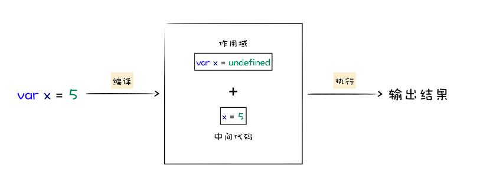

- https://github.com/Dyanwen/books/blob/master/%E5%9B%BE%E8%A7%A3GoogleV8/01_%E4%BD%A0%E7%9F%A5%E9%81%93v8%E6%98%AF%E5%A6%82%E4%BD%95%E6%89%A7%E8%A1%8Cjs%E4%BB%A3%E7%A0%81%E7%9A%84%E5%90%97%EF%BC%9F.md

# 什么是V8?
v8 是**js虚拟机**的一种 ，是由 **C 语言编写**的js引擎,目前用在chrome浏览器和node.js中,其核心功能是**将人类能够理解的编程语言js,翻译成能够理解的机器语言**。

V8是早于其他虚拟机引入了**惰性编译**, **内联缓存**,  **隐藏类**等机制,进一步优化了js代码的编译执行效率。

V8的主要功能就是结合js语言的特性和本质来编译执行它,通过深入地学习V8,你对js语言本质和设计思想会有很直观的感受。

## 如何学习V8?

js 借鉴了很多语言特性，比如

- C语言的基本语法
- java的类型系统和内存管理
- scheme的函数作为一等公民
- 还有self基于原型的继承机制

V8是js的实现,在学习V8工作原理时,我们需要额外关注js这些独特的设计思想和特性背后的实现,比如,

- 为了实现函数是一等公民的特性,js采取了基于对象的策略,
- 为了实现原型继承,V8为每个对象引入了`__proto__`属性

## V8如何执行js代码？

在了解v8如何执行js代码之前，我们首先需要知道的是高级代码是如何执行的，**主要的核心流程有两种**

- **解释执行**: 首先将输入的源代码通过**解析器**编译成中间代码,之后直接使用**解释器**解释执行中间代码,然后直接输出结果,具体流程如下。

  

- **编译执行**: 采用这种方式,也需要先将源代码转换成中间代码,然后我们的编译器再将中间代码转换成机器代码.通常编译成的机器代码是以二进制文件形式存储的,需要执行这段程序的时候直接执行二进制文件就可以了,还可以使用虚拟机将编译后的机器代码保存在内存中,然后直接执行内存中的二进制代码。

  

  

cpu只能识别机器指令，但是对于程序员来说，二进制代码是难以阅读和记忆的，于是我们将二进制指令集转换为人类可以识别和记忆的符号，这就是汇编指令集。

**汇编语言的缺点：**

  1. 不同的cpu有着不同的指令集
  2. 在编写汇编代码的时候，我们需要了解和处理器架构相关的硬件知识，比如你需要使用寄存器，内存，操作cpu等，我们在编写应用的时候，只想专心处理业务逻辑，并不想要过多理会这些处理器架构相关的细节。

因此我们需要一种屏蔽了计算机架构细节的语言,能适应多种不同`cpu`架构的语言,只专心处理业务逻辑的语言,比如`c`,`c++`,`java`,`c#`,`Python`,`js`等这些高级语言。

不同的浏览器对`js`这一门语言的实现也是不同的,例如`safari`使用的是`jscore`虚拟机,`firefox`使用了`traceMonkey`虚拟机,而chrome则使用了`v8`虚拟机。

实际上`v8`并没有采用某种单一的技术,而是**混合编译执行和解释执行这两种手段**,我们把这种混合使用编译器和解释器的技术称为**jit技术** 这是一种权衡策略,因为这两种方式都有各自的优缺点,

- 解释器执行的启动速度快,但是执行时的速度慢
 - 编译执行的启动速度慢,但是执行时的速度快

v8启动执行js之前，他需要准备执行js时所需要的一些基础环境，包括堆栈空间，全局作用域，消息循环系统，内置函数等。

- js全局执行上下文就包括了执行过程中的全局信息，比如一些内置函数，全局变量等信息。
- 全局作用域包含了一些全局变量，在执行过程中的数据都需要存放在内存中。
- v8采用了经典的堆和栈的内存管理模式，所以v8还需要初始化内存中的堆和栈机构。
- 还需要初始化消息循环系统。消息循环系统包含了消息驱动器和消息队列，它如同v8的心脏，不断接受消息并决策如何处理消息。

> 相信你注意到了，我们在解释器附近画了个监控机器人，这是一个监控解释器执行状态的模块，在解释执行字节码的过程中，如果发现了某一段代码会被重复多次执行，那么监控机器人就会将这段代码标记为热点代码。

当某段代码被标记为热点代码后，`V8`就会将这段字节码丢给优化编译器，优化编译器会在后台将字节码编译为二进制代码，然后再对编译后的二进制代码执行优化操作，优化后的二进制机器代码的执行效率会得到大幅提升。如果下面再执行到这段代码时，那么`V8`会优先选择 优化之后的二进制代码，这样代码的执行速度就会大幅提升。

不过，和静态语言不同的是，`JavaScript`是一种非常灵活的动态语言，对象的结构和属性是可 以在运行时任意修改的，**而经过优化编译器优化过的代码只能针对某种固定的结构，一旦在 执行过程中，对象的结构被动态修改了，那么优化之后的代码势必会变成无效的代码，这时 候优化编译器就需要执行反优化操作，经过反优化的代码，下次执行时就会回退到解释器解 释执行。**

> 理解了这一点，我们就可以来深入分析V8执行一段JavaScript代码所经历的主要流程了，这包括了:

- 解释执行和编译执行都有各自的优缺点，
  - 解释执行启动速度快，但是执行时速度慢
  - 编译执行启动速度慢，但是执行速度快。

为了充分地利用解释执行和编译执行的优点，规避其缺点，`V8`采用了一种权衡策略，在启动过程中采用了解释执行的策略，但是如果某段代码的执 行频率超过一个值，那么`V8`就会采用优化编译器将其编译成执行效率更加高效的机器代码。

