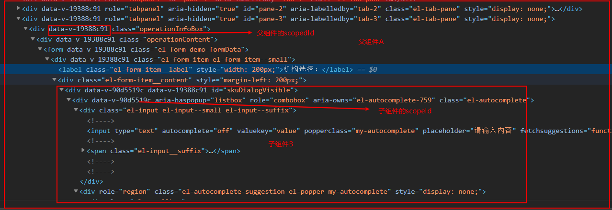

# 作用
给每一个定义的css类加上唯一标识，避免css全局污染。在没有使用scoped的情况下，比如有组件A和组件的style中定义了
同样的类`.a`, 那么打包之后的css文件中就会有两个同样的`.a`类， 当页面展示组件A或者组件B的时候样式都同时受到了定义的两个`.a`的影响。
解决办法就是在编译阶段加上一个特殊属性选择用于区分，打包后变成`.a[data-v-90d5519c]`和`.a[data-v-19388c91]`, 这样处理之后就变成了两个
不同的选择器。

# 打包之后的带有`data-v`的属性选择器是怎样起作用的呢？
在html中我们并没有定义`data-v`这样的属性， 这是在编译sfc的时候每个文件都会生成唯一的标识。
`style`代码块的`data-v`在编译的时候就已经生成了。而dom元素上的`data-v`是在创建dom的时候加上去的，在生成的js代码中
会在组件的options对象上添加`_scopeId`属性，这个属性的属性值就是`data-v`。 
这样就做到了css和html的统一。

# /deep/
`scopedId`默认是加在选择器的最后一级上的。比如说下面的例子中有组件A和组件B。在组件A中使用了组件B, 当在组件A中修改组件B的样式时：
```css
.compA .el-autocomplete {
  width: 280px;
}

/* 编译后的代码 */
.compA .el-autocomplete[data-v-19388c91] {
  width: 280px;
}
```

使用`/deep/`后
```css
.compA /deep/.el-autocomplete {
  width: 280px;
}

/* 编译后的代码 */
.compA[data-v-19388c91] .el-autocomplete {
  width: 280px;
}
```

对比下面的dom结构图， 很明显知道了deep之后起作用的原因了。



# 注意
1. 当在父组件内给子组件的根节点修改样式时，其实是不用加`/deep/`的， 因为在子组件的根节点上同时有父组件和子组件的`scopeId`
2. 当在父组件内给子组件的非根节点修改样式时需要带上`/deep/`，因为在父组件定义选择器的最后一级使用的是父组件的`scopeId`，
  而子组件中需要选择的元素却使用的是子组件的`scopeId`，所以是不会匹配上的，样式也不会生效。