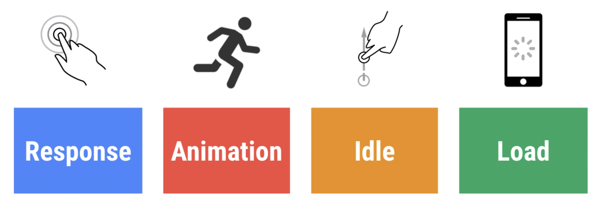

https://tuzilingdang.github.io/2019/07/04/frontend-performance-index-detail/#

# 常用性能指标

## 用户角度的`RAIL`性能模型。
RAIL 是一种以用户为中心的性能模型,在衡量一个页面的性能好坏时，站在用户角度通常我们会关注以下几个方面，其关键性能指标可见下方表格：

<table>
<thead>
<tr>
<th align="left">RAIL模型</th>
<th align="center">关键指标</th>
<th align="right">用户操作</th>
</tr>
</thead>
<tbody><tr>
<td align="left">响应</td>
<td align="center">输入延迟时间（从点按到绘制）小于 100 毫秒</td>
<td align="right">用户点按按钮（例如打开导航）</td>
</tr>
<tr>
<td align="left">动画</td>
<td align="center">每个帧的工作（从 JS 到绘制）完成时间小于 16 毫秒</td>
<td align="right">用户滚动页面，拖动手指（例如，打开菜单）或看到动画。 拖动时，应用的响应与手指位置有关（例如，拉动刷新、滑动轮播）。 此指标仅适用于拖动的持续阶段，不适用于开始阶段</td>
</tr>
<tr>
<td align="left">空闲</td>
<td align="center">主线程 JS 工作分成不大于 50 毫秒的块</td>
<td align="right">用户没有与页面交互，但主线程应足够用于处理下一个用户输入。</td>
</tr>
<tr>
<td align="left">加载</td>
<td align="center">页面可以在 1000 毫秒内就绪</td>
<td align="right">用户加载页面并看到关键路径内容</td>
</tr>
</tbody></table>

## 开发角度的性能指标

<table>
<thead>
<tr>
<th align="left">名称</th>
<th align="center">英文</th>
<th align="right">含义</th>
</tr>
</thead>
<tbody><tr>
<td align="left">FCP</td>
<td align="center">First Contentful Paint</td>
<td align="right">浏览器渲染DOM内容的第一个字节</td>
</tr>
<tr>
<td align="left">FMP</td>
<td align="center">Frist Meaningful Paint</td>
<td align="right">首次有效渲染时间</td>
</tr>
<tr>
<td align="left">FID</td>
<td align="center">Frist Input Delay</td>
<td align="right">用户实现交互操作的相应时间</td>
</tr>
<tr>
<td align="left">FCI</td>
<td align="center">First CPU Idle</td>
<td align="right">首次CPU空闲时间</td>
</tr>
<tr>
<td align="left">TTI</td>
<td align="center">Time to Interactive</td>
<td align="right">页面开始加载到稳定可交互的时间</td>
</tr>
<tr>
<td align="left">Speed Index</td>
<td align="center">Speed Index</td>
<td align="right">衡量页面内容在视觉上的填充速度</td>
</tr>
<tr>
<td align="left">FPS</td>
<td align="center">Frames Per Second</td>
<td align="right">每秒绘制的帧数</td>
</tr>
<tr>
<td align="left">白屏时间</td>
<td align="center">White Screen</td>
<td align="right">统计起始点到页面出现第一个元素的时间</td>
</tr>
<tr>
<td align="left">首屏时间</td>
<td align="center">First Screen</td>
<td align="right">页面首屏所有资源完全展示的时间</td>
</tr>
<tr>
<td align="left">内存占用空间</td>
<td align="center">Heap    Size</td>
<td align="right">内存占用空间</td>
</tr>
<tr>
<td align="left">JS 堆内存大小</td>
<td align="center">JS Heap    Size</td>
<td align="right">JS 堆内存大小</td>
</tr>
<tr>
<td align="left">DOM Nodes</td>
<td align="center">DOM 节点数</td>
<td align="right">DOM节点数量</td>
</tr>
<tr>
<td align="left">JS监听器数量</td>
<td align="center">JS Event Listeners</td>
<td align="right">JS监听器数量</td>
</tr>
<tr>
<td align="left">代码覆盖率</td>
<td align="center">coverage</td>
<td align="right">代码覆盖率</td>
</tr>
<tr>
<td align="left">关键文件大小</td>
<td align="center">key file</td>
<td align="right">关键文件大小</td>
</tr>
</tbody></table>
# 优化目标

<table>
<thead>
<tr>
<th align="left">指标</th>
<th align="center">优化目标</th>
</tr>
</thead>
<tbody><tr>
<td align="left">首屏加载时间</td>
<td align="center">小于 1s</td>
</tr>
<tr>
<td align="left">FPS</td>
<td align="center">达到60</td>
</tr>
<tr>
<td align="left">每秒动画帧数</td>
<td align="center">达到60</td>
</tr>
<tr>
<td align="left">填充速度指数</td>
<td align="center">小于1250</td>
</tr>
<tr>
<td align="left">关键文件大小 4G以下</td>
<td align="center">小于 345kb</td>
</tr>
<tr>
<td align="left">关键文件大小  Wifi</td>
<td align="center">小于 750kb</td>
</tr>
<tr>
<td align="left">关键CSS大小</td>
<td align="center">小于 15kb</td>
</tr>
<tr>
<td align="left">用户的响应时间</td>
<td align="center">小于 100ms</td>
</tr>
</tbody></table>