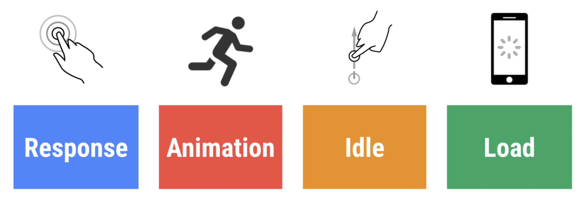
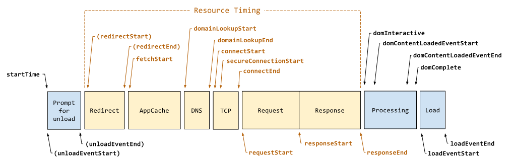

- https://tuzilingdang.github.io/2019/07/04/frontend-performance-index-detail/#
- https://web.dev/rail/

# 常用性能指标


## 用户角度的`RAIL`性能模型。

RAIL 是一种以用户为中心的性能模型,在衡量一个页面的性能好坏时，站在用户角度通常我们会关注以下几个方面，其关键性能指标可见下方表格：



<table>
<thead>
<tr>
<th align="left">RAIL模型</th>
<th align="center">关键指标</th>
<th align="right">用户操作</th>
</tr>
</thead>
<tbody><tr>
<td align="left">响应</td>
<td align="center">输入延迟时间（从点按到绘制）小于 100 毫秒</td>
<td align="right">用户点按按钮（例如打开导航）</td>
</tr>
<tr>
<td align="left">动画</td>
<td align="center">每个帧的工作（从 JS 到绘制）完成时间小于 16 毫秒</td>
<td align="right">用户滚动页面，拖动手指（例如，打开菜单）或看到动画。 拖动时，应用的响应与手指位置有关（例如，拉动刷新、滑动轮播）。 此指标仅适用于拖动的持续阶段，不适用于开始阶段</td>
</tr>
<tr>
<td align="left">空闲</td>
<td align="center">主线程 JS 工作分成不大于 50 毫秒的块</td>
<td align="right">用户没有与页面交互，但主线程应足够用于处理下一个用户输入。</td>
</tr>
<tr>
<td align="left">加载</td>
<td align="center">页面可以在 1000 毫秒内就绪</td>
<td align="right">用户加载页面并看到关键路径内容</td>
</tr>
</tbody></table>


## 开发角度的性能指标

<table>
<thead>
<tr>
<th align="left">名称</th>
<th align="center">英文</th>
<th align="right">含义</th>
</tr>
</thead>
<tbody><tr>
<td align="left">FCP</td>
<td align="center">First Contentful Paint</td>
<td align="right">浏览器渲染DOM内容的第一个字节</td>
</tr>
<tr>
<td align="left">FMP</td>
<td align="center">Frist Meaningful Paint</td>
<td align="right">首次有效渲染时间</td>
</tr>
<tr>
<td align="left">FID</td>
<td align="center">Frist Input Delay</td>
<td align="right">用户实现交互操作的相应时间</td>
</tr>
<tr>
<td align="left">FCI</td>
<td align="center">First CPU Idle</td>
<td align="right">首次CPU空闲时间</td>
</tr>
<tr>
<td align="left">TTI</td>
<td align="center">Time to Interactive</td>
<td align="right">页面开始加载到稳定可交互的时间</td>
</tr>
<tr>
<td align="left">Speed Index</td>
<td align="center">Speed Index</td>
<td align="right">衡量页面内容在视觉上的填充速度</td>
</tr>
<tr>
<td align="left">FPS</td>
<td align="center">Frames Per Second</td>
<td align="right">每秒绘制的帧数</td>
</tr>
<tr>
<td align="left">白屏时间</td>
<td align="center">White Screen</td>
<td align="right">统计起始点到页面出现第一个元素的时间</td>
</tr>
<tr>
<td align="left">首屏时间</td>
<td align="center">First Screen</td>
<td align="right">页面首屏所有资源完全展示的时间</td>
</tr>
<tr>
<td align="left">内存占用空间</td>
<td align="center">Heap    Size</td>
<td align="right">内存占用空间</td>
</tr>
<tr>
<td align="left">JS 堆内存大小</td>
<td align="center">JS Heap    Size</td>
<td align="right">JS 堆内存大小</td>
</tr>
<tr>
<td align="left">DOM Nodes</td>
<td align="center">DOM 节点数</td>
<td align="right">DOM节点数量</td>
</tr>
<tr>
<td align="left">JS监听器数量</td>
<td align="center">JS Event Listeners</td>
<td align="right">JS监听器数量</td>
</tr>
<tr>
<td align="left">代码覆盖率</td>
<td align="center">coverage</td>
<td align="right">代码覆盖率</td>
</tr>
<tr>
<td align="left">关键文件大小</td>
<td align="center">key file</td>
<td align="right">关键文件大小</td>
</tr>
</tbody></table>


# 优化目标

<table>
<thead>
<tr>
<th align="left">指标</th>
<th align="center">优化目标</th>
</tr>
</thead>
<tbody><tr>
<td align="left">首屏加载时间</td>
<td align="center">小于 1s</td>
</tr>
<tr>
<td align="left">FPS</td>
<td align="center">达到60</td>
</tr>
<tr>
<td align="left">每秒动画帧数</td>
<td align="center">达到60</td>
</tr>
<tr>
<td align="left">填充速度指数</td>
<td align="center">小于1250</td>
</tr>
<tr>
<td align="left">关键文件大小 4G以下</td>
<td align="center">小于 345kb</td>
</tr>
<tr>
<td align="left">关键文件大小  Wifi</td>
<td align="center">小于 750kb</td>
</tr>
<tr>
<td align="left">关键CSS大小</td>
<td align="center">小于 15kb</td>
</tr>
<tr>
<td align="left">用户的响应时间</td>
<td align="center">小于 100ms</td>
</tr>
</tbody></table>


# 性能指标统计方法及分析

在关注各项性能指标之前，有必要了解一下w3c标准的`Navigation Timing API` ，下图是level 2 标出的时间戳，level2 还处于`Working Draft`的阶段，即将进入`Recommendation`。`Navigation Timing`的属性对于目前我们的需要用到的性能指标有非常清晰的界定，可以提前了解一下。



Navigation Timing api 每个时间戳属性的定义可以查看下表：
<table>
<thead>
<tr>
<th align="left">属性</th>
<th align="center">含义</th>
</tr>
</thead>
<tbody><tr>
<td align="left">redirectStart</td>
<td align="center">如果发生http重定向并且是同源的，这个属性将返回重定向开始的第一个请求发生的时间，否则返回0</td>
</tr>
<tr>
<td align="left">redirectEnd</td>
<td align="center">如果发生http重定向并且是同源的，这个属性将返回最后一次重定向接收完最后一个字节的时间戳，否则返回0</td>
</tr>
<tr>
<td align="left">fetchStart</td>
<td align="center">如果请求新的资源用的是GET请求方式，该属性返回的是用户代理检查任何应用缓存之前的时间，否则返回用户代理开始请求资源的时间</td>
</tr>
<tr>
<td align="left">domainLookupStart</td>
<td align="center">当前文档进行域名查找的开始时间，如果有持久链接或者从应用缓存或本地资源读取当前文档 ，返回的值就是fetchStart</td>
</tr>
<tr>
<td align="left">domainLookupEnd</td>
<td align="center">当前文档进行域名查找结束的时间，如果有持久链接或者从应用缓存或本地资源读取当前文档 ，返回的值就是fetchStart</td>
</tr>
<tr>
<td align="left">connectStart</td>
<td align="center">与服务器建立连接的开始时间，如果有持久链接或者从应用缓存或本地资源读取当前文档 ，返回的值就是domainLookupEnd</td>
</tr>
<tr>
<td align="left">connectEnd</td>
<td align="center">与服务器建立连接的结束时间，如果有持久链接或者从应用缓存或本地资源读取当前文档 ，返回的值就是domainLookupEnd</td>
</tr>
<tr>
<td align="left">secureConnectionStart</td>
<td align="center">可选属性，没有时返回undefined，采用https协议时则返回https连接开始的时间，否则为0</td>
</tr>
<tr>
<td align="left">requestStart</td>
<td align="center">开始从服务器（或应用缓存或本地资源）请求当前实际文档的时间</td>
</tr>
<tr>
<td align="left">responseEnd</td>
<td align="center">从服务器（或应用缓存或本地资源）接收到当前实际文档最后一个字节的时间</td>
</tr>
<tr>
<td align="left">domLoading</td>
<td align="center">当前文档可读属性变成loading的时间</td>
</tr>
<tr>
<td align="left">domInteractive</td>
<td align="center">当前文档可读属性变成interactive的时间点</td>
</tr>
<tr>
<td align="left">domContentLoadedEventStart</td>
<td align="center">DOM解析完后，DOMContentLoaded 事件开始相应前的时间点</td>
</tr>
<tr>
<td align="left">domContentLoadedEventEnd</td>
<td align="center">DOM解析完后，DOMContentLoaded 事件完成的时间点</td>
</tr>
<tr>
<td align="left">domComplete</td>
<td align="center">当前文档可读属性变成complete的时间</td>
</tr>
<tr>
<td align="left">loadEventStart</td>
<td align="center">load事件开始执行的时间</td>
</tr>
<tr>
<td align="left">loadEventStart</td>
<td align="center">load事件执行结束的时间</td>
</tr>
</tbody></table>


按照上述的时间节点，我们可以计算如下的性能指标：


## 开始统计的起始点

如果加入网页重定向，unload页面的耗时，这个时间点从navigationStart开始，如果忽略前面的耗时，一般从fetchStart开始计算。


## FCP

页面文档返回第一个字节的时间，对于开发者来说这个指标非常重要，首字节的返回时间代表从后端拿到数据的整体相应耗时。


## 白屏时间

从统计起始点到页面出现第一个元素的时间，可以使用`domLoading - fetchStart` 或 `domLoading - navigationStart`。
如果采用`Navigation Timing Level 2 `的标准，则使用`domInteractive - fetchStart` 或 `domInteractive - navigationStart`。
不兼容`performance api `的情况，可以采用如下方案记录白屏时间：
```html
<!DOCTYPE html>
<html lang="en">
    <head>
        <title>测试白屏时间</title>
        <script>
            window.navigationStart = Date.now()
        </script>
        <meta charset="UTF-8">
        <meta name="viewport" content="width=device-width, initial-scale=1">
        <link href="css/style.css" rel="stylesheet">
        <script>
            window.firstPaintTime = Date.now()

            // 不兼容performance api 的情况，可以手动记录window.navigationStart的时间点
            const whiteScreen = window.firstPaintTime - performance.timing.navigationStart || window.navigationStart
        </script>
    </head>
    <body>
        <div>Test</div>
    </body>
</html>
```


## 首屏时间

页面首屏所有资源完全展示的时间。从视觉角度来看非常容易观测，但是前端比较难确定这个时间点。可以采用下面几种方法来记录：


### 1、performance API

`performance.timing.domContentLoadedEventEnd - performance.timing.fetchStart`。


### 2、首屏加载最慢图片的加载完成时间

如果首屏图片比较多，一般加载最慢的是图片，所以电商类活动开发的页面中，图片多的情况通常可参照如下代码：

```html
<!DOCTYPE html>
<html lang="en">
    <head>
        <title>测试首屏加载时间</title>
        <script>
            window.navigationStart = Date.now()
        </script>
        <meta charset="UTF-8">
        <meta name="viewport" content="width=device-width, initial-scale=1">
        <link href="css/style.css" rel="stylesheet">
        <script>
            window.firstPaintTime = Date.now()

            // 不兼容performance api 的情况，可以手动记录window.navigationStart的时间点
            const whiteScreen = window.firstPaintTime - performance.timing.navigationStart || window.navigationStart
        </script>
    </head>
    <body>
        <div>Test</div>
        
        
        

        <script>
            window.onload = function() {
            	   // 首屏加载时间
                window.firstScreen = window.lastImgLoadTime - performance.timing.navigationStart || window.navigationStart
            }

            function onImgLoad() {
                window.lastImgLoadTime = Date.now()
            }     
        </script>
    </body>
</html>
```


### 3、根据代码执行顺序

图片不多，但首屏逻辑较为复杂的情况下: 比如调用接口多且复杂耗时。
可以找到首屏最后加载出数据的js执行函数，手动记录该时间，再减去上述的navigationStart时间。


## FPS

上述几个指标对首次加载页面的体验影响非常直接，整个页面都稳定的后，用户滚动或拖动页面，展示动画的流畅度可以通过FPS来观查。 FPS表示的是每秒钟浏览器更新的图片帧数。按照上述的RAIL模型，每个帧的工作（从 JS 到绘制）完成时间小于 16 毫秒，1s内完成的帧数就是1000/16， 大概是60帧左右。低于30 FPS 以下的动画，就让人感觉到明显的卡顿和不适了。


## 速度指数：Speed Index

速度指数代表页面的填充速度。


## 内存

当我们在写代码时要时刻提醒自己：更多的内存 === 更好的性能。长时间运行的应用应该处于稳定的状态，内存理论上会围绕一个常量震动。整体页面的性能不好，会导致页面卡顿，白屏等现象。


### 内存问题的现象

1. 页面性能随使用时间的延长越来越差。
可能是内存泄露，用户浏览页面的时间越长，可能由于页面的错误导致占用的内存越来越多。

2. 页面的性能一直很差。
可能是内存膨胀，页面使用的内存比实际应该使用的要多。

3. 页面出现延迟或者经常卡顿暂停。
可能由于垃圾回收过于频繁，浏览器进行垃圾回收时会造成脚本执行的阻塞。