## Web Vitals ？

什么是 Web Vitals ，Google 给的定义是一个良好网站的基本指标 (Essential metrics for a healthy site)，为什么还要再定义一个新的指标集，原因是过去要衡量一个好的网站，需要使用的指标太多，推出 Web Vitals 是简化这个学习的曲线，站主只要观注 Web Vitals 指标表现即可。

而在 Web Vitals 指标中，Core Web Vitals 是其中最重要的核心，目前包含三个指标：

- **LCP 显示最大内容元素所需时间** (衡量网站初次载入速度)
- **FID 首次输入延迟时间** (衡量网站互动顺畅程度)
- **CLS 累计版面配置移转** (衡量网页元件视觉稳定性)

指标标准如下图。

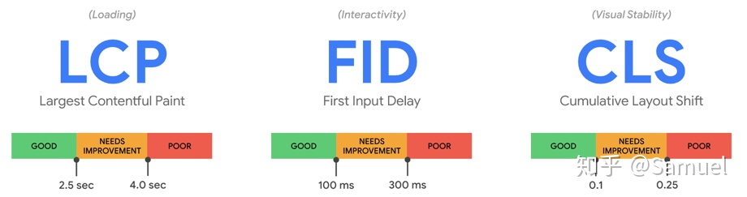

这三个指标不是突然出现的，如 LCP 在 [WICG](https://link.zhihu.com/?target=https%3A//wicg.io/) 已经孵化至少 1 年以上，FID 在 [Google Chrome Labs](https://link.zhihu.com/?target=https%3A//github.com/GoogleChromeLabs) 上已经实施 2 年以上，LCP 和 CLS (相关 [Layout Instability API](https://link.zhihu.com/?target=https%3A//wicg.github.io/layout-instability/)) 已于今年入 [W3C](https://link.zhihu.com/?target=https%3A//www.w3.org/) 草拟标准。而 Core Web Vitals 为何精挑这三个指标，让我们来细部了解其内容。

## 技术实践

**衡量网站初次载入速度**

在过去的翻页设计，常用 [load](https://link.zhihu.com/?target=https%3A//developer.mozilla.org/en-US/docs/Web/Events/load) 和 [DOMContentLoaded](https://link.zhihu.com/?target=https%3A//developer.mozilla.org/en-US/docs/Web/Events/DOMContentLoaded) 事件反应页面元件完成载入，但为了更精准地抓到页面到完成渲染的持续时间，得使用 [FCP](https://link.zhihu.com/?target=https%3A//w3c.github.io/paint-timing/%23first-contentful-paint) 指标。不过在 [SPA](https://link.zhihu.com/?target=https%3A//en.wikipedia.org/wiki/Single-page_application) 的时代，页面常常一开始是先显示一个载入图示，此时，FCP 就很难反应页面初次载入直到 Web 能够提供使用的那个时间点。[FMP](https://link.zhihu.com/?target=https%3A//web.dev/first-meaningful-paint/) 和 [Speed Index](https://link.zhihu.com/?target=https%3A//web.dev/speed-index/) 尝试帮助抓到此时间点，不过衡量标准过于复杂，不易推广。

延伸阅读: [FMP 算法](https://link.zhihu.com/?target=https%3A//docs.google.com/document/d/1BR94tJdZLsin5poeet0XoTW60M0SjvOJQttKT-JK8HI/view) 、[Speed Index 算法](https://link.zhihu.com/?target=https%3A//sites.google.com/a/webpagetest.org/docs/using-webpagetest/metrics/speed-index)

WICG 上则孵化了一个新的指标 LCP ，简单清楚地以网页 Viewport 最大 Element 载入为基准点，衡量标准如下图所示，在 2.5 秒内载完最大 Element 为良好的网页载入速度。

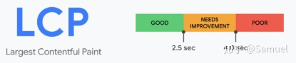

其最大指的是实际 Element 长宽大小，Margin / Padding / Border 等 CSS 大小效果不计入。包含的种类 为 , <image>, url(…), <video> 及包含文字节点的 Block 或 Inline Element，未来可能会再加入 <svg> 。

因为网页上的 Element 可能持续加载，最大的 Element 也可能持续改变 (如文字载入完，然后载入图片) ，所以当每一个当下最大的 Element 载完，浏览器会发出一个 PerformanceEntry Metric，直到使用者可以进行 Keydown / Scrolling / Tapping 等操作，Browser才会停止发送 Entry，故只要抓到最后一次 Entry ，即能判断 LCP 的持续时间。

如下图所示，绿色区域是 LCP 不断改变的侦测对象，也能看到 FCP 与 LCP 的判断差异。

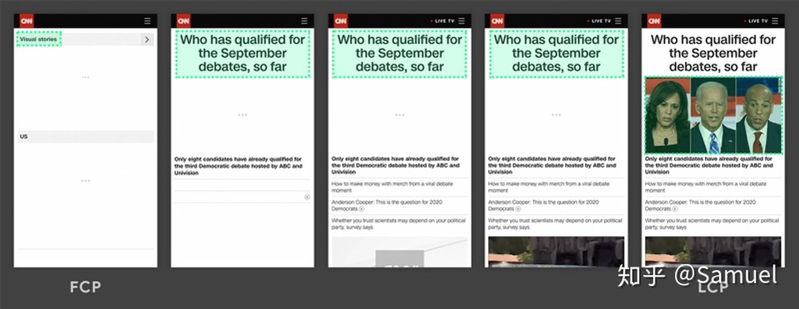

下图可以看到一开始的 <svg> 图片并没有被计入 LCP 的侦测对象。

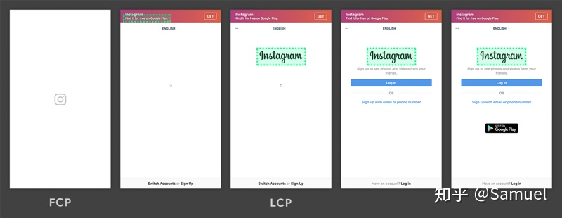

开发者可透过 PerformanceObserver 及设定 Type 'largest-contentful-paint' 拿到 LCP 的时间，如下图所示。(建议使用 Chrome v83 以上版本)

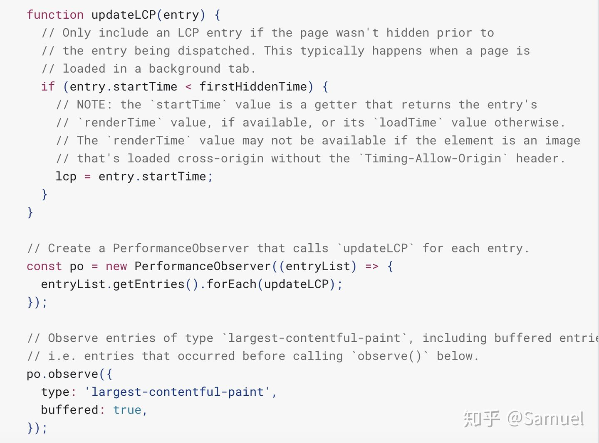

**衡量网站互动顺畅程度**

如何衡量网站操作的顺畅程度，Google 采用 FID 指标，其定义为在 [TTI](https://link.zhihu.com/?target=https%3A//web.dev/tti/) 的时间内第一个互动事件的开始时间与浏览器回应事件的时间差，其互动事件为单次事件如 Clicks / Taps / Key Presses 等，其他连续性事件 Scrolling / Zooming 则不计，如下图所示。

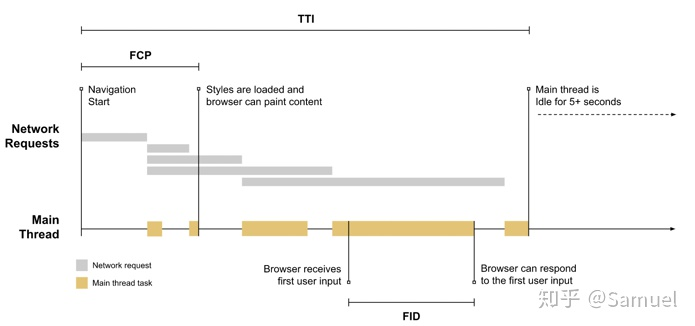

为什么要取在 TTI 发生的第一次的操作事件，Google 给的理由有以下三点:

- 使用者的第一次互动体验印象相当重要
- 当今网页最大的互动性问题通常发生在一开始载入时
- 页面载入完后的第二次操作事件延迟，有其他专门的改善解决建议

其指标衡量标准如下图所示。

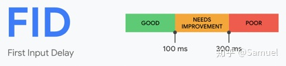

但是 FID 的计算有其明显的问题，如当使用者在 Main Thread 闲置时操作，那 FID 可能就短，若不操作则 FID 则无法计算。这对开发者来说，很难去衡量网站的 FID 符合良好的标准，所以 Google 给的建议是透过降低 [TBT](https://link.zhihu.com/?target=https%3A//web.dev/tbt/) 的时间来降低 FID 的值，当 TBT 越短，其 FID 就越好。

开发者可透过 PerformanceObserver 及设定 Type 'first-input' 拿到 FID 的时间，如下图所示。(建议使用 Chrome v83 以上版本)

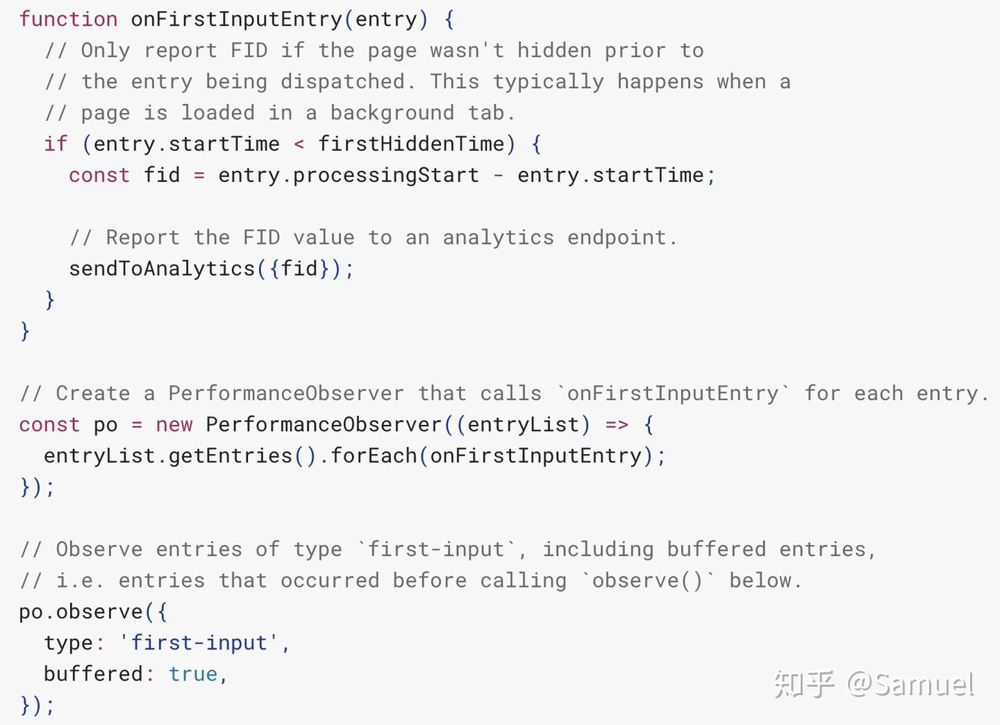

**衡量网页元件视觉稳定性**

相信大家在操作网页时，常常发生以下误点的情况，让人对此 Web 的印象相当不好。

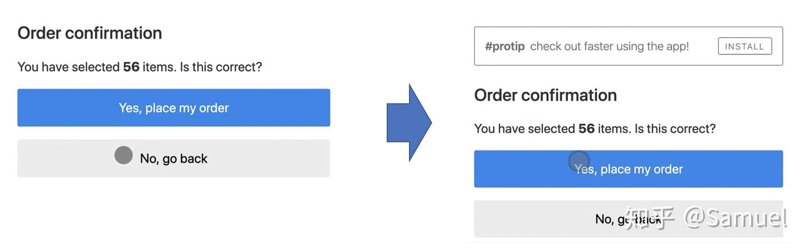

为了衡量此体验指标，Google 基于 Layout Instability API 建立 CLS 指标，衡量标准如下图所示。

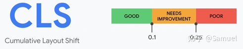

其 CLS 代表的是每个 Element 非預期位移的累积，而每个位移的算法如下:

元件位移分數 (Layout Shift Score) = 影響範圍 (Impact Fraction) * 移動距離 (Distance Fraction)

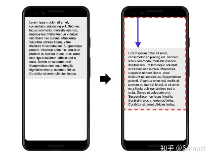

如上例来说，影响范围 (红色) 占比 Viewport 75% ，箭头 (紫色) 移动占 Viewport 的 height 25%，故 0.75 * 0.25 = 0.1875

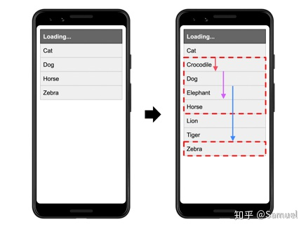

上例影响范围 (红色) 占 Viewport 38%，单个 Zebra 箭头 (蓝色) 移动最大占 Viewport height 30% ，故 0.38 x 0.3 = 0.114。依序将每个移位的元件之位移分數累计起来即是 CLS。(透过 Layout Instability API 即可拿到目前可视元件在每两个 Frame 间的位置异动信息)

算法已经了解了，**但是指标定义的"期望"如何定义，Google 给的解释如下**：

Layout Shifts 的发生与使用者的互动是关联的，如透过点击一个连结、按了一个按钮或在搜寻框打字。

故在使用者操作后的 500ms 内的 Layout Shifts Performance Entry 的 hadRecentInput 标识为 true ，将不被计入 CLS 指标内。所以如载入一个下拉式选单内容，使用者送了一个 AJAX 至后端，前端应先建立空白区块 (位移不被计入 CLS)，并放入载入图示，于信息回传后填入空白区域，而不是载入后才配置区块空间。

Layout Shifts 的发生与使用者的互动是关联的，如透过点击一个连结、按了一个按钮或在搜寻框打字。

故在使用者操作后的 500ms 内的 Layout Shifts Performance Entry 的 hadRecentInput 标识为 true ，将不被计入 CLS 指标内。所以如载入一个下拉式选单内容，使用者送了一个 AJAX 至后端，前端应先建立空白区块 (位移不被计入 CLS)，并放入载入图示，于信息回传后填入空白区域，而不是载入后才配置区块空间。

开发者可透过 PerformanceObserver 及设定 Type 'layout-shift' 拿到 Layout Shift 的时间，如下图所示。(建议使用 Chrome v83 以上版本)

开发者可透过 PerformanceObserver 及设定 Type 'layout-shift' 拿到 Layout Shift 的时间，如下图所示。(建议使用 Chrome v83 以上版本)

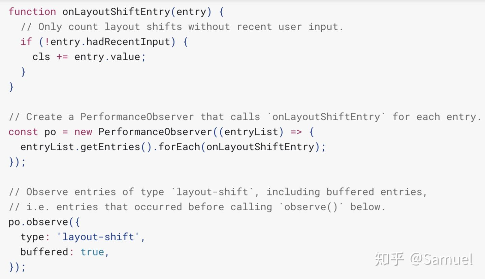

**其他**

- Core Web Vitals 的指标衡量针对单一网页，但是一个良好的网站，应该是 75 % 的 PV 都能取得良好的程度才能称得上是良好的网站。
- 某些动画效果是用来做为引导使用者，CSS 的 transform 不会被计入 CLS 。
- FID 对应到 RAIL 的 R，Scrolling / Zooming 对应到 RAIL 的 A。

## 推广

Google 总共在六种工具上新增了 Web Vitals 的衡量功能，如下图所示。

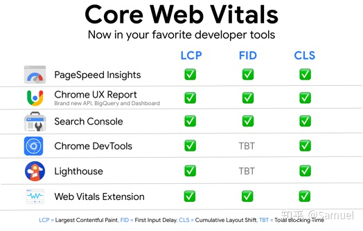

其中推荐 [PageSeed Insights](https://link.zhihu.com/?target=https%3A//developers.google.com/speed/pagespeed/insights/) 和 [Web Vitals Extension](https://link.zhihu.com/?target=https%3A//chrome.google.com/webstore/detail/web-vitals/ahfhijdlegdabablpippeagghigmibma) 来简易测试网站的表现分数。

Google 此次大幅度地推出六样工具，基于过去推行的几次量化指标成效没有很明显 (如 RAIL)，2021 年后可能将 Web Vitals 表现纳入自家搜寻引擎排序演算法中，半强迫地让众多仰赖来客流量的站主能事前利用这些工具改善体验分数，表现良好的网站还能优先出现在 Google Search Top Stories，另外线上也推出相关主题活动可以参与了解 ([web.dev LIVE](https://link.zhihu.com/?target=https%3A//web.dev/live/))。

## 业务整合

Google 积极在使用者体验量化上定出标准，对自家的云业务也进行了深度的整合，尽可能地提供各式各样的工具给经营网站的站主，此模式透过站主深入到各式各样的网站经营，让 Web Vitals 能变成是业界使用者体验量化的衡量标准。以下列出 [BigQuery](https://link.zhihu.com/?target=https%3A//cloud.google.com/bigquery) 和 [Google Data Studio](https://link.zhihu.com/?target=https%3A//datastudio.google.com/) 整合 Web Vitals 的使用方式。

Google 在 BigQuery 上有提供各式网站的 [CrUX 报表](https://link.zhihu.com/?target=https%3A//developers.google.com/web/tools/chrome-user-experience-report)资讯并且免费查询 (有限查询量)，Google 也提供了不少查询的 SQL 的[范例](https://link.zhihu.com/?target=https%3A//github.com/GoogleChrome/CrUX/tree/master/sql)可以参考， 如下图为淘宝在 2020 年 5 月 1 日所收集到的 Web Vitals 表现 (p75_lcp 2000ms 为表现良好)，此数值呈现各使用者不同装置下的 75% 体验表现，能提供给站主较客观的资讯。

延伸阅读: CrUX 的收集 [API](https://link.zhihu.com/?target=https%3A//docs.crux.run/%23/api%3Fid%3Dgetting-started)

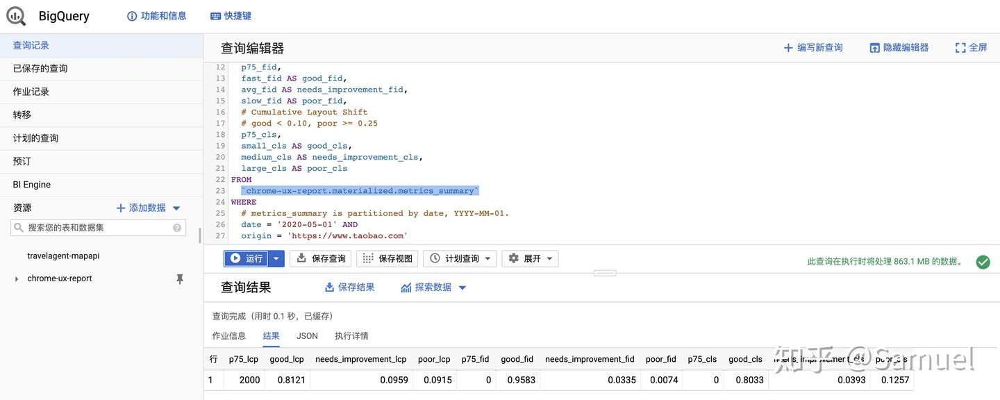

在 Data Studio 上能选取 CrUX Report 插件做为数据源产出制定报表，如下图。

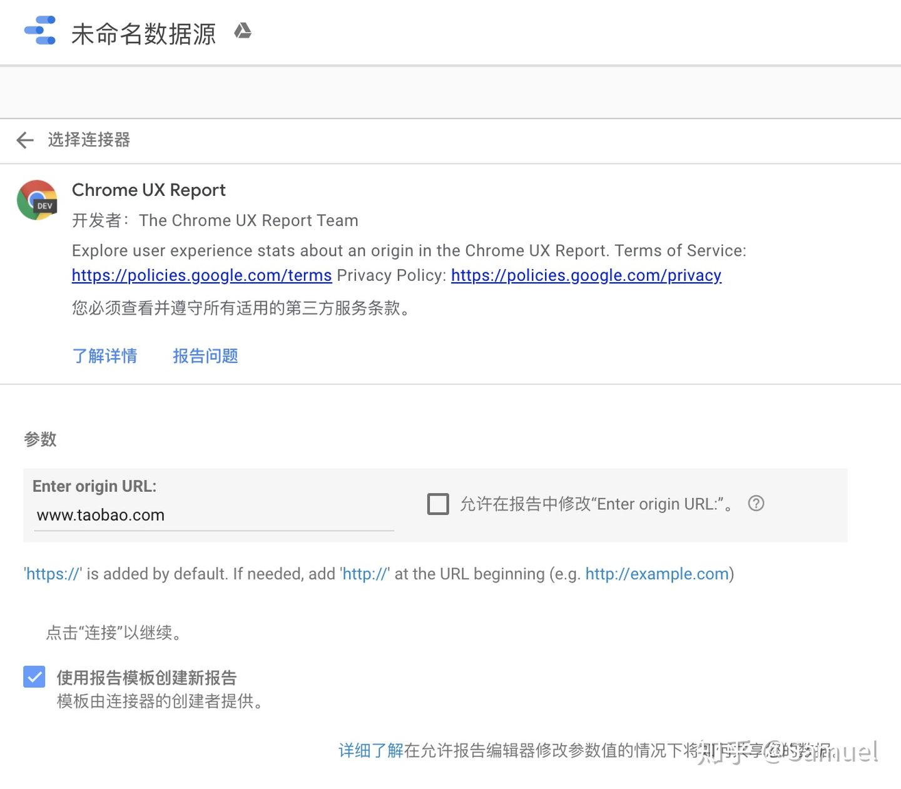

下一步浏览各字段设定。

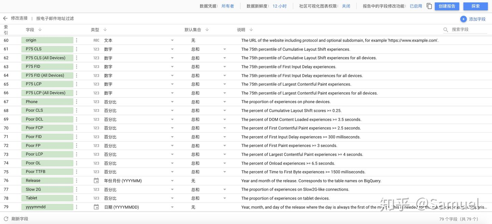

接下来报表就产生在 Data Studio ，如下图。

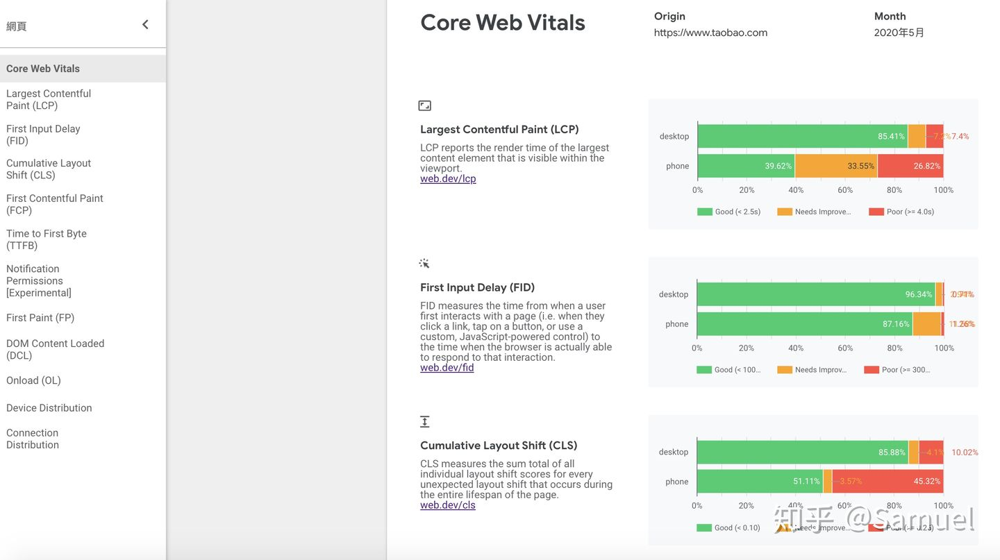

除了 Core Web Vitals 指标以外，还包含使用设备类型及连线网路类型。

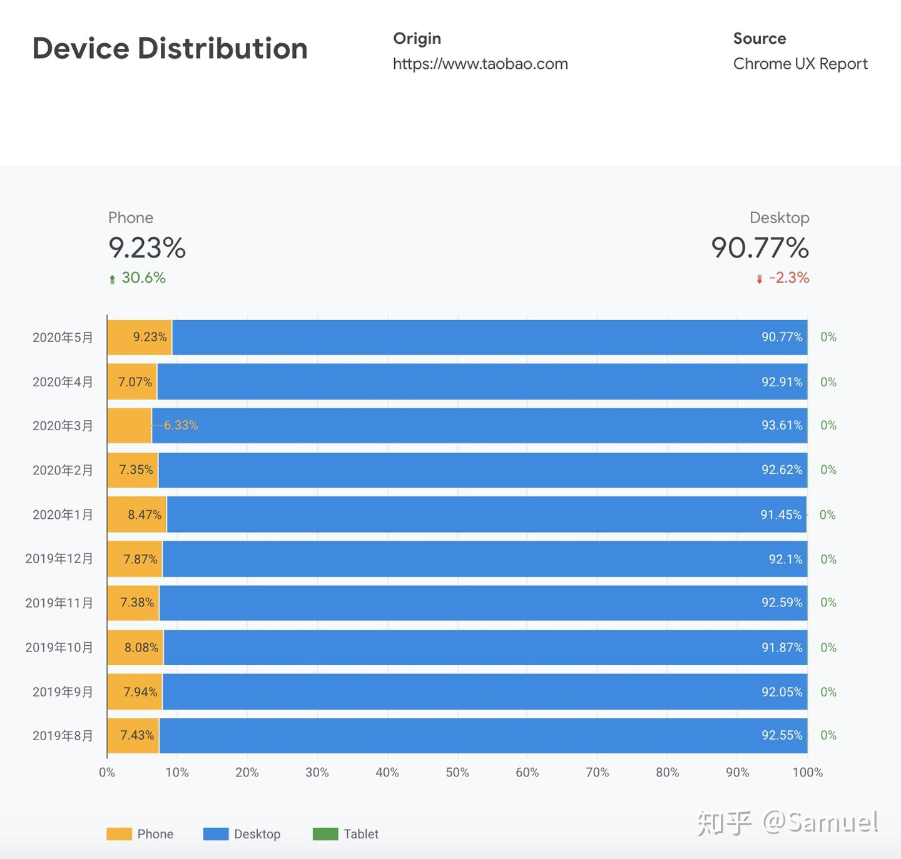

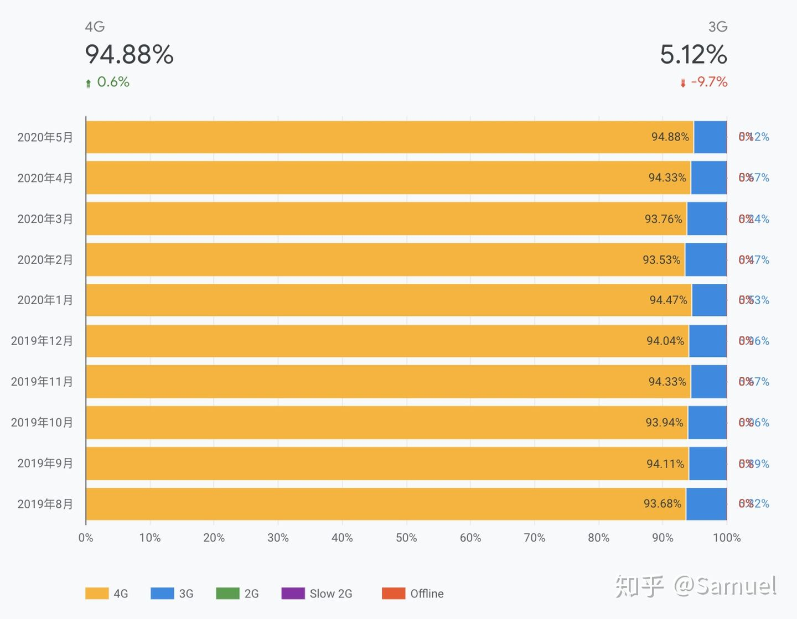

这对于管理网站的站主而言是一个简易了解整个使用者体验及数据分析的方式，如果要进阶处理细部资讯，能选择 BigQuery 插件作为数据源。

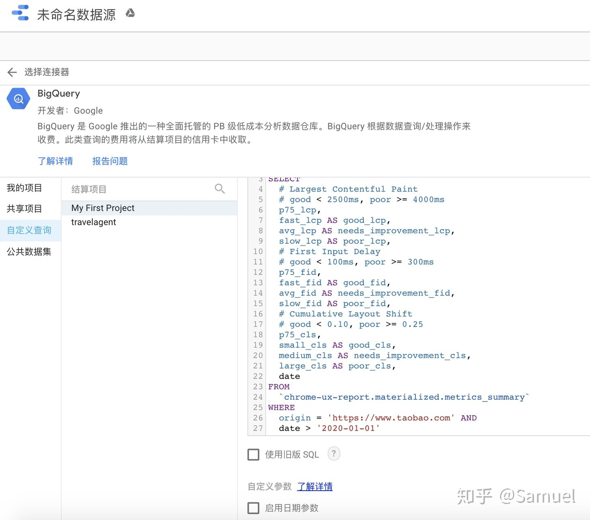

浏览各字段设定。

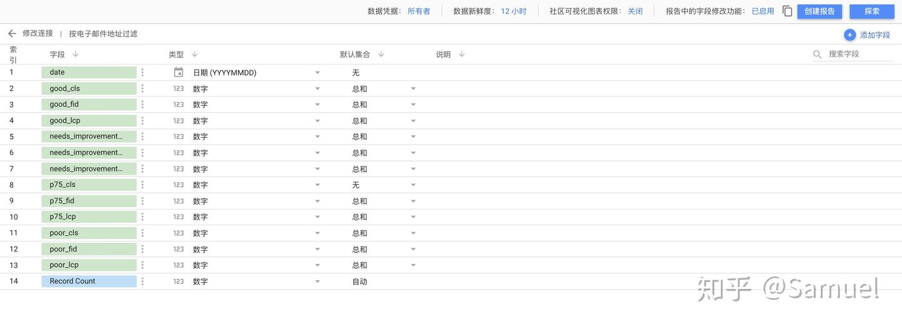

透过设定图表了解每月 Web Vitals 指标变化，如下图。

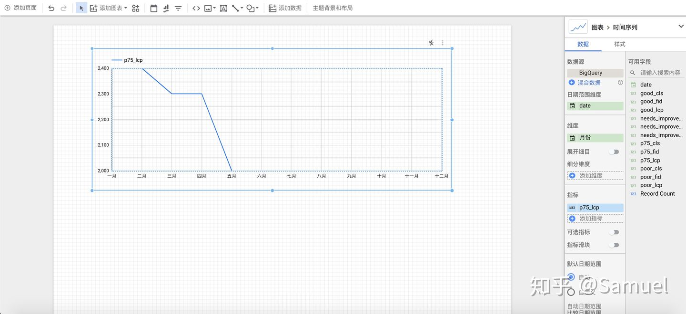

下图为手机及桌机上 LCP 的每月表现。

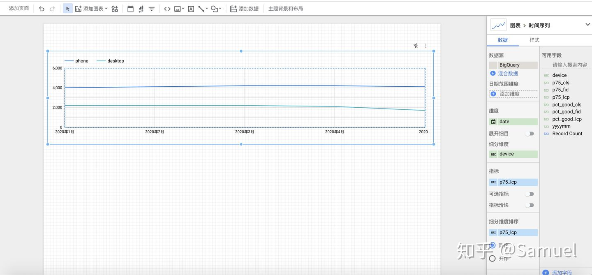

利用以上工具 (另还有 [Google Analytics](https://link.zhihu.com/?target=https%3A//analytics.google.com/analytics/web/) 和 [Search Console](https://link.zhihu.com/?target=https%3A//search.google.com/search-console/about) 数据源插件)，站主能透过这些不同插件的数据源结合网站营运资料来进行综合分析，如营收、获利和使用者体验的关系。

## 小结

Google 在 Web 上的扎根与投资是非常长期的，从一开始对面微软来说也是很渺小，十年累积的发展成果，使之越来越有话语权。而单看使用者体验量化标准制定的发展策略，我们可以看到 Google 把所得的数据再回馈到既有业务的 BigQuery 与 DataStudio 进行分析，对 Google 自己和网站经营者都是鱼帮水水帮鱼，让使用 Google Search 出来的网站都是体验良好的网站，并且丰富了 Google 应用生态圈。

虽然说 Google 所提出的使用者体验量化指标不一定完全适合于我们，但是其数据使用方式及生态圈建立都是我们能取经的地方，我们也能从中学习 Google 如何兼顾利用使用者体验的量化资讯以及提升整个体验层次。

[阿里体验管理平台 (AEM)](https://link.zhihu.com/?target=https%3A//aem.alibaba-inc.com/) 已经涵盖 Core Web Vitals 三项指标，未来我们也能利用此平台将收集到的信息再加以加工回馈到我们的产品生态圈中，进而提升整体产品服务体验水平。

编辑于 2020-07-04

[前端开发](https://www.zhihu.com/topic/19550901)

[bigquery](https://www.zhihu.com/topic/19965488)

[用户行为分析](https://www.zhihu.com/topic/19665467)