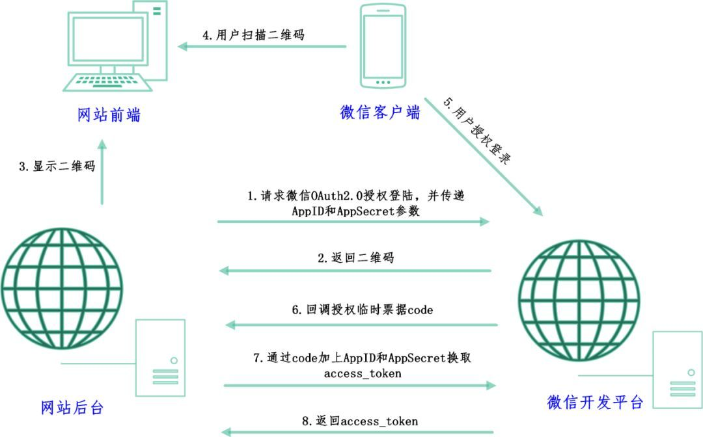

# 参考文档
https://segmentfault.com/a/1190000015469221

# 用户操作流程
1. 进入网页登陆界面，随机生成一个二维码；
2. 用户通过手机扫描二维码，将微信账号与二维码绑定；
3. 用户在手机微信点击登录按钮，授权网页登录微信账号；
4. 网页获得用户的账号信息，将数据显示。


# 背后的原理
1. 网站页面刷新，网页后台向微信后台请求授权登录；
2. 微信后台返回登录所需二维码；
3. 用户通过手机扫描二维码，并在手机上授权登录后，微信后台告知网页后台已授权；
4. 网页后台向微信后台请求微信账号数据；
5. 微信后台返回账号数据；
6. 网页后台接收数据并通过浏览器显示；




# 以qq邮箱的的微信扫码登录为例
1. 在页面中使用`iframe`, 向微信服务器请求一个二维码，参数上带有扫码成功后的重定向地址
```js
https://open.weixin.qq.com/connect/qrconnect?appid=wx5e893ac3cc590290&redirect_uri=https%3A%2F%2Fwx.mail.qq.com%2Flogin%2Flogin%3Fauth_type%3D1%26return_target%3D5%26delegate_url%3Dhttps%253A%252F%252Fmail.qq.com%252Fcgi-bin%252Freadtemplate%253Fcheck%253Dfalse%2526t%253Dloginpage_new_jump_for_xmail&self_redirect=false&response_type=code&scope=snsapi_login&state=state&href=https%3A%2F%2Fres.wx.qq.com%2Fa%2Fwebmail%2Fxmail%2Fres%2Fcss%2Fiframe_wx38793b.css
```
2. 在iframe中就会生成二维码
3. 用户微信客户端扫码后，网页会提示扫码成功，并且微信客户端会出现确认登录的按钮。
4. 用户扫码成功后页面发起重定向并且在重定向的地址上会带有用于识别用的code。拿到code就可以从微信服务端拿到用户的信息了。