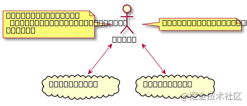

https://juejin.cn/post/6844904017487724557

## 快速生成项目
- https://github.com/ykfe/ssr
- next.js
- https://github.com/ykfe/egg-react-ssr
- https://github.com/manuelbieh/react-ssr-setup
- https://github.com/cereallarceny/cra-ssr 

## CSR & SSR

### 客户端渲染（Client Side Rendering）

- **CSR 渲染流程：**

### 服务端渲染（Server Side Rendering）

- 是指将单页应用（SPA）在**服务器端**渲染成 HTML 片段，发送到浏览器，然后交由浏览器为其绑定状态与事件，成为完全可交互页面的过程。（**PS：本文中的 SSR 内容都是围绕同构应用来讲的**）
- **SSR 渲染流程：**
- 服务端只负责首次“渲染”（真正意义上，只有浏览器才能渲染页面，服务端其实是生成 HTML 内容），然后返回给客户端，客户端**接管**页面交互（事件绑定等逻辑），之后客户端路由切换时，直接通过 JS 代码来显示对应的内容，不再需要服务端渲染（只有页面刷新时会需要）

## 为什么要用 SSR

**优点：**

- **更快的首屏加载速度**：无需等待 JavaScript 完成下载且执行才显示内容，更快速地看到完整渲染的页面，有更好的用户体验。
- 更友好的 SEO：
  - 爬虫可以直接抓取渲染之后的页面，CSR 首次返回的 HTML 文档中，是空节点（root），不包含内容，爬虫就无法分析你的网站有什么内容，所以就无法给你好的排名。而 SSR 返回渲染之后的 HTML 片段，内容完整，所以能更好地被爬虫分析与索引。

- 基于旧版本的搜索引擎：我们会给 html 加 title 和 description 来做简单的 seo 优化，这两个本质上并不会提高搜索的排名，而是提高网站转化率。给网站提供更多的描述，让用户有点击的欲望，从而提高排名。

- 基于新版本的搜索引擎（全文搜索）：想要光靠上面两个来给网站有个好的排名是不行的，所以需要 SSR 来提供更多的网站内容

**缺点：**
- 对服务器性能消耗较高
- 项目复杂度变高，出问题需要在前端、node、后端三者之间找
- 需要考虑 SSR 机器的运维、申请、扩容，增加了运维成本（可以通过 Serverless 解决）

  

## 什么是同构应用

- **一套代码既可以在服务端运行又可以在客户端运行，这就是同构应用。**
- 在服务器上生成渲染内容，让用户尽早看到有信息的页面。一个完整的应用除包括纯粹的静态内容以外，还包括各种事件响应、用户交互等。这就意味着在浏览器端一定还要执行 JavaScript 脚本，以完成绑定事件、处理异步交互等工作。
- 从性能及用户体验上来看，服务端渲染应该表达出页面最主要、最核心、最基本的信息；而浏览器端则需要针对交互完成进一步的页面渲染、事件绑定等增强功能。所谓同构，就是指前后端共用一套代码或逻辑，而在这套代码或逻辑中，理想的状况是在浏览器端进一步渲染的过程中，判断已有的 DOM 结构和即将渲染出的结构是否相同，若相同，则不重新渲染 DOM 结构，只需要进行事件绑定即可。
- 从这个维度上讲，同构和服务端渲染又有所区别，同构更像是服务端渲染和浏览器端渲染的交集，它弥补了服务端和浏览器端的差异，从而使得同一套代码或逻辑得以统一运行。同构的核心是“同一套代码”，这是脱离于两端角度的另一个维度。

# 创建自己的SSR项目
1. 创建node服务器
2. 修改webpack配置
3. 在服务端渲染时异步数据怎么回填
4. 注意组件的同构（需要同时能够在浏览器和node环境运行正常）, node环境下能执行的生命周期有哪些。
    - http://www.ayqy.net/blog/react-ssr-api/
5. router和redux

