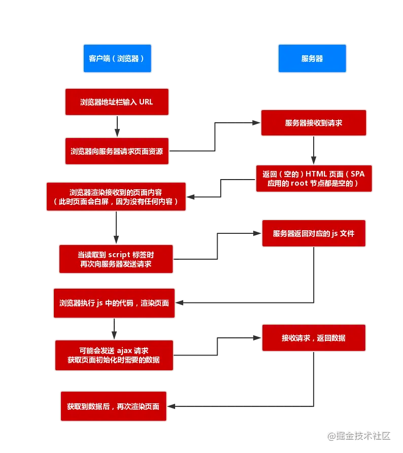
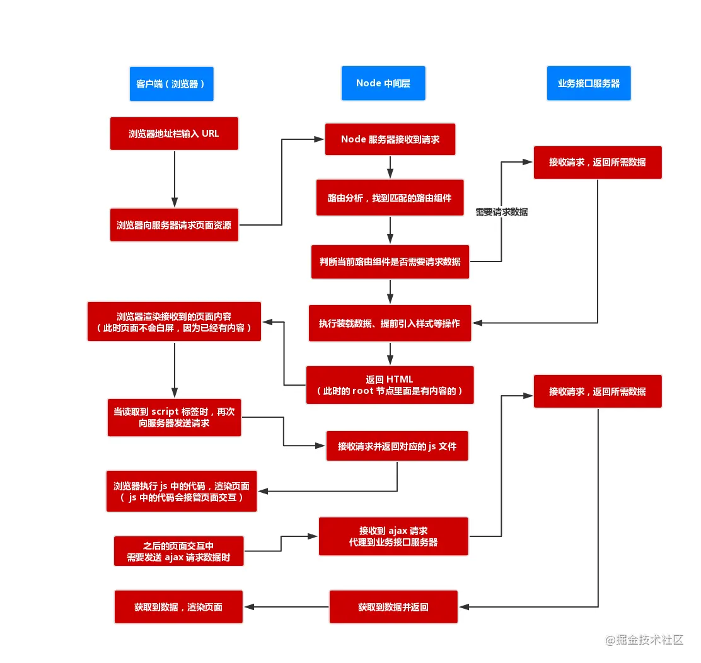

- https://juejin.cn/post/6844904017487724557
- https://ssr.vuejs.org/zh/guide/hydration.html
- https://zhuanlan.zhihu.com/p/90746589

> **重要** : 在对你的应用程序使用服务器端渲染 (SSR) 之前，你应该问的第一个问题是，是否真的需要它。这主要取决于内容到达时间 (time-to-content) 对应用程序的重要程度。例如，如果你正在构建一个内部仪表盘，初始加载时的额外几百毫秒并不重要，这种情况下去使用服务器端渲染 (SSR) 将是一个小题大作之举。然而，内容到达时间 (time-to-content) 要求是绝对关键的指标，在这种情况下，服务器端渲染 (SSR) 可以帮助你实现最佳的初始加载性能。

# 快速生成SSR项目
- https://github.com/ykfe/ssr
- next.js
- https://github.com/ykfe/egg-react-ssr
- https://github.com/manuelbieh/react-ssr-setup
- https://github.com/cereallarceny/cra-ssr 


# 什么时候应该使用SSR？
- https://zhuanlan.zhihu.com/p/41856333
### 应该避免使用` SSR `
首先, 如果你不需要，应该避免使用` SSR`。这样可以避免解决客户端和服务端代码复用、数据的客户端重激等问题。
### 应用是否需要登录才能查看大多数内容（例如 GMail）？
如果是这样，您不需要` SSR`。构建一个静态的` app-shell`，使用尽可能快的` TTI(Time-To-Interactive)`弹出登录页面，并在用户输入凭据时预加载(preload)所有应用程序的资源(assets)和脚本(script)。使用` service worker` 缓存您的 app-shell，以便后续加载保持超级快速。
### 应用是否更倾向于读 or 写（以内容为中心 vs. 以交互为重点）？
如果大多数用户在登陆页面后即将做一些事情（例如笔记应用程序），您不需要 SSR。在某些情况下，SSR 可以将您的应用程序置于“不可思议的山谷”状态，您可以在其中查看页面，但无法与页面进行交互。这最终是一个比菊花图(spinner)或加载屏幕更糟糕的体验，因为 click 或 tap 将简单地停滞或什么也不做。译者注：客户端激活(client-side re-hydration)的消耗。
### SEO / 社交分享对您的应用很重要吗（例如电子商务）？
如果是这样，您需要（至少一部分）SSR。虽然一些搜索引擎现在执行 JavaScript 并且能够解析和索引仅限 JS 的站点，但所有爬虫都能够读取从服务器返回的内容。在某些情况下（例如，如果您只关心内容的社交共享），您可以使用有限的 SSR，只将`<meta>`标记注入 HTML 的头部，实际的页面呈现仍然在 JavaScript 中进行。与此相关的是像 AMP(类似百度 MIP)这样的技术，它要求页面上的内容被认为是有效的。

### 首次使用的用户是否可以通过链接访问深层内容？ （例如新闻网站）
跟上条相关但不完全相同，如果用户最有可能登陆深度内容链接（并且阅读比应用程序的交互更重要），您可能需要 SSR。SSR 将始终是获得第一个绘制的最快方式，因为 HTML 在第一个响应中通过线路发送，并且在 JS 解析或其他请求时不会被阻止。

# CSR和SSR的渲染流程对比

### 客户端渲染（Client Side Rendering）

- **CSR 渲染流程：**



### 服务端渲染（Server Side Rendering）

- 是指将单页应用（SPA）在**服务器端**渲染成 HTML 片段，发送到浏览器，然后交由浏览器为其绑定状态与事件，成为完全可交互页面的过程。

- **SSR 渲染流程：**

- 服务端只负责首次“渲染”（真正意义上，只有浏览器才能渲染页面，服务端其实是生成 HTML 内容），然后返回给客户端，客户端**接管**页面交互（事件绑定等逻辑），之后客户端路由切换时，直接通过` JS `代码来显示对应的内容，不再需要服务端渲染（只有页面刷新时会需要）。


# SSR优缺点

**优点：**

1. **更快的首屏加载速度**：
无需等待所有的 JavaScript 都完成下载并执行，才显示服务器渲染的标记，所以你的用户将会更快速地看到完整渲染的页面。通常可以产生更好的用户体验，并且对于那些「内容到达时间(time-to-content) 与转化率直接相关」的应用程序而言，服务器端渲染 (SSR) 至关重要。

2. **更好的 SEO**：
  爬虫可以直接抓取渲染之后的页面，`CSR `首次返回的 `HTML `文档中，是空节点（root），不包含内容，爬虫就无法分析你的网站有什么内容，所以就无法给你好的排名。而 `SSR `返回渲染之后的` HTML `片段，内容完整，所以能更好地被爬虫分析与索引。

  请注意，截至目前，Google 和 Bing 可以很好对同步 JavaScript 应用程序进行索引。在这里，同步是关键。如果你的应用程序初始展示 loading 菊花图，然后通过 Ajax 获取内容，抓取工具并不会等待异步完成后再行抓取页面内容。也就是说，如果 SEO 对你的站点至关重要，而你的页面又是异步获取内容，则你可能需要服务器端渲染(SSR)解决此问题。


**缺点：**
1. 代码需要同构，同时能够在客户端和服务端运行。
1. 服务器渲染应用程序，需要处于` Node.js server `运行环境， 而使用`CSR`的应用可以部署在任何服务器上。
2. 项目复杂度变高，出问题需要在前端、node、后端三者之间找
3. 需要考虑` SSR `机器的运维、申请、扩容，增加了运维成本（可以通过` Serverless `解决）
4. 虽说使用` SSR `方式渲染，不但可以让浏览器更早的渲染出` HTML `页面，而且还能让用户更快的看到` HTML `页面。不过美中不足的是，在前端框架(如 react / vue)没有执行完之前，这些页面是不存在交互这一说的，甚至是包括像用户快速点击按钮等类似这样简单的交互都不能完成。
5. `SSR`的TTFB(Time To First Byte)要比`CSR`大， 因为服务器得花时间构建html字符串，并且构建时请求数据也是要花时间的。而CSR只是返回一个不带内容的html。
6. 对服务器性能消耗较高。通过对比 SSR、CSR 这两种渲染方式会发现，在使用 SSR 方式渲染 HTML 页面的过程中，服务器的吞吐量会明显少于用 CSR 渲染 HTML 页面时服务器的吞吐量。尤其是当你在服务端使用 react / vue 的时候，这是因为它们对服务器吞吐量的影响太大啦。比如ReactDOMServer.renderToString具有以下特点：同步方法、在调用过程中，会绑定CPU（属于 CPU 独享型）、会阻塞整个事件循环流程。
在renderToString没有执行完之前，服务器是不可能处理其它请求的。让我们做个假设，在使用 SSR 渲染 HTML 页面的过程中，执行renderToString就花了 500ms，这意味你现在每秒最多只能处理两个请求。

  


# 什么是同构应用

- **一套代码既可以在服务端运行又可以在客户端运行，这就是同构应用。**
- 在服务器上生成渲染内容，让用户尽早看到有信息的页面。一个完整的应用除包括纯粹的静态内容以外，还包括各种事件响应、用户交互等。这就意味着在浏览器端一定还要执行` JavaScript `脚本，以完成绑定事件、处理异步交互等工作。
- 从性能及用户体验上来看，服务端渲染应该表达出页面最主要、最核心、最基本的信息；而浏览器端则需要针对交互完成进一步的页面渲染、事件绑定等增强功能。所谓同构，就是指前后端共用一套代码或逻辑，而在这套代码或逻辑中，理想的状况是在浏览器端进一步渲染的过程中，判断已有的` DOM `结构和即将渲染出的结构是否相同，若相同，则不重新渲染` DOM `结构，只需要进行事件绑定即可。
- 从这个维度上讲，同构和服务端渲染又有所区别，同构更像是服务端渲染和浏览器端渲染的交集，它弥补了服务端和浏览器端的差异，从而使得同一套代码或逻辑得以统一运行。同构的核心是“**同一套代码**”，这是脱离于两端角度的另一个维度。


# 编写通用代码
### 请求隔离
1. 避免应用单例
在纯客户端应用程序 (client-only app) 中，每个用户会在他们各自的浏览器中使用新的应用程序实例。对于服务器端渲染，我们也希望如此：每个请求应该都是全新的、独立的应用程序实例，以便不会有交叉请求造成的状态污染 (cross-request state pollution)。
2. 避免应用全局状态单例
当编写纯客户端 (client-only) 代码时，我们习惯于每次在新的上下文中对代码进行取值。但是，Node.js 服务器是一个长期运行的进程。当我们的代码进入该进程时，它将进行一次取值并留存在内存中。这意味着如果创建一个单例对象，它将在每个传入的请求之间共享。
3. router
4. eventBus
5. ....
### 生命周期函数
在服务端只会执行一部分的生命周期函数。

### 访问特定平台(Platform-Specific) API
通用代码不可接受特定平台的 API，因此如果你的代码中，直接使用了像 window 或 document，这种仅浏览器可用的全局变量，则会在 Node.js 中执行时抛出错误，反之也是如此。
# 构建客户端和服务端代码
对于客户端应用程序和服务器应用程序，我们都要使用 webpack 打包。
- `服务器 bundle`，用于服务器端渲染(SSR), 只是完成当前地址的第一次渲染。
- `客户端 bundle`，会发送给浏览器，用于混合静态标记。将在服务端渲染出来的`html`激活。


# 路由和代码分割
1. 代码异步加载如何处理？

# 服务端渲染时如何获取异步数据
在服务器端渲染(SSR)期间，我们本质上是在渲染我们应用程序的"快照"，所以如果应用程序依赖于一些异步数据，那么在开始渲染过程之前，需要先预取和解析好这些数据。

另一个需要关注的问题是在客户端，在挂载 (mount) 到客户端应用程序之前，需要获取到与服务器端应用程序完全相同的数据 - 否则，客户端应用程序会因为使用与服务器端应用程序不同的状态，然后导致混合失败。

### Vue ssr
1. 在路由组件上暴露出一个自定义静态函数` asyncData`, 通过调用`asyncData`方法获取组件渲染需要的数据。注意，由于此函数会在组件实例化之前调用，所以它无法访问` this`。
2. 通`vue-router`提供的方法获取到当前路由匹配到的组件，然后调用组建上的`asyncData`方法。
```js
    router.push(context.url)

    router.onReady(() => {
      const matchedComponents = router.getMatchedComponents()
      if (!matchedComponents.length) {
        return reject({ code: 404 })
      }

      // 对所有匹配的路由组件调用 `asyncData()`
      Promise.all(matchedComponents.map(Component => {
        if (Component.asyncData) {
          return Component.asyncData({
            store,
            route: router.currentRoute
          })
        }
      })).then(() => {
        // 在所有预取钩子(preFetch hook) resolve 后，
        // 我们的 store 现在已经填充入渲染应用程序所需的状态。
        // 当我们将状态附加到上下文，
        // 并且 `template` 选项用于 renderer 时，
        // 状态将自动序列化为 `window.__INITIAL_STATE__`，并注入 HTML。
        context.state = store.state

        resolve(app)
      }).catch(reject)
    }, reject)
```


# 创建自己的SSR项目
1. 创建node服务器
2. 修改webpack配置
3. 在服务端渲染时异步数据怎么回填
4. 注意组件的同构（需要同时能够在浏览器和node环境运行正常）, node环境下能执行的生命周期有哪些。
    - http://www.ayqy.net/blog/react-ssr-api/
5. router和redux


