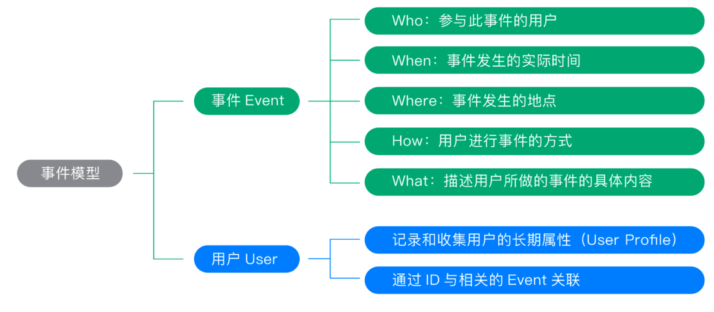

- https://manual.sensorsdata.cn/sa/latest/getting_start_introduction-22249853.html

#  1、神策分析简介
- 是针对企业级客户推出的深度**用户行为分析产品**。

# 2、什么是用户行为分析
做行为分析需要经历的 3 个步骤：
1. 提出业务问题
2. 定义问题的分析对象，具体是哪几个行为
3. 对行为进行统计和分析

# 3、如何描述用户行为
使用“事件模型（ Event 模型）”来描述用户的各种行为，事件模型包括`事件（ Event ）`和`用户（ User ）`两个核心实体。

> 为什么这两个实体结合在一起就可以清晰地描述清楚用户行为？
实际上，我们在描述用户行为时，往往只需要描述清楚几个要点，即可将整个行为描述清楚，要点包括：
- 是谁
- 什么时间
- 什么地点
- 以什么方式
- 干了什么




# 4、如何采集用户行为

### 1、如何正确地标识用户

> 准确地标识用户，做好用户关联，是用户行为分析的基础。如果有一丝纰漏，后续得到的统计或分析结果，都将被打上问号。


#### 1、用户标识及关联

1. 第一种是通过**用户的设备 ID 来唯一标识这名用户**，这种方式在一定程度上解决了用户标识的问题，但是这种方案缺点也很明显，比如，同一台手机被多个用户用过，产生的行为被标记为同一个“人”；而老用户换新手机也会被识别为一个全新的用户；等等问题最终都将导致数据分析的结果不准确。
2. 第二种方案则是通过**用户的账号或者客户号来识别用户**，这种方案在业务后台系统中比较常见，但是用户在未登录状态下发生行为是无法被识别的，因此这种方案只能准确地记录业务数据，主要在业务数仓的搭建中充当用户标识。


>  关于神策是怎么标识用户的，推荐阅读[《如何准确的标识用户-基础概念》](https://manual.sensorsdata.cn/sa/latest/tech_knowledge_user-42795032.html)。

简单来说，在用户未登录的情况下，神策会选取设备 ID 作为唯一标识，登录状态下选取登录 ID 或者 userid ，一个用户既有设备 ID（亦称作“匿名 ID”）又有登录 ID。接下来，通过“**用户关联**”将同一个用户的设备 ID 和登录 ID 关联到一起，这样不管用户是匿名和登录的状态发生的行为，我们都能准确识别到是同一个用户，这是目前为止较为通用且准确的用户标识方式。


#### 2、神策支持的用户关联方案

- [一对一关联方案](https://manual.sensorsdata.cn/sa/latest/tech_knowledge_user-42795032.html#id-.标识用户v1.13-方案二：关联设备ID和登录ID（一对一）)。大部分情况下，一个用户只有一台设备，因此一个用户只会有一个设备 ID 和一个登录 ID，针对这种情况，神策提供了设备 ID 和登录 ID 一对一关联的方案。

- [多对一关联方案](https://manual.sensorsdata.cn/sa/latest/tech_knowledge_user-42795032.html#id-.标识用户v1.13-方案三：关联设备ID和登录ID（多对一）)。针对一个用户有多台设备的情况，或存在多个端的情况。比如，同时有小程序端，App 端，Web 端，此时用户在每个端的设备 ID 都不一样，等同于是一个用户会有多设备的情况。


#### 3、确定待接入产品的关联方案


### 2、采集方案设计


### 3、基础数据校验


# 5、技术指南

### Web JS SDK 预置事件和预置属性

事件：

- $pageview： Web 浏览页面
- $WebClick： Web 元素点击
- $WebStay： Web 视区停留， 超过4s未滚动
- $WebPageLeave： Web 页面浏览时长

属性：


### JS SDk

- https://manual.sensorsdata.cn/sa/latest/tech_sdk_client_web-7548149.html

```js
var sensors = require('sa-sdk-javascript'); 
sensors.init({
  server_url: '数据接收地址',
  is_track_single_page:true, // 单页面配置，默认开启，若页面中有锚点设计，需要将该配置删除，否则触发锚点会多触发 $pageview 事件
  use_client_time:true, 
  send_type:'beacon',
  heatmap: {
     //是否开启点击图，default 表示开启，自动采集 $WebClick 事件，可以设置 'not_collect' 表示关闭。
     clickmap:'default',
     //是否开启触达图，not_collect 表示关闭，不会自动采集 $WebStay 事件，可以设置 'default' 表示开启。
     scroll_notice_map:'not_collect'
  }
});
sensors.quick('autoTrack'); //用于采集 $pageview 事件。

```

