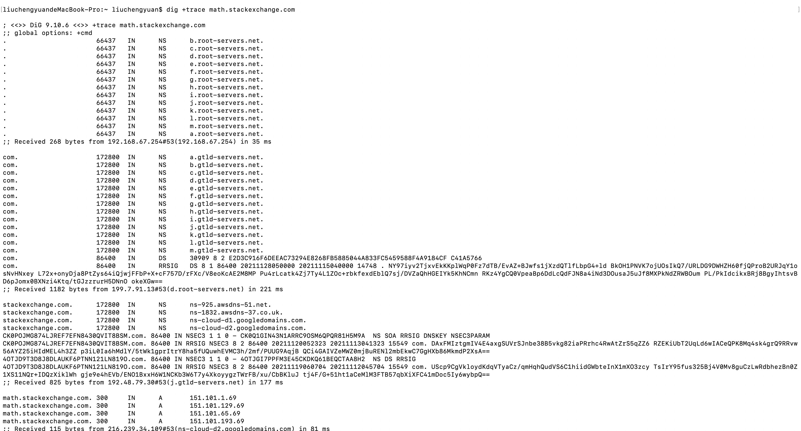

- https://juejin.cn/post/6990344840181940261
- 

# 什么是DNS?

众所周知，在互联网中是用IP来标识一台服务器的。IP地址虽然能够代表一台设备，但是由于记忆起来比较困难，所以将其替换成一个能够理解和识别的名字，这个名字我们称作为域名。例如：www.51cto.com 就是一个域名，在域名后面会定义一个IP地址用来指向网站服务器。那么问题来了，谁来做这个从域名到IP地址的对应呢？答案是通过DNS来实现。

> 简单的说就是，DNS提供了从域名到IP的服务。


### 定义

DNS 是域名系统（Domain Name System，缩写：DNS）是互联网的一项服务。它将域名和IP地址相互映射的一个分布式数据库，在数据库中保存域名与IP的对照关系，从而使人更方便地访问互联网。


# 查看DNS解析过程

虽然只需要返回一个IP地址，但是DNS的查询过程非常复杂，分成多个步骤。

工具软件dig可以显示整个查询过程。
```shell
dig math.stackexchange.com

# 指定4.2.2.2为DNS服务器的地址
dig @4.2.2.2 math.stackexchange.com

# +trace参数可以显示DNS的整个分级查询过程。
$ dig +trace math.stackexchange.com

# 通过IP查询域名（逆向查询）
dig -x 192.30.252.153
```


### **dig +trace math.stackexchange.com**查看完整的解析过程。




### 1、获取根域名服务器

- 这一段返回的`root-servers.net`是所有根域名服务器
- 所有信息都是从服务`192.168.67.254#53`上获取的，从电脑里的网络可以查看到DNS信息。这是什么服务器？

```shell
;; global options: +cmd
.			66437	IN	NS	b.root-servers.net.
.			66437	IN	NS	c.root-servers.net.
.			66437	IN	NS	d.root-servers.net.
.			66437	IN	NS	e.root-servers.net.
.			66437	IN	NS	f.root-servers.net.
.			66437	IN	NS	g.root-servers.net.
.			66437	IN	NS	h.root-servers.net.
.			66437	IN	NS	i.root-servers.net.
.			66437	IN	NS	j.root-servers.net.
.			66437	IN	NS	k.root-servers.net.
.			66437	IN	NS	l.root-servers.net.
.			66437	IN	NS	m.root-servers.net.
.			66437	IN	NS	a.root-servers.net.
;; Received 268 bytes from 192.168.67.254#53(192.168.67.254) in 35 ms
```


### 2、获取顶级域名服务器

- 根据内置的根域名服务器IP地址，DNS服务器向所有这些IP地址发出查询请求，询问`math.stackexchange.com`的顶级域名服务器`com.`的NS记录。最先回复的根域名服务器将被缓存，以后只向这台服务器发请求。
- 下面的`199.7.91.13#53`是域名`d.root-servers.net`指向的地址。
- 下面结果显示`.com`域名的13条NS记录，同时返回的还有每一条记录对应的IP地址。

```shell
com.			172800	IN	NS	a.gtld-servers.net.
com.			172800	IN	NS	b.gtld-servers.net.
com.			172800	IN	NS	c.gtld-servers.net.
com.			172800	IN	NS	d.gtld-servers.net.
com.			172800	IN	NS	e.gtld-servers.net.
com.			172800	IN	NS	f.gtld-servers.net.
com.			172800	IN	NS	g.gtld-servers.net.
com.			172800	IN	NS	h.gtld-servers.net.
com.			172800	IN	NS	i.gtld-servers.net.
com.			172800	IN	NS	j.gtld-servers.net.
com.			172800	IN	NS	k.gtld-servers.net.
com.			172800	IN	NS	l.gtld-servers.net.
com.			172800	IN	NS	m.gtld-servers.net.
com.			86400	IN	DS	30909 8 2 E2D3C916F6DEEAC73294E8268FB5885044A833FC5459588F4A9184CF C41A5766
com.			86400	IN	RRSIG	DS 8 1 86400 20211128050000 20211115040000 14748 . NY97iyv2TjxvEkKKplWqP0Fz7dTB/EvAZ+BJwfs1jXzdQTlfLbpG4+ld BkOH1PNVK7ojUOsIkQ7/URLDG9DWHZH60fjQProB2URJqY1osNvHNxey L72x+onyDja8PtZys64iQjwjFFbP+X+cF757D/rFXc/V8eoKcAE2M8MP Pu4rLcatk4Zj7Ty4L1ZOc+rbkfexdEblQ7sj/DVZaQhHGEIYk5KhNCmn RKz4YgCQ0VpeaBp6DdLcQdFJN8a4iNd3DOusaJ5uJf8MXPkNdZRWBOum PL/PkIdcikxBRj8BgyIhtsvBD6pJomx0BXNzi4Ktq/tGJzzrurH5DNnO okeXGw==
;; Received 1182 bytes from 199.7.91.13#53(d.root-servers.net) in 221 ms
```


### 3、获取次级域名服务器

- 然后，DNS服务器向这些顶级域名服务器发出查询请求，询问`math.stackexchange.com`的次级域名`stackexchange.com`的NS记录。
- `192.48.79.30#53`就是`j.gtld-servers.net`的地址。

```shell
stackexchange.com.	172800	IN	NS	ns-925.awsdns-51.net.
stackexchange.com.	172800	IN	NS	ns-1832.awsdns-37.co.uk.
stackexchange.com.	172800	IN	NS	ns-cloud-d1.googledomains.com.
stackexchange.com.	172800	IN	NS	ns-cloud-d2.googledomains.com.
CK0POJMG874LJREF7EFN8430QVIT8BSM.com. 86400 IN NSEC3 1 1 0 - CK0Q1GIN43N1ARRC9OSM6QPQR81H5M9A  NS SOA RRSIG DNSKEY NSEC3PARAM
CK0POJMG874LJREF7EFN8430QVIT8BSM.com. 86400 IN RRSIG NSEC3 8 2 86400 20211120052323 20211113041323 15549 com. DAxFMIztgmIV4E4axgSUVrSJnbe38B5vkg82iaPRrhc4RwAtZrS5qZZ6 RZEKiUbT2UqLd6wIACeQPK8Mq4sk4grQ9RRvw56AYZ25iHIdMEL4h3ZZ p3iL0Ia6hMdlY/5tWk1gprItrY8ha5fUQuwhEVMC3h/2mf/PUUG9AqjB QCi4GAIVZeMWZ0mjBuRENl2mbEkwC7GgHXb86MkmdP2XsA==
4OTJD9T3D8J8DLAUKF6PTNN121LN819O.com. 86400 IN NSEC3 1 1 0 - 4OTJGI7PPFM3E45CKDKQ61BEQCTAA8H2  NS DS RRSIG
4OTJD9T3D8J8DLAUKF6PTNN121LN819O.com. 86400 IN RRSIG NSEC3 8 2 86400 20211119060704 20211112045704 15549 com. UScp9CgVkloydKdqVTyaCz/qmHqhQudVS6C1hiidGWbteInX1mXO3zcy TsIrY95fus325Bj4V0Mv8guCzLwRdbhezBn0Z1XS11NQr+IDQzXiklWh gje9e4hEVb/ENO1BxxH6W1NCKb3W6T7y4XkoyygzTWrFB/xu/CbBKluJ tj4F/G+51ht1aCeMlM3FTB57qbXiXFC41mDoc5Iy6wybpQ==
;; Received 825 bytes from 192.48.79.30#53(j.gtld-servers.net) in 177 ms

```


### 4、获取得到A地址，也有可能是CNAME？

- 然后，向`ns-cloud-d2.googledomains.com`服务获取`math.stackexchange.com`对应的A地址。

```shell
math.stackexchange.com.	300	IN	A	151.101.1.69
math.stackexchange.com.	300	IN	A	151.101.129.69
math.stackexchange.com.	300	IN	A	151.101.65.69
math.stackexchange.com.	300	IN	A	151.101.193.69
;; Received 115 bytes from 216.239.34.109#53(ns-cloud-d2.googledomains.com) in 81 ms
```


### 浏览器访问时DNS的解析过程

1. **首先使用浏览器缓存。**用户请求通过浏览器输入要访问网站的地址，例如：www.51cto.com。浏览器会在自己的缓存中查找URL对应IP地址。如果之前访问过，保存了这个URL对应IP地址的缓存，那么就直接访问IP地址。如果没有缓存，进入到第2步。
2. **然后使用计算机本地的host。**通过计算机本地的Host文件配置，可以设置URL和IP地址的映射关系。比如windows下是通过C:windwossystem32driveretchosts文件来设置的，linux中则是/etc/named.confg文件。这里查找本地的Host文件，看是有IP地址的缓存。如果在文件中依旧没有找到映射关系，进入第3步。
3. **然后请求本地（可能是本机或者本地区，比如校园网）DNS服务。**请求Local DNS Server，通过本地运营商获取URL和IP的映射关系。如果在校园网，DNS服务器就在学校，如果是小区网络，DNS服务器是运营商提供的。总之这个服务器在物理位置上离发起请求的计算机比较近。Local DNS Server缓存了大量的DNS解析结果。由于它的性能较好，物理上的距离又比较近，它通常会在很短的时间内返回指定域名的解析结果。80%的DNS解析需求在这一步就满足了。如果在这一步还是没有完成DNS解析， 进入到第4步。
4. 开始上面的DNS解析的四个步骤。
   - 获取根域名服务器
   - 获取顶级域名服务器
   - 获取次级域名服务器
   - 获取得到域名对应的A地址， 如果是CNAME，继续重复上面的步骤。


# DNS的记录类型

域名与IP之间的对应关系，称为"记录"（record）。根据使用场景，"记录"可以分成不同的类型（type），前面已经看到了有`A`记录和`NS`记录。

- `A`：地址记录（Address），返回域名指向的IP地址。
-  `NS`：域名服务器记录（Name Server），返回保存下一级域名信息的服务器地址。该记录只能设置为域名，不能设置为IP地址。
- `MX`：邮件记录（Mail eXchange），返回接收电子邮件的服务器地址。
- `CNAME`：规范名称记录（Canonical Name），返回另一个域名，即当前查询的域名是另一个域名的跳转，详见下文。
- `PTR`：逆向查询记录（Pointer Record），只用于从IP地址查询域名，详见下文。


> 一般来说，为了服务的安全可靠，至少应该有两条`NS`记录，而`A`记录和`MX`记录也可以有多条，这样就提供了服务的冗余性，防止出现单点失败。


### CNAME

CNAME 即指别名记录，也被称为规范名字。一般用来把域名解析到别的域名上，当需要将域名指向另一个域名，再由另一个域名提供 ip 地址，就需要添加 CNAME 记录。


`CNAME`记录主要用于域名的内部跳转，为服务器配置提供灵活性，用户感知不到。举例来说，`facebook.github.io`这个域名就是一个`CNAME`记录。

```shell
$ dig facebook.github.io

...

;; ANSWER SECTION:
facebook.github.io. 3370    IN  CNAME   github.map.fastly.net.
github.map.fastly.net.  600 IN  A   103.245.222.133
```

上面结果显示，`facebook.github.io`的CNAME记录指向`github.map.fastly.net`。也就是说，用户查询`facebook.github.io`的时候，实际上返回的是`github.map.fastly.net`的IP地址。这样的好处是，变更服务器IP地址的时候，只要修改`github.map.fastly.net`这个域名就可以了，用户的`facebook.github.io`域名不用修改。


> 由于`CNAME`记录就是一个替换，所以域名一旦设置`CNAME`记录以后，就不能再设置其他记录了（比如`A`记录和`MX`记录），这是为了防止产生冲突。举例来说，`foo.com`指向`bar.com`，而两个域名各有自己的`MX`记录，如果两者不一致，就会产生问题。由于顶级域名通常要设置`MX`记录，所以一般不允许用户对顶级域名设置`CNAME`记录。


# DNS缓存

为了让我们更快的拿到想要的 IP，DNS 广泛使用了缓存技术。DNS 缓存的原理非常简单，**在一个 DNS 查询的过程中，当某一台 DNS 服务器接收到一个 DNS 应答（例如，包含某主机名到 IP 地址的映射）时，它就能够将映射缓存到本地，下次查询就可以直接用缓存里的内容。当然，缓存并不是永久的，每一条映射记录都有一个对应的生存时间，一旦过了生存时间，这条记录就应该从缓存移出。**

事实上，**有了缓存，大多数 DNS 查询都绕过了根 DNS 服务器**，需要向根 DNS 服务器发起查询的请求很少。


# 问题

### 1、 域名可以恶意解析为其他网站的IP吗？

- http://www-quic.zhihu.com/question/273478814

从技术上来讲是可以解析到任意IP地址的，这时候针对这个地址发起HTTP访问，HTTP头中的host字段会是你的域名（而非该IP对应站点的域名），如果对方的网站HTTP服务器没有做对应的防护就可以访问，如果方的网站HTTP服务器有防护则无法访问。


### 2、域名指向多个IP地址(负载均衡)

- https://help.aliyun.com/knowledge_detail/39800.html?spm=5176.10695662.1996646101.searchclickresult.30fe205bfMZdbF
- https://support.huaweicloud.com/dns_faq/dns_faq_023.html
- https://www.cnblogs.com/xiaobaiskill/p/10045596.html


当为域名添加A类型或者AAAA类型解析记录时，参数“值”支持填写多个IP地址，将域名解析到多个IP地址。

**当解析记录的“值”包含多个IP地址时，域名解析会返回所有的IP地址，但返回IP地址的顺序是随机的，浏览器默认取第一个返回的IP地址作为解析结果。**


其解析流程如下：

1. 网站访问者通过浏览器向**Local DNS**发送解析请求。
2. **Local DNS**将解析请求逐级转发至权威**DNS**。
3. 权威DNS在收到解析请求后，**将所有IP地址以随机顺序全部返回Local DNS**，也可以设置每个IP的权重。
4. Local DNS将所有IP地址返回浏览器。
5. 网站访问者的浏览器随机访问其中一个IP地址，通常选取返回的第一个IP地址。

根据大量测试数据显示，解析到各IP地址的比例接近相等。


### 3、 DNS配置权重解析

在大型网络应用中，通常会使用多台服务器提供同一个服务。为了平衡每台服务器上的访问压力，通常会选择采用负载均衡来实现，提高服务器响应效率。

云解析服务支持解析的负载均衡，也叫做带权重的记录轮询，通过为不同解析记录配置“权重”参数来实现。

当您的网站拥有多台服务器，每台服务器具有独立的IP地址。通过解析的负载均衡可以实现将不同用户的访问请求按比例分配到各个服务器上。


### 4、如何实现通过多个域名访问同一网站？

实现通过多个域名访问同一网站，需要为每个域名配置一条取值相同的A类型记录集，


### 5、DNS劫持

DNS劫持就是通过劫持了DNS服务器，通过某些手段取得某域名的解析记录控制权，进而修改此域名的解析结果，导致对该域名的访问由原IP地址转入到修改后的指定IP，其结果就是对特定的网址不能访问或访问的是假网址，从而实现窃取资料或者破坏原有正常服务的目的。DNS劫持通过篡改DNS服务器上的数据返回给用户一个错误的查询结果来实现的。

DNS劫持症状：在某些地区的用户在成功连接宽带后，首次打开任何页面都指向ISP提供的“电信互联星空”、“网通黄页广告”等内容页面。还有就是曾经出现过用户访问Google域名的时候出现了百度的网站。这些都属于DNS劫持。

**解决方法**

对于DNS劫持，可以采用使用国外免费公用的DNS服务器解决。例如OpenDNS（208.67.222.222）或GoogleDNS（8.8.8.8）。

**总结**

DNS劫持就是指用户访问一个被标记的地址时，DNS服务器故意将此地址指向一个错误的IP地址的行为。范例，网通、电信、铁通的某些用户有时候会发现自己打算访问一个地址，却被转向了各种推送广告等网站，这就是DNS劫持。


### 6、DNS缓存中毒攻击


# 命令行修改DNS
## MAC
- https://blog.csdn.net/snowrain1108/article/details/51734553

获取系统已有的DNS配置
```shell
networksetup -getdnsservers Wi-Fi
```
设置DNS, 可以同时设置多个, 会覆盖已有的配置
```shell
networksetup -setdnsservers Wi-Fi 8.8.8.8 114.114.114.114
```

## windows
- https://www.cnblogs.com/freeweb/p/5061025.html