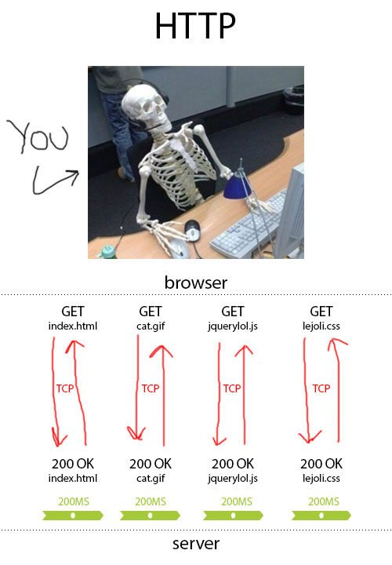
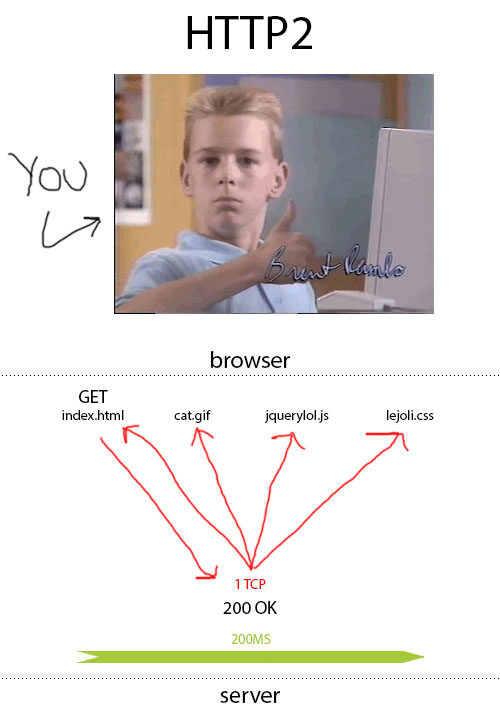

- https://blog.51cto.com/u_14355948/3188929
- https://www.infoq.cn/article/whcobxfbgtphy7ijv1kp
- https://segmentfault.com/a/1190000038707568
- [http2](https://http2-explained.haxx.se/zh)
- [http3](https://http3-explained.haxx.se/zh)
- https://segmentfault.com/a/1190000013028798

# http1.0
### 无法复用连接
HTTP 1.0规定浏览器与服务器只保持短暂的连接，浏览器的每次请求都需要与服务器建立一个TCP连接，服务器完成请求处理后立即断开TCP连接，服务器不跟踪每个客户也不记录过去的请求。

### 队头阻塞（head of line blocking）
由于HTTP1.0规定下一个请求必须在前一个请求响应到达之后才能发送，假设前一个请求响应一直不到达，那么下一个请求就不发送，后面的请求就阻塞了。

# http1.1
### 长连接。
- 增加了一个Connection字段，通过设置Keep-Alive可以保持HTTP连接不断开，避免了每次客户端与服务器请求都要重复建立释放建立TCP连接。Connection请求头的值为Keep-Alive时，客户端通知服务器返回本次请求结果后保持连接；Connection请求头的值为close时，客户端通知服务器返回本次请求结果后关闭连接。

- 在同一个tcp的连接中可以传送多个HTTP请求和响应. 多个请求和响应可以重叠，多个请求和响应可以同时进行。

### 管道化（pipelining）— 尴尬的假并行传输
允许客户端不用等待上一次请求结果返回，就可以发出下一次请求，但服务器端必须按照接收到客户端请求的先后顺序依次回送响应结果，以保证客户端能够区分出每次请求的响应内容。
> 管道化只是让我们把先进先出队列从客户端（请求队列）迁移到服务端（响应队列）。
> 客户端发送新的请求不必等到上一个请求的响应，但是新的请求的响应必定是在上一个请求响应之后才响应的。

>  HTTP1.1还是无法彻底解决队头阻塞（head of line blocking）的问题。
HTTP1.1支持管道化，但是服务器也必须进行逐个响应的送回，这个是很大的一个缺陷。
实际上，现阶段的浏览器厂商采取了另外一种做法，它允许我们打开多个TCP的会话, 同域可开启6-8个tcp来达到并发。

### 缓存处理（强缓存和协商缓存、启发式缓存）

### 断点传输
- https://blog.csdn.net/liang19890820/article/details/53215087
指的是在上传/下载时，将任务（一个文件或压缩包）人为的划分为几个部分，每一个部分采用一个线程进行上传/下载，如果碰到网络故障，可以从已经上传/下载的部分开始继续上传/下载未完成的部分，而没有必要从头开始上传/下载。可以节省时间，提高速度。

### host字段
在HTTP1.0中认为每台服务器都绑定一个唯一的IP地址，因此，请求消息中的URL并没有传递主机名（hostname）。但随着虚拟主机技术的发展，在一台物理服务器上可以存在多个虚拟主机（Multi-homed Web Servers），并且它们共享一个IP地址。

# http2
### 二进制分帧。
把原来HTTP1.x的header和body部分用frame重新封装了一层。
### 多路复用（连接共享）
### 头部压缩
### 服务器推送

# http3
### QUIC

# HTTP的发展
### http1

谈未来之前，咱们先讲讲现实。你了解 HTTP 吗？这个定义于 1991 年的协议是用来管理 Web 的。它的全名是超文本传输协议，让你可以从网页中获取资源，网页数据从 Web 服务器传输到你的浏览器上。它基于较低级别的协议——TCP，这里是重点——而且它是无状态的。这意味着每个请求都是完全独立的。页面上显示的每个 GIF 图片都在互联网上独立存在，这对这些 GIF 图片本身来说是好事。但对我们来说，这样的一个系统是有些支离破碎的。

问题在于每个请求一次只会查找一个文件。每次都要创建一个昂贵的 TCP 连接。想象一下，如果你的页面上有 10,000 个小技巧，这会是多么沉重的负担啊。

尽管浏览器可以同时发出六个不同的请求，但是 HTTP 仍然很慢，并且需要很多 TCP 连接。另外，我们开发人员通常不会在意这一点。我们喜欢在页面上塞满各种垃圾。比如说巨大的 jQuery 库，包含 300 个无用的 CSS 样式表，结尾是一个透明的 8 兆大 PNG 图。

### SPDY

当谷歌发现我们在互联网上到处倾倒垃圾后，他们就开始搞一个称为 SPDY 的东西了。目的是什么呢？当然是加快互联网的速度。

SPDY 是一个规范，建议继续使用 HTTP，但要更改一些规则。通过压缩标头、对请求进行优先级排序和多路复用，它将把所有 TCP 请求和连接变成单独的一个！

具体来说，当你读取 HTML 时，浏览器会查看你在页面中要询问的所有内容。然后，它可以一次获取所有内容，这样就可以避免一个文件一个文件地获取了。

### HTTP2

HTTP2 的第一份草案基于 SPDY。HTTP2 很快被广泛采用，随后互联网上的一切变得快多了。今天，互联网上 42.7％的内容使用 HTTP2。

### QUIC

### HTTP3