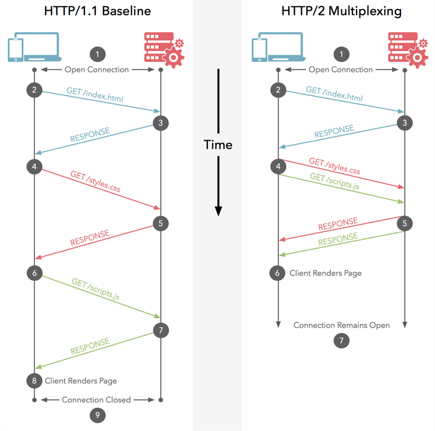
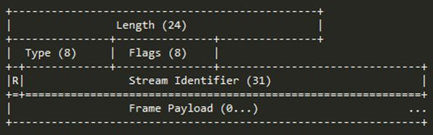
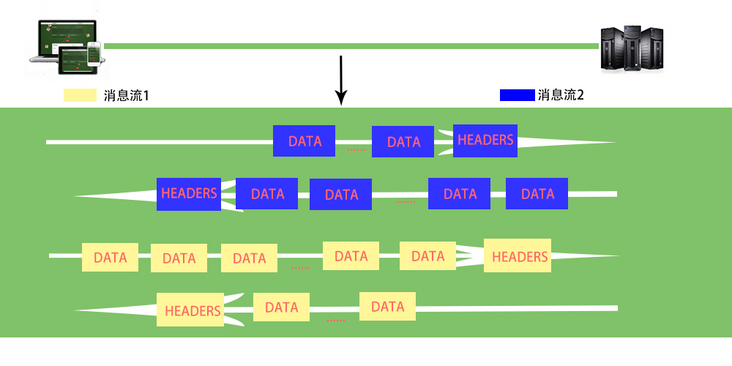
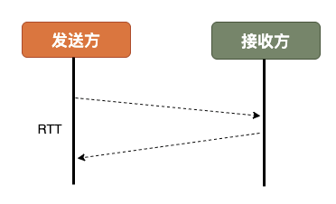
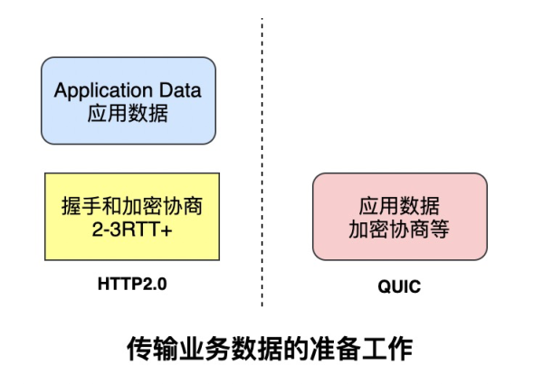

- https://blog.51cto.com/u_14355948/3188929
- https://www.infoq.cn/article/whcobxfbgtphy7ijv1kp
- https://segmentfault.com/a/1190000038707568
- [http2](https://http2-explained.haxx.se/zh)
- [http3](https://http3-explained.haxx.se/zh)
- https://segmentfault.com/a/1190000013028798

# HTTP的发展

### http1

### SPDY

### HTTP2

### QUIC

### HTTP3

# http1.0

### 1、无法复用连接
HTTP 1.0规定浏览器与服务器只保持短暂的连接，浏览器的每次请求都需要与服务器建立一个TCP连接，服务器完成请求处理后立即断开TCP连接，服务器不跟踪每个客户也不记录过去的请求。

### 2、 队头阻塞（head of line blocking）
由于HTTP1.0规定下一个请求必须在前一个请求响应到达之后才能发送，假设前一个请求响应一直不到达，那么下一个请求就不发送，后面的请求就阻塞了。

# http1.1

### 1、长连接。解决tcp连接不能复用的问题。
- 增加了一个`Connection`字段，通过设置`Keep-Alive`可以保持`TCP`连接不断开，避免了每次客户端与服务器请求都要重复建立释放建立`TCP`连接。`Connection`请求头的值为`Keep-Alive`时，客户端通知服务器返回本次请求结果后继续保持连接；`Connection`请求头的值为`close`时，客户端通知服务器返回本次请求结果后关闭连接。

- 多个`HTTP`请求可以复用同一个`tcp`连接。 

### 2、管道化（pipelining）。未彻底解决队头阻塞的问题，尴尬的假并行传输
允许客户端不用等待上一次请求结果返回，就可以发出下一次请求，但服务器端必须按照接收到客户端请求的先后顺序依次回送响应结果，以保证客户端能够区分出每次请求的响应内容。**管道化只是让我们把先进先出队列从客户端（请求队列）迁移到服务端（响应队列）**。
-  客户端发送新的请求不必等到上一个请求的响应，但是新的请求的响应必定是在上一个请求响应之后才响应的。
-  HTTP1.1还是无法彻底解决队头阻塞（head of line blocking）的问题。HTTP1.1支持管道化，但是服务器也必须进行逐个响应的送回，这个是很大的一个缺陷。实际上，现阶段的浏览器厂商采取了另外一种做法，它允许我们打开多个TCP的会话, 同域可开启**6-8**个tcp来达到并发。

### 3、缓存处理（强缓存和协商缓存、启发式缓存）

### 4、断点传输
- https://blog.csdn.net/liang19890820/article/details/53215087
指的是在上传/下载时，将任务（一个文件或压缩包）人为的划分为几个部分，每一个部分采用一个线程进行上传/下载，如果碰到网络故障，可以从已经上传/下载的部分开始继续上传/下载未完成的部分，而没有必要从头开始上传/下载。可以节省时间，提高速度。

### 5、host字段
在HTTP1.0中认为每台服务器都绑定一个唯一的IP地址，因此，请求消息中的URL并没有传递主机名（hostname）。但随着虚拟主机技术的发展，在一台物理服务器上可以存在多个虚拟主机（Multi-homed Web Servers），并且它们共享一个IP地址。

# http2

- 基于` SPDY `协议。
### 1、二进制分帧
#### 帧
HTTP/2 数据通信的最小单位消息。 指 HTTP/2 中逻辑上的 HTTP 消息。例如请求和响应等，消息由一个或多个帧组成。

#### 流

存在于连接中的一个虚拟通道。流可以承载双向消息，每个流都有一个唯一的整数ID。

####  http2采用二进制格式传输数据， http1采用文本格式传输数据
`HTTP/2 `采用二进制格式传输数据，而非` HTTP 1.x `的文本格式，二进制协议解析起来更高效。 
- `HTTP / 1 `的请求和响应报文，都是由起始行，首部和实体正文（可选）组成，各部分之间以文本换行符分隔。
- `HTTP/2 `将请求和响应数据分割为更小的帧，并且它们采用二进制编码。

#### 流、消息、帧
- 同域名下所有通信都在单个连接上完成，该连接可以承载任意数量的双向数据流。每个数据流都以消息的形式发送。
- 消息又由一个或多个帧组成。多个帧之间可以乱序发送，**根据帧首部的流标识可以重新组装**。

### 2、多路复用
### http/1的2个问题
在` HTTP/1 `中，每次请求都会建立一次HTTP连接，也就是我们常说的3次握手4次挥手，这个过程在一次请求过程中占用了相当长的时间，即使开启了` Keep-Alive` ，解决了多次连接的问题，但是依然有两个效率上的问题：

第一个：串行的文件传输（队头拥塞）。当请求a文件时，b文件只能等待，等待a连接到服务器、服务器处理文件、服务器返回文件，这三个步骤。我们假设这三步用时都是1秒，那么a文件用时为3秒，b文件传输完成用时为6秒，依此类推。（注：此项计算有一个前提条件，就是浏览器和服务器是单通道传输）

第二个：连接数过多。我们假设Apache设置了最大并发数为300，因为浏览器限制，浏览器发起的最大请求数为6，也就是服务器能承载的最高并发为50，当第51个人访问时，就需要等待前面某个请求处理完成。
#### 什么是多路复用？

- https://github.com/Advanced-Frontend/Daily-Interview-Question/issues/14

> HTTP/2的多路复用就是为了解决上述的两个性能问题。

**多路复用，就是在一个 TCP 连接中可以存在多条流。换句话说，也就是可以发送多个请求，对端可以通过帧中的标识知道属于哪个请求。**
- `http/2`多路复用，代替`http/1`的序列和阻塞机制。二进制分帧解决了HTTP的队头拥塞（head of line blocking）问题。
- 同域名下所有通信都在单个连接上完成，消除了因多个 TCP 连接而带来的延时和内存消耗。

#### 为什么HTTP/1.1不能实现“多路复用”？
HTTP/1.1是基于文本解析的协议。

#### HTTP/2帧结构设计和多路复用实现

帧是一个数据单元，实现了对消息的封装。下面是HTTP/2的帧结构：

帧的字节中保存了不同的信息，**前9个字节对于每个帧都是一致的**，“服务器”解析HTTP/2的数据帧时只需要解析这些字节，就能准确的知道整个帧期望多少字节数来进行处理信息。我们先来了解一下帧中每个字段保存的信息：

| 名称              | 长度   | 描述                                     |
| ----------------- | ------ | ---------------------------------------- |
| Length            | 3 字节 | 表示帧负载的长度，默认最大帧大小2^14     |
| Type              | 1 字节 | 当前帧的类型，下面会做介绍               |
| Flags             | 1 字节 | 具体帧的标识                             |
| R                 | 1 字节 | 保留位，不需要设置，否则可能带来严重后果 |
| Stream Identifier | 31 位  | 每个流的唯一ID                           |
| Frame Payload     |        |                                          |

如果使用HTTP/1.1的话，你需要发送完上一个请求，才能发送下一个；由于HTTP/2是分帧的，**请求和响应可以交错甚至可以复用**。
为了能够发送不同的“数据信息”，通过帧数据传递不同的内容，HTTP/2中定义了10种不同类型的帧，在上面表格的Type字段中可对“帧”类型进行设置。下表是HTTP/2的帧类型：

| 名称          | ID   | 描述                                   |
| ------------- | ---- | -------------------------------------- |
| DATA          | 0x0  | 传输流的核心内容                       |
| HEADERS       | 0x1  | 包含HTTP首部，和可选的优先级参数       |
| PRIORITY      | 0x2  | 指示或者更改流的优先级和依赖           |
| RST_STREAM    | 0x3  | 允许一端停止流（通常是由于错误导致的） |
| SETTINGS      | 0x4  | 协商连接级参数                         |
| PUSH_PROMISE  | 0x5  | 提示客户端，服务端要推送些东西         |
| PING          | 0x6  | 测试连接可用性和往返时延（RTT）        |
| GOAWAY        | 0x7  | 告诉另外一端，当前端已结束             |
| WINDOW_UPDATE | 0x8  | 协商一端要接收多少字节（用于流量控制） |
| CONTINUATION  | 0x9  | 用以拓展HEADER数据块                   |

有了以上对HTTP/2帧的了解，我们就可以解释多路复用是怎样实现的了，不过在这之前我们先来了解“流”的概念：**HTTP/2连接上独立的、双向的帧序列交换。流ID（帧首部的6-9字节）用来标识帧所属的流**
下面两张图分别表示了HTTP/2协议上POST请求数据流“复用”的过程，很容易看的明白：

### 3、头部压缩
#### 解决的问题
`HTTP1.x`的`header`中的字段很多时候都是重复的，例如method:get、status:200等等，随着网页增长到需要数十到数百个请求，这些请求中的冗余标头字段不必要地消耗带宽，从而显著增加了延迟，因此，Hpack技术应时而生。

### 4、服务器推送
- https://www.upyun.com/tech/article/294/1.html
- https://www.ruanyifeng.com/blog/2018/03/http2_server_push.html
#### 什么是服务器推送？
> 服务器主动向浏览器推送静态资源（不是socket）
服务器推送（server push）指的是，还没有收到浏览器的请求，服务器就把各种资源推送给浏览器。
比如，浏览器只请求了index.html，但是服务器把index.html、style.css、example.png全部发送给浏览器。这样的话，只需要一轮 HTTP 通信，浏览器就得到了全部资源，提高了性能。

#### 怎么使用？
- 服务器推送（server push）是 HTTP/2 协议里面，唯一一个需要开发者自己配置的功能。其他功能都是服务器和浏览器自动实现，不需要开发者关心。

1. nginx配置服务器推送
2. Apache配置服务器推送
3. 后端配置服务器推送
  - [nodejs示例](https://github.com/RisingStack/http2-push-example)

#### 和preload的区别？

#### 性能提升

服务器推送可以提高性能。网上[测评](https://www.smashingmagazine.com/2017/04/guide-http2-server-push/#measuring-server-push-performance)的结果是，打开这项功能，比不打开时的 HTTP/2 快了8%，比将资源都嵌入网页的 HTTP/1 快了5%。

### 5、资源优先级和依赖设置
### 6、流量控制
### 7、重置消息

# http3
- https://zhuanlan.zhihu.com/p/140739394
- https://network.51cto.com/art/202009/625999.htm
- https://www.taohui.tech/2021/02/04/%E7%BD%91%E7%BB%9C%E5%8D%8F%E8%AE%AE/%E6%B7%B1%E5%85%A5%E5%89%96%E6%9E%90HTTP3%E5%8D%8F%E8%AE%AE/
- https://www.upyun.com/tech/article/558/QUIC%2FHTTP3%20%E5%8D%8F%E8%AE%AE%E7%AE%80%E6%9E%90.html
### 出现的背景
#### 基于TCP的http/2存在的问题
- TCP建立连接时间长(本质上是TCP的问题)
- TCP队头阻塞问题
- TCP拥塞控制
- 移动互联网领域表现不佳(弱网环境)

#### 为什么要选UDP?

- 基于TCP开发的设备和协议非常多，兼容困难
- TCP协议栈是Linux内部的重要部分，修改和升级成本很大
- UDP本身是无连接的、没有建链和拆链成本
- UDP的数据包无队头阻塞问题
- UDP改造成本小

####  QUIC

QUIC其实是Quick UDP Internet Connections的缩写，直译为快速UDP互联网连接。

### 解决TCP层队头阻塞问题
队头阻塞 Head-of-line blocking(缩写为HOL blocking)是计算机网络中是一种性能受限的现象，通俗来说就是：一个数据包影响了一堆数据包，它不来大家都走不了。**队头阻塞问题可能存在于HTTP层和TCP层，在HTTP1.x时两个层次都存在该问题。HTTP2.0协议的多路复用机制解决了HTTP层的队头阻塞问题，但是在TCP层仍然存在队头阻塞问题。**

TCP协议在收到数据包之后，这部分数据可能是乱序到达的，但是TCP必须将所有数据收集排序整合后给上层使用，如果其中某个包丢失了，就必须等待重传，从而出现某个丢包数据阻塞整个连接的数据使用。

QUIC协议是基于UDP协议实现的，在一条链接上可以有多个流，流与流之间是互不影响的，当一个流出现丢包影响范围非常小，从而解决队头阻塞问题。

### 0RTT

衡量网络建链的常用指标是RTT Round-Trip Time，也就是数据包一来一回的时间消耗。

RTT包括三部分：往返传播时延、网络设备内排队时延、应用程序数据处理时延。

一般来说HTTPS协议要建立完整链接包括:TCP握手和TLS握手，总计需要至少2-3个RTT，普通的HTTP协议也需要至少1个RTT才可以完成握手。

然而，QUIC协议可以实现在第一个包就可以包含有效的应用数据，从而实现0RTT，但这也是有条件的。

简单来说，基于TCP协议和TLS协议的HTTP2.0在真正发送数据包之前需要花费一些时间来完成握手和加密协商，完成之后才可以真正传输业务数据。

但是QUIC则第一个数据包就可以发业务数据，从而在连接延时有很大优势，可以节约数百毫秒的时间。

QUIC的0RTT也是需要条件的，对于第一次交互的客户端和服务端0RTT也是做不到的，毕竟双方完全陌生。

因此，QUIC协议可以分为**首次连接和非首次连接**，两种情况进行讨论。

