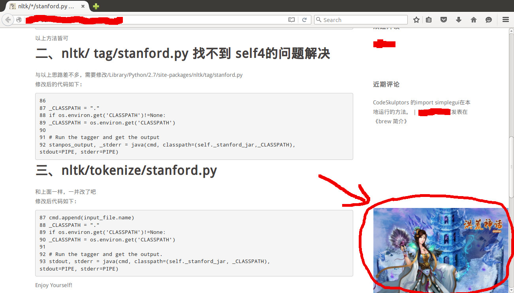

# SSL握手

1. 客户端发起HTTPS请求。

2. 服务端提前准备好公钥和私钥。

3. 服务端将相应的公钥传送给客户端。

4. 客户端解析证书的正确性。

   - 如果证书正确，则会生成一个随机数（密钥），并用公钥进行加密，传输给服务端。
   - 如果证书不正确，则SSL握手失败，需要重新上传证书进行认证。

   >  **说明** 正确性包括以下内容：

   - 证书未过期。
   - 发行服务器证书的CA可靠。
   - 发行者证书的公钥能够正确解开服务器证书的发行者的数字签名。
   - 服务器证书上的域名和服务器的实际域名相匹配。

5. 服务端用之前的私钥进行解密，得到随机数（密钥）。
6. 服务端用随机数（密钥）对传输的数据进行加密。
7. 客户端用随机数（密钥）对服务端的加密数据进行解密，拿到相应的数据。

# HTTPS安全传输的优势

- HTTPS安全传输，有效防止HTTP明文传输中的窃听、篡改、冒充和劫持风险。
- 数据传输过程中对您的关键信息进行加密，防止类似Session ID或者Cookie内容被攻击者捕获造成的敏感信息泄露等安全隐患。
- 数据传输过程中对数据进行完整性校验，防止DNS或内容遭第三方劫持、篡改等中间人攻击（MITM）隐患，详情请参见[使用HTTPS防止流量劫持](http://yq.aliyun.com/articles/2666)。
- HTTPS是主流趋势：未来主流浏览器会将HTTP协议标识为不安全，谷歌浏览器Chrome 70以上版本以及Firefox已经在2018年将HTTP网站标识为不安全，若坚持使用HTTP协议，除了安全会埋下隐患外，终端客户在访问网站时出现的不安全标识，也将影响访问。
- 主流浏览器对HTTPS网站进行搜索加权，主流浏览器均支持HTTP/2，而支持HTTP/2必须支持HTTPS。无论从安全、市场或用户体验来看，普及HTTPS是未来的一个方向，所以强烈建议您将访问协议升级到HTTPS。

# 中间人攻击

- https://juejin.cn/post/6844904065227292685

### 什么是中间人攻击？

### 浏览器是如何确保 CA 证书的合法性？

#### 1. 证书包含什么信息？

- 颁发机构信息
- 公钥
- 公司信息
- 域名
- 有效期
- 指纹
- ……

# 流量劫持

- https://developer.aliyun.com/article/2666

前不久小米等六家互联网公司发表联合声明，呼吁运营商打击流量劫持。流量劫持最直观的表现，就是网页上被插入了一些乱七八糟的广告/弹窗之类的内容。比如下面这种：

页面的右下角被插入了广告。

**流量劫持总体来说属于中间人攻击（Man-in-the-Middle Attack，MITM）的一种**，本质上攻击者在通信两端之间对通信内容进行嗅探和篡改，以达到插入数据和获取关键信息的目的。目前互联网上发生的流量劫持基本是两种手段来实现的:

- **域名劫持**：通过劫持掉域名的DNS解析结果，将HTTP请求劫持到特定IP上，使得客户端和攻击者的服务器建立TCP连接，而非和目标服务器直接连接，这样攻击者就可以对内容进行窃取或篡改。在极端的情况下甚至攻击者可能伪造目标网站页面进行钓鱼攻击。
- **直接流量修改**：在数据通路上对页面进行固定的内容插入，比如广告弹窗等。在这种情况下，虽然客户端和服务器是直接建立的连接，但是数据内容依然可能遭到野蛮破坏。

能够实施流量劫持的根本原因，是HTTP协议没有办法对通信对方的身份进行校验以及对数据完整性进行校验。如果能解决这个问题，则流量劫持将无法轻易发生。

