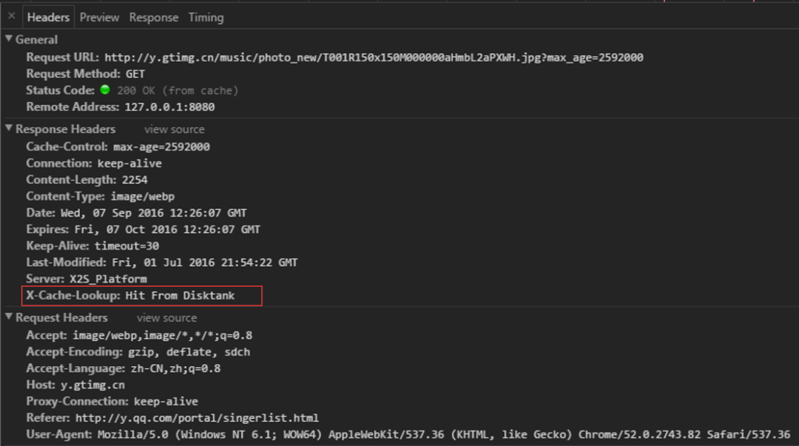

- https://segmentfault.com/a/1190000015816331
- https://juejin.cn/post/6844903593275817998
- https://www.jiqizhixin.com/articles/2020-07-24-12
- http://louiszhai.github.io/2017/04/07/http-cache/
- https://blog.csdn.net/qq_38910842/article/details/104960509

### Web 缓存介绍

- Web 缓存是指一个 Web 资源（如 html 页面，图片，js，数据等）存在于 Web 服务器和客户端（浏览器）之间的副本。
- 缓存会根据进来的请求保存输出内容的副本；当下一个请求来到的时候，如果是相同的 URL，缓存会根据缓存机制决定是直接使用副本响应访问请求，还是向源服务器再次发送请求。

### Web 缓存的好处

- 减少网络延迟，加快页面打开速度
- 减少网络带宽消耗
- 降低服务器压力
- ...

### HTTP 的缓存机制

#### 简化的流程如下

#### 根据什么规则缓存

1. 新鲜度（过期机制）：也就是缓存副本有效期。一个缓存副本必须满足以下条件，浏览器会认为它是有效的，足够新的：

- 含有完整的过期时间控制头信息（HTTP 协议报头），并且仍在有效期内；
- 浏览器已经使用过这个缓存副本，并且在一个会话中已经检查过新鲜度；

1. 校验值（验证机制）：服务器返回资源的时候有时在控制头信息带上这个资源的实体标签 Etag（Entity Tag），它可以用来作为浏览器再次请求过程的校验标识。如果发现校验标识不匹配，说明资源已经被修改或过期，浏览器需求重新获取资源内容。

#### HTTP 缓存的两个阶段

浏览器缓存一般分为两类：强缓存（也称本地缓存）和协商缓存（也称弱缓存）。

##### 本地缓存阶段

浏览器发送请求前，会先去缓存里查看是否命中强缓存，如果命中，则直接从缓存中读取资源，不会发送请求到服务器。否则，进入下一步。

##### 协商缓存阶段

当强缓存没有命中时，浏览器一定会向服务器发起请求。服务器会根据 Request Header 中的一些字段来判断是否命中协商缓存。如果命中，服务器会返回 304 响应，但是不会携带任何响应实体，只是告诉浏览器可以直接从浏览器缓存中获取这个资源。如果本地缓存和协商缓存都没有命中，则从直接从服务器加载资源。

##### 按照本地缓存阶段和协商缓存阶段分类：

### 常见的与缓存有关的消息报头

- **Cache-Control**：**HTTP1.1** 提出的特性，为了**弥补 Expires 缺陷加入**的，提供了更精确细致的缓存功能。[详细了解](https://developer.mozilla.org/zh-CN/docs/Web/HTTP/Headers/Cache-Control)详细看几个常见的指令：

  - max-age：功能和 Expires 类似，但是后面跟一个以“秒”为单位的相对时间，来供浏览器计算过期时间。

  - no-cache：提供了过期验证机制。在 Chrome 的 devtools 中勾选 Disable cache 选项，发送的请求会去掉 If-Modified-Since 这个 Header。同时设置 Cache-Control:no-cache  Pragma:no-cache，每次请求均为 200)。

    

  - no-store：表示当前请求资源禁用缓存；

  - public：表示缓存的版本可以被代理服务器或者其他中间服务器识别；

  - private：表示只有用户自己的浏览器能够进行缓存，公共的代理服务器不允许缓存。

- **Expires**：HTTP1.0 的特性，标识该资源过期的时间点，它是一个绝对值，格林威治时间（Greenwich Mean Time, GMT），即在这个时间点之后，缓存的资源过期；优先级：Cache-Control 优先级高于 Expires，为了兼容，通常两个头部同时设置；浏览器默认行为：其实就算 Response Header 中沒有设置 Cache-Control 和 Expires，浏览器仍然会缓存某些资源，这是浏览器的默认行为，是为了提升性能进行的优化，每个浏览器的行为可能不一致，有些浏览器甚至没有这样的优化。

- **Last-Modified(Response Header)与 If-Modified-Since(Request Header)**： 是一对报文头，属于 http 1.0。

  If-Modified-Since 是一个请求首部字段，并且只能用在 GET 或者 HEAD 请求中。Last-Modified 是一个响应首部字段，包含服务器认定的资源作出修改的日期及时间。当带着 If-Modified-Since 头访问服务器请求资源时，服务器会检查 Last-Modified，如果 Last-Modified 的时间早于或等于 If-Modified-Since 则会返回一个不带主体的 304 响应，否则将重新返回资源。

  
  
-   **ETag 与 If-None-Match** ： 是一对报文头，属于 http 1.1。

  ETag 是一个响应首部字段，它是根据实体内容生成的一段 hash 字符串，标识资源的状态，由服务端产生。If-None-Match 是一个条件式的请求首部。如果请求资源时在请求首部加上这个字段，值为之前服务器端返回的资源上的 ETag，则当且仅当服务器上没有任何资源的 ETag 属性值与这个首部中列出的时候，服务器才会返回带有所请求资源实体的 200 响应，否则服务器会返回不带实体的 304 响应。

  

**优先级：ETag 优先级比 Last-Modified 高，同时存在时会以 ETag 为准。**

### 缓存使用流程

浏览器第一次向一个web服务器发起`http`请求后，服务器会返回请求的资源，并且在响应头中添加一些有关缓存的字段如：`Cache-Control`、`Expires`、`Last-Modified`、`ETag`、`Date`等等。之后浏览器再向该服务器请求该资源就可以视情况使用**强缓存**和**协商缓存**。

- 强缓存：浏览器直接从本地缓存中获取数据，不与服务器进行交互。
- 协商缓存：浏览器发送请求到服务器，服务器判定是否可使用本地缓存。
- 联系与区别：**两种缓存方式最终使用的都是本地缓存；前者无需与服务器交互，后者需要。**

下面假定浏览器已经访问了服务器，服务器返回了缓存相关的头部字段且浏览器已对相关资源做好缓存。通过下图来分析强缓存和协商缓存：

### 强缓存

如图红线所示的过程代表强缓存。用户发起了一个`http`请求后，浏览器发现先本地已有所请求资源的缓存，便开始检查缓存是否过期。有两个http头部字段控制缓存的有效期：**Expires**和**Cache-Control**，浏览器是根据以下两步来判定缓存是否过期的：

1. 查看缓存是否有`Cache-Control`的`s-maxage`或`max-age`指令，若有，则使用响应报文生成时间`Date + s-maxage/max-age`获得过期时间，再与当前时间进行对比（`s-maxage`适用于多用户使用的公共缓存服务器）；
2. 如果没有`Cache-Control`的`s-maxage`或`max-age`指令，则比较`Expires`中的过期时间与当前时间。`Expires`是一个**绝对时间**。

**注意**，在HTTP/1.1中，**当首部字段`Cache-Control`有指定`s-maxage`或`max-age`指令，比起首部字段`Expires`，会优先处理`s-maxage`或`max-age`。**

另外下面列几个`Cache-Control`的常用指令：

- `no-cache`：含义是**不使用本地缓存，需要使用协商缓存**，也就是先与服务器确认缓存是否可用。
- `no-store`：**禁用缓存**。
- `public`：表明其他用户也可使用缓存，适用于公共缓存服务器的情况。
- `private`：表明只有特定用户才能使用缓存，适用于公共缓存服务器的情况。

经过上述两步判断后，若缓存未过期，返回状态码为`200`，则直接从本地读取缓存，这就完成了整个强缓存过程；**如果缓存过期，则进入协商缓存或服务器返回新资源过程。**

### 协商缓存

**当浏览器发现缓存过期后，缓存并不一定不能使用了，因为服务器端的资源可能仍然没有改变，所以需要与服务器协商，让服务器判断本地缓存是否还能使用。**此时浏览器会判断缓存中是否有`ETag`或`Last-Modified`字段，如果没有，则发起一个http请求，服务器根据请求返回资源；如果有这两个字段，则在请求头中添加`If-None-Match`字段（有`ETag`字段的话添加）、`If-Modified-Since`字段（有`Last-Modified`字段的话添加）。

**注意：**如果同时发送`If-None-Match` 、`If-Modified-Since`字段，**服务器只要比较`If-None-Match`和`ETag`的内容是否一致即可**；如果内容一致，服务器认为缓存仍然可用，则返回状态码`304`，浏览器直接读取本地缓存，这就完成了协商缓存的过程，也就是图中的蓝线；如果内容不一致，则视情况返回其他状态码，并返回所请求资源。下面详细解释下这个过程：

#### 1.`ETag`和`If-None-Match`

二者的值都是服务器为每份资源分配的唯一标识字符串。

- 浏览器请求资源，服务器会在响应报文头中加入`ETag`字段。资源更新时，服务器端的`ETag`值也随之更新；
- 浏览器再次请求资源时，会在请求报文头中添加`If-None-Match`字段，**它的值就是上次响应报文中的`ETag`的值**；
- 服务器会比对`ETag`与`If-None-Match`的值是否一致，如果不一致，服务器则接受请求，返回更新后的资源；如果一致，表明资源未更新，则返回状态码为`304`的响应，可继续使用本地缓存，要注意的是，此时响应头会加上`ETag`字段，即使它没有变化。

#### 2.`Last-Modified`和`If-Modified-Since`

二者的值都是GMT格式的时间字符串。

- 浏览器第一次向服务器请求资源后，服务器会在响应头中加上`Last-Modified`字段，**表明该资源最后一次的修改时间**；
- 浏览器再次请求该资源时，会在请求报文头中添加`If-Modified-Since`字段，它的值就是上次服务器响应报文中的`Last-Modified`的值；
- 服务器会比对`Last-Modified`与`If-Modified-Since`的值是否一致，如果不一致，服务器则接受请求，返回更新后的资源；如果一致，表明资源未更新，则返回状态码为`304`的响应，可继续使用本地缓存，**与`ETag`不同的是：此时响应头中不会再添加`Last-Modified`字段。**

#### 3.`ETag`较之`Last-Modified`的优势

以下内容引用于：[http协商缓存VS强缓存](https://link.segmentfault.com/?url=https%3A%2F%2Fwww.cnblogs.com%2Fwonyun%2Fp%2F5524617.html)

你可能会觉得使用`Last-Modified`已经足以让浏览器知道本地的缓存副本是否足够新，为什么还需要`ETag`呢？`HTTP1.1`中`ETag`的出现主要是为了解决几个`Last-Modified`比较难解决的问题：

- 一些文件也许会周期性的更改，但是他的**内容并不改变(仅仅改变的修改时间)**，这个时候我们并不希望客户端认为这个文件被修改了，而重新`GET`；
- 某些文件修改非常频繁，比如在秒以下的时间内进行修改，(比方说1s内修改了N次)，**`If-Modified-Since`能检查到的粒度是s级的，这种修改无法判断(或者说`UNIX`记录`MTIME`只能精确到秒)；**
- 某些服务器**不能精确的得到文件的最后修改时间**。

这时，利用`ETag`能够更加准确的控制缓存，因为`ETag`是服务器自动生成的资源在服务器端的唯一标识符，资源每次变动，都会生成新的`ETag`值。`Last-Modified`与`ETag`是可以一起使用的，但服务器会优先验证`ETag`。

### 缓存位置

浏览器可以在内存、硬盘中开辟一个空间用于保存请求资源副本。我们经常调试时在 DevTools Network 里看到 Memory Cache（內存缓存）和 Disk Cache（硬盘缓存），指的就是缓存所在的位置。请求一个资源时，会按照优先级**（Service Worker -> Memory Cache -> Disk Cache -> Push Cache**）依次查找缓存，如果命中则使用缓存，否则发起请求。这里先介绍 Memory Cache 和 Disk Cache。

##### **200 from memory cache**

表示不访问服务器，直接从内存中读取缓存。因为缓存的资源保存在内存中，所以读取速度较快，但是关闭进程后，缓存资源也会随之销毁，一般来说，系统不会给内存分配较大的容量，因此内存缓存一般用于存储较小文件。同时内存缓存在有时效性要求的场景下也很有用（比如浏览器的隐私模式）。

##### **200 from disk cache**

表示不访问服务器，直接从硬盘中读取缓存。与内存相比，硬盘的读取速度相对较慢，但硬盘缓存持续的时间更长，关闭进程之后，缓存的资源仍然存在。由于硬盘的容量较大，因此一般用于存储大文件。

##### **200 from prefetch cache**

在 preload 或 prefetch 的资源加载时，两者也是均存储在 http cache，当资源加载完成后，如果资源是可以被缓存的，那么其被存储在 http cache 中等待后续使用；如果资源不可被缓存，那么其在被使用前均存储在 memory cache。

##### **CDN Cache**

以腾讯 CDN 为例：X-Cache-Lookup:Hit From MemCache 表示命中 CDN 节点的内存；X-Cache-Lookup:Hit From Disktank 表示命中 CDN 节点的磁盘；X-Cache-Lookup:Hit From Upstream 表示没有命中 CDN。

### 定义最优缓存策略

- 使用一致的网址：如果您在不同的网址上提供相同的内容，将会多次获取和存储该内容。注意：URL 区分大小写！
- 确定中继缓存可以缓存哪些资源：对所有用户的响应完全相同的资源很适合由 CDN 或其他中继缓存进行缓存；
- 确定每个资源的最优缓存周期：不同的资源可能有不同的更新要求。审查并确定每个资源适合的 max-age；
- 确定网站的最佳缓存层级：对 HTML 文档组合使用包含内容特征码的资源网址以及短时间或 no-cache 的生命周期，可以控制客户端获取更新的速度；
- 更新最小化：有些资源的更新比其他资源频繁。如果资源的特定部分（例如 JS 函数或一组 CSS 样式）会经常更新，应考虑将其代码作为单独的文件提供。这样，每次获取更新时，剩余内容（例如不会频繁更新的库代码）可以从缓存中获取，确保下载的内容量最少；
- 确保服务器配置或移除 ETag：因为 Etag 跟服务器配置有关，每台服务器的 Etag 都是不同的；
- 善用 HTML5 的缓存机制：合理设计启用 LocalStorage、SessionStorage、IndexDB、SW 等存储，会给页面性能带来明显提升；
- 结合 Native 的强大存储能力：善于利用客户端能力，定制合适的缓存机制，打造极致体验。

### 启发式缓存阶段

- 如果Expires，Cache-Control: max-age，或 Cache-Control:s-maxage都没有在响应头中出现，并且设置了Last-Modified时，那么浏览器默认会采用一个启发式的算法，即**启发式缓存**。
- 当缓存过期的时候，浏览器下次并不会直接进入协商阶段，而是先进入启发式缓存阶段。 也就是说，当存有 Last-Modified字段的时候，即使是断网，且强缓存都失效后，也有一定时间是直接读取缓存文件的。你可以通过关闭服务器，刷新页面来观察。
- 根据响应头中2个时间字段 **Date 和 Last-Modified** 之间的时间差值，取其值的10%作为缓存时间周期。这是浏览器默认的缓存方式。
-  etag是没有这个阶段的。

> 触发启发式缓存的条件
>
> 1. 不设置Expires，Cache-Control: max-age，或 Cache-Control:s-maxage
> 2. 设置Last-Modified
> 3. 本地缓存过期

### 用户行为

最后附一张图说明用户行为对浏览器缓存的影响：

