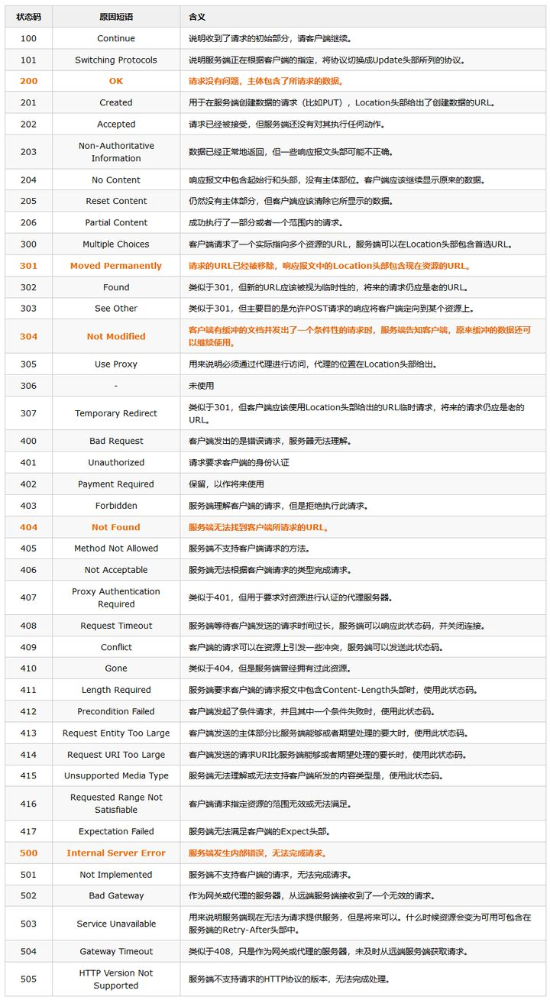

# 1、Http与Https的区别
1. HTTP 的URL 以http:// 开头，而HTTPS 的URL 以https:// 开头
2. HTTP 是不安全的，而 HTTPS 是安全的
3. HTTP 标准端口是80 ，而 HTTPS 的标准端口是443
4. 在OSI 网络模型中，HTTP工作于应用层，而HTTPS 的安全传输机制工作在传输层
5. HTTP 无法加密，而HTTPS 对传输的数据进行加密
6. HTTP无需证书，而HTTPS 需要CA机构wosign的颁发的SSL证书

# 2、什么是Http协议无状态协议?怎么解决Http协议无状态协议?
1. 无状态协议对于事务处理没有记忆能力。也就是说，当客户端一次HTTP请求完成以后，客户端再发送一次HTTP请求，HTTP并不知道当前客户端是一个"老用户"。

2. 可以使用Cookie来解决无状态的问题，Cookie就相当于一个通行证，第一次访问的时候给客户端发送一个Cookie，当客户端再次来的时候，拿着Cookie(通行证)，那么服务器就知道这个是"老用户"。

# 3、URI和URL的区别
### URI
是uniform resource identifier，统一资源标识符，用来唯一的标识一个资源。

### URL
是uniform resource locator，统一资源定位器，它是一种具体的URI，即URL可以用来标识一个资源，而且还指明了如何locate这个资源。

# 4、常用的HTTP方法有哪些？
1. get
2. post
3. put
4. delete
5. head
6. options

# 5、什么是HTTP报文？
HTTP报文是HTTP协议在客户端和服务端之间传送的数据块。

# 6、HTTP报文由哪三部分组成？

# 7、HTTP报文分为哪两类？
### 请求报文（request message）
当客户端向服务端发送请求时，就是发送请求报文。
### 响应报文（response message）
当服务端向客户端返回数据时，就是返回响应报文。

# 8、HTTP的状态码分为哪几类？
### 100~199
信息提示
### 200~299
请求成功
### 300~399
重定向
### 400~499
客户端错误
### 500~599
服务器错误

# 9、常见的状态码

# 10、http1和http2的区别
https://zhuanlan.zhihu.com/p/102561034
### HTTP1.1
1. 高延迟 — 队头阻塞(Head-Of-Line Blocking)
2. 无状态特性 — 阻碍交互
3. 明文传输 — 不安全性
4. 不支持服务端推送

### 队头阻塞
队头阻塞是指当顺序发送的请求序列中的一个请求因为某种原因被阻塞时，在后面排队的所有请求也一并被阻塞，会导致客户端迟迟收不到数据。
> 解决办法：
1. 将同一页面的资源分散到不同域名下，提升连接上限。虽然能公用一个 TCP 管道，但是在一个管道中同一时刻只能处理一个请求，在当前的请求没有结束之前，其他的请求只能处于阻塞状态。
2. 减少请求数量
3. 内联一些资源：css、base64 图片等
4. 合并小文件减少资源数

### 无状态特性
无状态是指协议对于连接状态没有记忆能力。纯净的 HTTP 是没有 cookie 等机制的，每一个连接都是一个新的连接。上一次请求验证了用户名密码，而下一次请求服务器并不知道它与上一条请求有何关联，换句话说就是掉登录态。

### 不安全性
传输内容没有加密，中途可能被篡改和劫持。

### HTTP2
1. 多路复用 — 解决队头阻塞
2. 头部压缩 — 解决巨大的 HTTP 头部
3. 请求优先级 — 先获取重要数据
4. 服务端推送 — 填补空缺
5. 提高安全性
6. 二进制分帧
### 多路复用 — 解决队头阻塞
允许在一个连接上无限制并发流。多路复用允许同时通过单一的 HTTP/2 连接发起多重的请求-响应消息。多路复用允许同时通过单一的 HTTP/2 连接发起多重的请求-响应消息。
### 头部压缩 — 解决巨大的 HTTP 头部
使用专门的 HPACK 算法，每次请求和响应只发送差异头部，一般可以达到 50%~90% 的高压缩率。
### 请求优先级 — 先获取重要数据
虽然无限的并发流解决了队头阻塞的问题，但如果带宽受限，客户端可能会因防止堵塞通道而阻止请求。在网络通道被非关键资源堵塞时，高优先级的请求会被优先处理。
### 服务端推送 — 填补空缺
服务端推送（ServerPush），可以让服务端主动把资源文件推送给客户端。当然客户端也有权利选择是否接收。
### 提高安全性
支持使用 HTTPS 进行加密传输。
### 二进制分帧
首先，HTTP2 没有改变 HTTP1 的语义，只是在应用层使用二进制分帧方式传输。因此，也引入了新的通信单位：帧、消息、流。
分帧有什么好处？服务器单位时间接收到的请求数变多，可以提高并发数。最重要的是，为多路复用提供了底层支持。

# 11、 三次握手和四次挥手

