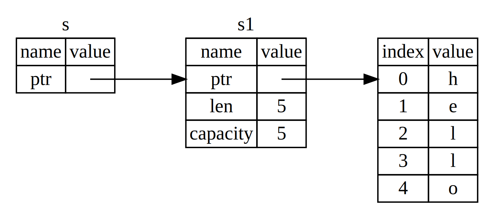

- [中文文档](https://www.rust-lang.org/zh-CN/)
- [在线测试代码](https://play.rust-lang.org/)
- https://github.com/ctjhoa/rust-learning
- https://doc.rust-lang.org/stable/book/
- https://kaisery.github.io/trpl-zh-cn/
- https://tourofrust.com/05_zh-cn.html

# 所有权

### 内存管理方式
所有运行的程序都必须管理其使用计算机内存的方式。
1. 一些语言中具有垃圾回收机制，在程序运行时不断地寻找不再使用的内存；
2. 在另一些语言中，程序员必须亲自分配和释放内存。
3. `Rust `则选择了第三种方式：通过所有权系统管理内存，编译器在编译时会根据一系列的规则进行检查。在运行时，所有权系统的任何功能都不会减慢程序。

### 栈（Stack）与堆（Heap）
栈和堆都是代码在运行时可供使用的内存，但是它们的结构不同。
#### 栈
栈以放入值的顺序存储值并以相反顺序取出值。这也被称作 `后进先出（last in, first out）`。增加数据叫做` 进栈（pushing onto the stack）`，而移出数据叫做` 出栈（popping off the stack）`。
- 栈中的所有数据都必须占用已知且固定的大小。在编译时大小未知或大小可能变化的数据，要改为存储在堆上。
- 入栈比在堆上分配内存要快，因为（入栈时）分配器无需为存储新数据去搜索内存空间；其位置总是在栈顶。
- 当你的代码调用一个函数时，传递给函数的值（包括可能指向堆上数据的指针）和函数的局部变量被压入栈中。当函数结束时，这些值被移出栈。


#### 堆
- 堆是缺乏组织的：**当向堆放入数据时，你要请求一定大小的空间。** `内存分配器（memory allocator）`在堆的某处找到一块足够大的空位，把它标记为已使用，并返回一个表示该位置地址的` 指针（pointer）`。这个过程称作` 在堆上分配内存`（allocating on the heap），有时简称为 “分配”（allocating）。

- 将数据推入栈中并不被认为是分配。因为指针的大小是已知并且固定的，你可以将指针存储在栈上，不过当需要实际数据时，必须访问指针。
  
  > 想象一下去餐馆就座吃饭。当进入时，你说明有几个人，餐馆员工会找到一个够大的空桌子并领你们过去。如果有人来迟了，他们也可以通过> 询问来找到你们坐在哪。
  
- 相比入栈， 在堆上分配内存则需要更多的工作，这是因为分配器必须首先找到一块足够存放数据的内存空间，并接着做一些记录为下一次分配做准备。

- 访问堆上的数据比访问栈上的数据慢，因为必须通过指针来访问。现代处理器在内存中跳转越少就越快（缓存）。


### 所有权的作用
**所有权的存在就是为了管理堆数据。**  跟踪哪部分代码正在使用堆上的哪些数据，最大限度的减少堆上的重复数据的数量，以及清理堆上不再使用的数据确保不会耗尽空间。


### 所有权规则
1. `Rust `中的每一个值都有一个被称为其` 所有者（owner）`的变量。
2. 值在任一时刻有且只有一个所有者， 当一个值赋值给另一个值时会将所有权交出。
```rust
```
3. 当所有者（变量）离开作用域，这个值将被丢弃。

### 变量作用域


### String 类型
字符串字面值是很方便的，不过它们并不适合使用文本的每一种场景。原因之一就是它们是不可变的。另一个原因是并非所有字符串的值都能在编写代码时就知道：例如，要是想获取用户输入并存储该怎么办呢？为此，Rust 有第二个字符串类型，String。这个类型管理被分配到堆上的数据，所以能够存储在编译时未知大小的文本。
可以使用 from 函数基于字符串字面值来创建 String，如下：
```rust
let s = String::from("hello"); // 可变
let s1 = "hello"; // 不可变
```
为什么` String `可变而字面值却不行呢？区别在于两个类型对内存的处理上。

#### 字符串字面值
就字符串字面值来说，我们在编译时就知道其内容，所以文本被直接硬编码进最终的可执行文件中。这使得字符串字面值快速且高效。不过这些特性都只得益于字符串字面值的不可变性。

#### String
对于 String 类型，为了支持一个可变，可增长的文本片段，需要在堆上分配一块在编译时未知大小的内存来存放内容。这意味着：

1. 必须在运行时向内存分配器（memory allocator）请求内存。
2. 需要一个当我们处理完 String 时将内存返回给分配器的方法。

第一部分由我们完成：当调用` String::from `时，它的实现 (implementation) 请求其所需的内存。这在编程语言中是非常通用的。
第二部分实现起来就各有区别了。
- 在有 垃圾回收（garbage collector，GC）的语言中， GC 记录并清除不再使用的内存，而我们并不需要关心它。
- 没有 GC 的话，识别出不再使用的内存并调用代码显式释放就是我们的责任了，跟请求内存的时候一样。
  - 如果忘记回收了会浪费内存。
  - 如果过早回收了，将会出现无效变量。
  - 如果重复回收，这也是个 bug。我们需要精确的为一个 allocate 配对一个 free。

**Rust 采取了一个不同的策略：内存在拥有它的变量离开作用域后就被自动释放。**
```rust
fn main() {
  {
    let s = String::from("hello"); // 从此处起，s 是有效的
    // 使用 s
  } // 此作用域已结束 s 不再有效, 变量拥有的数据也会被释放掉。
}
```
这是一个将 String 需要的内存返回给分配器的很自然的位置：当 s 离开作用域的时候。**当变量离开作用域，Rust 为我们调用一个特殊的函数。这个函数叫做 drop，在这里 String 的作者可以放置释放内存的代码。Rust 在结尾的 } 处自动调用 drop。**


### 变量与数据交互的方式（一）：移动
- https://kaisery.github.io/trpl-zh-cn/ch04-01-what-is-ownership.html#%E5%8F%98%E9%87%8F%E4%B8%8E%E6%95%B0%E6%8D%AE%E4%BA%A4%E4%BA%92%E7%9A%84%E6%96%B9%E5%BC%8F%E4%B8%80%E7%A7%BB%E5%8A%A8

变量的所有权总是遵循相同的模式：
**将值赋给另一个变量时移动它, 因为数据值只能有一个所有者变量， 所以上一个所有者必须交出所有权给下一个所有者。**
当持有堆中数据值的变量离开作用域时，其值将通过` drop `被清理掉，除非数据被移动为另一个变量所有。

像整型这样的在编译时已知大小的类型被整个存储在栈上，所以拷贝其实际的值是快速的。这意味着没有理由在创建变量 y 后使 x 无效。
```rust
let x = 5;
let y = x;
println!("{}", x); //5 
println!("{}", y); //5
```
看看存在堆中的String。
```rust
let s1 = String::from("hello");
let s2 = s1;
// s1不可用， 所有权已经移动到s2哪里去了。
```
> 这里要与`javascript中`的引用类型区分开来。

### 变量与数据交互的方式（二）：克隆
如果我们确实需要深度复制` String `中堆上的数据，而不仅仅是栈上的数据，可以使用一个叫做` clone `的通用函数

### Copy注解
如果一个类型实现了` Copy trait`，那么一个旧的变量在将其赋值给其他变量后仍然可用。`Rust `不允许自身或其任何部分实现了` Drop trait `的类型使用` Copy trait`。如果我们对其值离开作用域时需要特殊处理的类型使用` Copy `注解，将会出现一个编译时错误。

如下是一些 `Copy` 的类型：

- 所有整数类型，比如 `u32`。
- 布尔类型，`bool`，它的值是 `true` 和 `false`。
- 所有浮点数类型，比如 `f64`。
- 字符类型，`char`。
- 元组，当且仅当其包含的类型也都实现 `Copy` 的时候。比如，`(i32, i32)` 实现了 `Copy`，但 `(i32, String)` 就没有。


### 所有权与函数
将值传递给函数在语义上与给变量赋值相似。向函数传递值可能会移动或者复制，就像赋值语句一样。
```rust
fn main() {
    let s = String::from("hello");  // s 进入作用域

    takes_ownership(s);             // s 的值移动到函数里 ...
                                    // ... 所以s到这里不再有效

    let x = 5;                      // x 进入作用域

    makes_copy(x);                  // x 应该移动函数里，
                                    // 但 i32 是 Copy 的，所以在后面可继续使用 x

} // 这里, x 先移出了作用域，然后是 s。但因为 s 的值已被移走，
  // 所以不会有特殊操作

fn takes_ownership(some_string: String) { // some_string 进入作用域
    println!("{}", some_string);
} // 这里，some_string 移出作用域并调用 `drop` 方法。占用的内存被释放

fn makes_copy(some_integer: i32) { // some_integer 进入作用域
    println!("{}", some_integer);
} // 这里，some_integer 移出作用域。不会有特殊操作
```

#### 返回值也可以转移所有权。
```rust
fn main() {
    let s1 = gives_ownership();         // gives_ownership 将返回值
                                        // 移给 s1

    let s2 = String::from("hello");     // s2 进入作用域

    let s3 = takes_and_gives_back(s2);  // s2 被移动到
                                        // takes_and_gives_back 中,
                                        // 它也将返回值移给 s3
} // 这里, s3 移出作用域并被丢弃。s2 也移出作用域，但已被移走，
  // 所以什么也不会发生。s1 移出作用域并被丢弃

fn gives_ownership() -> String {             // gives_ownership 将返回值移动给
                                             // 调用它的函数

    let some_string = String::from("hello"); // some_string 进入作用域.

    some_string                              // 返回 some_string 并移出给调用的函数
}

// takes_and_gives_back 将传入字符串并返回该值
fn takes_and_gives_back(a_string: String) -> String { // a_string 进入作用域

    a_string  // 返回 a_string 并移出给调用的函数
}
```
# 引用和借用
在上面的例子中我们知道了， 如果变量的所有权移交到了函数内部， 必须通过`return`的方式重新移交到外部。
否则外部将无法使用， 并且数据也会被销毁。这未免有点太繁琐了！！！

**对象的引用可以解决这个问题。**

下面是如何定义并使用一个 calculate_length 函数，它以一个对象的引用作为参数而不是获取值的所有权：
```rust
fn main() {
    let s1 = String::from("hello");

    let len = calculate_length(&s1);

    println!("The length of '{}' is {}.", s1, len);
}

fn calculate_length(s: &String) -> usize {
    s.len()
}

```

`&s1 `语法让我们创建一个` 指向 值 s1 `的引用，但是并不拥有它。因为并不拥有这个值，所以当引用停止使用时，它所指向的值也不会被丢弃。

**指针运算**

- 运算符` & `可以获取对象的引用指针，引用允许你使用值但不获取其所有权。
- 与使用` & `引用相反的操作是` 解引用（dereferencing）`，它使用解引用运算符，`*`。


让我们增加一些解释性的注释：

```rust
fn calculate_length(s: &String) -> usize { // s 是对 String 的引用
    s.len()
} // 这里，s 离开了作用域。但因为它并不拥有引用值的所有权，
  // 所以什么也不会发生
```

变量 `s` 有效的作用域与函数参数的作用域一样，不过当引用停止使用时并不丢弃它指向的数据，因为我们没有所有权。当函数使用引用而不是实际值作为参数，无需返回值来交还所有权，因为就不曾拥有所有权。

> 我们将创建一个引用的行为称为 **借用（borrowing）**。

如果我们尝试修改借用的变量呢？

```rust
fn main() {
    let s = String::from("hello");

    change(&s);
}

fn change(some_string: &String) {
    some_string.push_str(", world");
}

// 报错：
// error[E0596]: cannot borrow immutable borrowed content `*some_string` as mutable
//  --> error.rs:8:5
//   |
// 7 | fn change(some_string: &String) {
//   |                        ------- use `&mut String` here to make mutable
// 8 |     some_string.push_str(", world");
//   |     ^^^^^^^^^^^ cannot borrow as mutable
```

**可变引用**
我们通过一个小调整就能修复上面的报错。
```rust
fn main() {
    let mut s = String::from("hello");

    change(&mut s);
}

fn change(some_string: &mut String) {
    some_string.push_str(", world");
}

```
**不过可变引用有一个很大的限制：在同一时间只能有一个对某一特定数据的可变引用。**这些代码会失败：
```rust
let mut s = String::from("hello");

let r1 = &mut s;
let r2 = &mut s;

println!("{}, {}", r1, r2);
```


这个限制的好处是 Rust 可以在编译时就避免数据竞争。**数据竞争**（*data race*）类似于竞态条件，它可由这三个行为造成：

- 两个或更多指针同时访问同一数据。
- 至少有一个指针被用来写入数据。
- 没有同步数据访问的机制。


### 悬垂引用（Dangling References）


### 引用的规则
让我们概括一下之前对引用的讨论：

1. 在任意给定时间，要么 只能有一个可变引用，要么 只能有多个不可变引用。
2. 引用必须总是有效的。