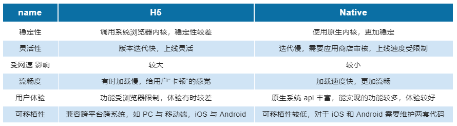

# JSBridge 的起源
### Native还是H5?
近些年，移动端普及化越来越高，开发过程中选用 Native 还是 H5 一直是热门话题。Native 和 H5 都有着各自的优缺点。

### Hybrid, Native和H5一起使用
为了满足业务的需要，公司实际项目的开发过程中往往会融合两者进行 Hybrid 开发。

> Native 和 H5 分处两地，看起来无法联系，那么如何才能让双方协同实现功能呢？
JSBridge 是一种 JS 实现的 Bridge，连接着桥两端的 Native 和 H5。它在 APP 内方便地让 Native 调用 JS，JS 调用 Native ，是双向通信的通道。JSBridge 主要提供了 JS 调用 Native 代码的能力，实现原生功能如查看本地相册、打开摄像头、指纹支付等。

# JS 调用 Native
JS 调用 Native 的实现方式较多，主要有:
1. 拦截 URL Scheme 
2. 重写 prompt 等原生 JS 方法
3. 注入 API

### 拦截 URL Scheme  
Android 和 iOS 都可以通过拦截 URL Scheme 并解析 scheme 来决定是否进行对应的 Native 代码逻辑处理。这种方法的优点是不存在漏洞问题、使用灵活，可以实现 H5 和 Native 页面的无缝切换。例如在某一页面需要快速上线的情况下，先开发出 H5 页面。某一链接填写的是 H5 链接，在对应的 Native 页面开发完成前先跳转至 H5 页面，待 Native 页面开发完后再进行拦截，跳转至 Native 页面，此时 H5 的链接无需进行修改。但是使用 iframe.src 来发送 URL Scheme 需要对 URL 的长度作控制，使用复杂，速度较慢。

### 重写 prompt 等原生 JS 方法
使用该方式时，可以与 Android 和 iOS 约定好使用传参的格式，这样 H5 可以无需识别客户端，传入不同参数直接调用 Native 即可。剩下的交给客户端自己去拦截相同的方法，识别相同的参数，进行自己的处理逻辑即可实现多端表现一致。

### 注入API
基于 Webview 提供的能力，我们可以向 Window 上注入对象或方法。JS 通过这个对象或方法进行调用时，执行对应的逻辑操作，可以直接调用 Native 的方法。使用该方式时，JS 需要等到 Native 执行完对应的逻辑后才能进行回调里面的操作。

# Native调用JS
Native调用JS比较简单，只要H5将JS方法暴露在Window上给Native调用即可。

# JSBridge 的使用
- 如何引用
    - 由 H5 引用。采用本地引入 npm 包的方式进行调用。这种方式可以确定 JSBridge 是存在的，可直接调用 Native 方法。但是如果后期 Bridge 的实现方式改变，双方需要做更多的兼容，维护成本高。
    - 由 Native 注入。采用 Native 注入的方式来引用 JSBridge。这样有利于保持 API 与 Native 的一致性，但是缺点是在 Native 注入的方法和时机都受限，JS 调用 Native 之前需要先判断 JSBridge 是否注入成功。

